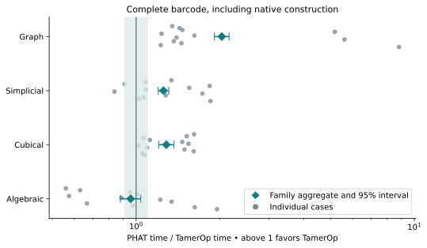
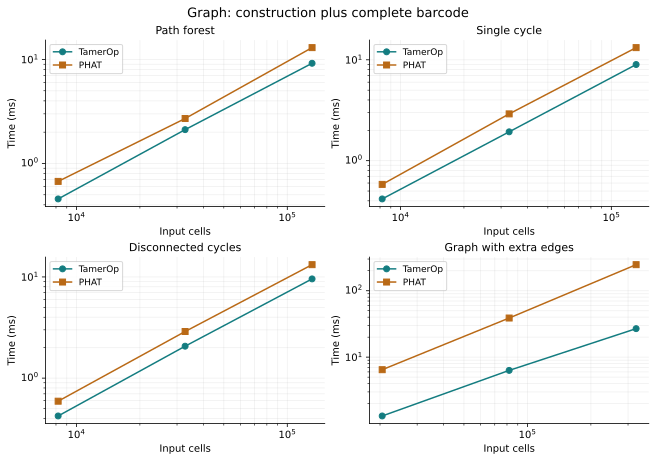
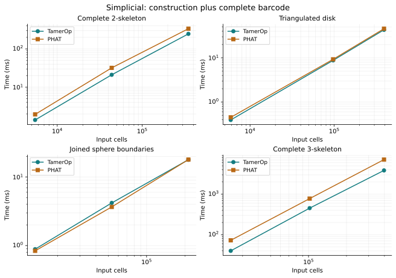
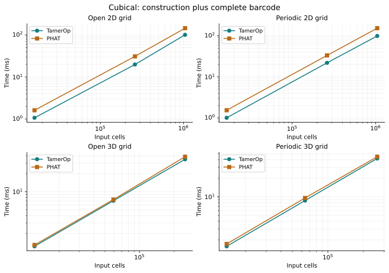
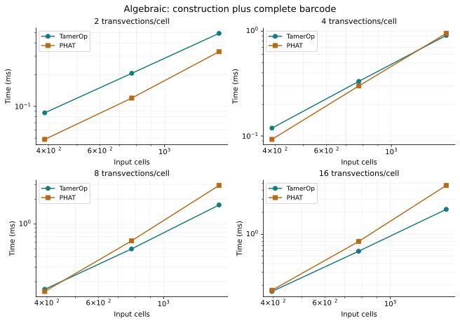
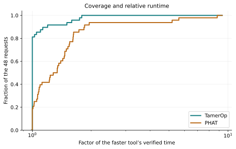

# Ordinary persistence: TamerOp and PHAT

**PHAT v2, completed 2026-10-04.** Both programs returned verified complete
barcodes on all **48 medium/large inputs**, spanning four families and sixteen
structural variants. TamerOp was **1.33× as fast in the balanced aggregate**, corresponding to about **25% less time** under the declared weighting.
The aggregate PHAT/TamerOp ratio is **1.329×**, with an approximate 95%
interval of **1.290–1.370**.
Graphs show the strongest family aggregate, with TamerOp **2.03× as fast**.

Inputs range from **387 to 1,048,576 cells**.
The largest complete 3-skeleton takes about
**3.86 s in TamerOp** and **7.14 s in PHAT**.
These are compiled computations with fresh mathematical results, not cached
answers or startup measurements. Individual variants differ; the tables and
curves show the practical scale of both advantages and slower cases.

This is the current PHAT report. It replaces the earlier smaller-workload
comparison with a newly declared size distribution and freshly measured data.
The implementation remains the accepted `phat-2026-10-04` snapshot; a different
aggregate across new workloads is not itself an implementation speedup.

[All benchmark results](index.md) · [Actual runtimes](#phat-v2-runtimes-and-input-sizes) ·
[Scaling curves](#phat-v2-scaling-by-structural-variant) ·
[Machine](#machine-used-for-phat-v2) · [Data](#phat-v2-measurement-records)

## The ordinary-persistence question in this study

As a filtration grows, components, holes and higher-dimensional classes appear
and disappear. Their lifetimes form the ordinary barcode. Both tools receive
identical decoded cell dimensions, integer filtration grades and boundary
columns over F₂. The answer contains every nonempty finite interval and every
essential birth, in every supplied degree. Equal-grade, zero-length pairs are
omitted; surviving classes are neither discarded nor clipped.

For this finite one-parameter problem, the complete barcode determines the
persistence module up to isomorphism. TamerOp answers it directly from a
`GradedComplex` through public `persistence_diagram(...; representatives=false)`.
This benchmark does not construct an `EncodingResult`. Finite encodings remain
central when later questions need the retained module and maps, especially
with several parameters. See [ordinary persistence](../ordinary_persistence.md)
and [finite encodings](../finite_encodings.md).

The competitor is unchanged [upstream PHAT](https://bitbucket.org/phat-code/phat/)
v1.7, using its default twist reduction with bit-tree pivot columns, on one
thread. This is a comparison with that supported default route; it does not
survey every PHAT algorithm or threaded configuration.

## PHAT v2 timing boundary

Native construction converts shared decoded boundary data to each program's
representation. The query reduces it and materializes a sorted complete barcode.
PHAT's conversion from cell pairs and recovery of essential births are charged.
TamerOp's ordinary public validation remains enabled. The combined phase times
construction and query together; it is the primary comparison.

| Phase | PHAT/TamerOp (95% interval) |
| --- | --- |
| Native construction | 0.508 (0.452–0.571) |
| Complete barcode query | 1.629 (1.573–1.686) |
| Construction plus query | 1.329 (1.290–1.370) |

All ratios divide **PHAT time by TamerOp time**; above one favors TamerOp.
Intervals use five paired process passes. The combined result is directly
measured, not the sum of separate phase medians. Parsing, fixture generation,
independent checks, reset inspection, serialization, package loading and
compilation are outside the timers. Filtration construction from raw images or
point clouds is outside this supplied-boundary comparison.

Each phase uses two fresh warmups and three accepted measurements. Each request
starts from verified fresh mathematical state: an unreduced PHAT matrix or an
input-only TamerOp complex, with no previous barcode or reduction reused.
Negative controls require corrupted native inputs to fail reset checks. Normal
reuse inside one computation is allowed. Julia performs a full collection
before phase warmup and charges natural collections during requests.

Five serial paired process passes produced **4,320 accepted samples**
and **2,880 warmup rows**. Every accepted measurement recorded zero
compilation and recompilation; **0 contaminated attempts were rejected**.
Tools and case order reverse in alternating passes. Every produced barcode,
including warmups, is checked outside the timer.

## PHAT v2 results by family

| Family | Cases | PHAT/TamerOp (95% interval) | Practical interpretation |
| --- | --- | --- | --- |
| Graph | 12 | 2.031 (1.912–2.158) | TamerOp 2.03× as fast |
| Simplicial | 12 | 1.254 (1.201–1.310) | TamerOp 1.25× as fast |
| Cubical | 12 | 1.284 (1.205–1.368) | TamerOp 1.28× as fast |
| Algebraic | 12 | 0.955 (0.878–1.039) | Similar; PHAT about 4.5% less time |

The largest displayed case-median saving for TamerOp is about
**3.28 seconds** on the complete 3-skeleton above.
The largest saving for PHAT is about **0.53 ms**,
on the middle-sized joined-sphere input: **3.67 ms versus
4.19 ms**. These are differences between each tool's
displayed case medians, not a sum or estimate for an unmeasured workload.

Similar family aggregates can contain individual differences. PHAT retains a
substantial relative advantage on the low-density algebraic controls; the
smallest takes about **0.049 ms versus 0.087 ms**,
with a paired ratio of **0.559**. That is a small absolute
cost for one request, but it can accumulate in frequent batches. The per-variant
curves and complete data retain these cases.

The four families have equal weight; each family's four variants and three
sizes divide its weight equally. Case ratios are geometric means of paired
process-median ratios. Aggregate uncertainty uses five paired-block log ratios
and a t interval with four degrees of freedom. It describes repeat-run variation
on these fixed inputs, not performance on arbitrary future data.

We lead with magnitudes and actual times. Point estimates from 1/1.10 to 1.10
are described as similar performance, with the measured edge explicit; this is
a practical band, not a statistical proof of equivalence. Larger relative gaps
remain explicit even when their absolute cost is small. Supplementary case
counts use those same frozen thresholds:

| Family | TamerOp faster | Within the practical band | PHAT faster |
| --- | --- | --- | --- |
| Graph | 12 | 0 | 0 |
| Simplicial | 6 | 4 | 2 |
| Cubical | 7 | 5 | 0 |
| Algebraic | 4 | 3 | 5 |

Counts do not assign the same practical importance to a microsecond gap and a
saving of several seconds. The broad claim gate requires at least 80% weighted
practical advantages, 80% of families favoring TamerOp, and an aggregate lower
interval above 1.10, also supported by pass ranges and equal-case sensitivity.
**The predeclared criteria for “generally faster on this suite” are not satisfied; the supported conclusion is the aggregate and family-specific account above.**

## PHAT v2 runtimes and input sizes

All times are **milliseconds**. A time cell is the median across four structural
variants at that family/size level, followed by their minimum–maximum range.
Each individual case time is the median of five process medians. These ranges
describe different inputs, not timing confidence intervals.

| Family / level | Cells | Boundary entries | Output bars | TamerOp ms: median (range) | PHAT ms: median (range) |
| --- | --- | --- | --- | --- | --- |
| Graph / 1 | 8,191–20,480 | 8,190–32,768 | 2,817–13,587 | 0.439 (0.418–1.303) | 0.632 (0.582–6.478) |
| Graph / 2 | 32,767–81,920 | 32,766–131,072 | 11,427–54,064 | 2.092 (1.933–6.324) | 2.900 (2.706–38.809) |
| Graph / 3 | 131,071–327,680 | 131,070–524,288 | 45,622–216,621 | 9.381 (8.983–26.870) | 13.217 (13.009–246.669) |
| Simplicial / 1 | 5,488–24,157 | 11,656–92,484 | 1,202–17,852 | 1.140 (0.392–39.957) | 1.392 (0.449–72.679) |
| Simplicial / 2 | 43,744–102,090 | 98,304–396,760 | 11,683–82,973 | 14.929 (4.193–452.904) | 20.629 (3.667–779.382) |
| Simplicial / 3 | 212,993–396,606 | 393,216–1,555,400 | 46,708–342,462 | 144.954 (17.930–3,862.012) | 190.942 (17.990–7,141.729) |
| Cubical / 1 | 12,167–16,384 | 32,004–41,472 | 447–1,098 | 1.143 (1.004–1.569) | 1.577 (1.281–1.715) |
| Cubical / 2 | 59,319–262,144 | 173,394–524,288 | 2,147–17,439 | 14.284 (7.062–21.993) | 20.309 (7.399–33.311) |
| Cubical / 3 | 250,047–1,048,576 | 738,234–2,097,152 | 8,915–69,567 | 70.654 (34.985–101.147) | 95.072 (38.608–153.654) |
| Algebraic / 1 | 387–396 | 2,218–9,068 | 137–163 | 0.140 (0.087–0.164) | 0.122 (0.049–0.171) |
| Algebraic / 2 | 771–780 | 4,729–38,762 | 294–314 | 0.415 (0.206–0.586) | 0.463 (0.120–0.796) |
| Algebraic / 3 | 1,539–1,548 | 11,470–157,959 | 575–607 | 1.307 (0.492–2.199) | 1.948 (0.330–4.679) |

Cell counts include generators in all supplied degrees. Boundary entries count
nonzero coefficients; output bars include finite intervals and essential births.
The algebraic controls have fewer cells but much denser boundaries. Size level
is a position within a variant's declared ladder, not a common geometric scale.

For a more direct view, these are the **largest inputs of all sixteen variants**:

| Family / variant | Cells | Boundary entries | TamerOp ms | PHAT ms | PHAT/TamerOp |
| --- | --- | --- | --- | --- | --- |
| Graph / Path forest | 131,071 | 131,070 | 9.197 | 13.009 | 1.366 |
| Graph / Single cycle | 131,072 | 131,072 | 8.983 | 13.212 | 1.455 |
| Graph / Disconnected cycles | 131,072 | 131,072 | 9.564 | 13.223 | 1.226 |
| Graph / Graph with extra edges | 327,680 | 524,288 | 26.870 | 246.669 | 8.814 |
| Simplicial / Complete 2-skeleton | 349,632 | 1,040,384 | 246.686 | 336.172 | 1.279 |
| Simplicial / Triangulated disk | 391,171 | 781,320 | 43.221 | 45.712 | 1.064 |
| Simplicial / Joined sphere boundaries | 212,993 | 393,216 | 17.930 | 17.990 | 1.022 |
| Simplicial / Complete 3-skeleton | 396,606 | 1,555,400 | 3,862.012 | 7,141.729 | 1.850 |
| Cubical / Open 2D grid | 1,046,529 | 2,091,012 | 101.147 | 145.291 | 1.492 |
| Cubical / Periodic 2D grid | 1,048,576 | 2,097,152 | 99.329 | 153.654 | 1.611 |
| Cubical / Open 3D grid | 250,047 | 738,234 | 34.985 | 38.608 | 1.053 |
| Cubical / Periodic 3D grid | 262,144 | 786,432 | 41.979 | 44.854 | 1.074 |
| Algebraic / 2 transvections/cell | 1,539 | 11,470 | 0.492 | 0.330 | 0.666 |
| Algebraic / 4 transvections/cell | 1,542 | 47,878 | 0.909 | 0.951 | 0.974 |
| Algebraic / 8 transvections/cell | 1,545 | 119,270 | 1.706 | 2.946 | 1.625 |
| Algebraic / 16 transvections/cell | 1,548 | 157,959 | 2.199 | 4.679 | 1.953 |

Dividing displayed medians can differ from the reported ratio, which pairs
process passes before aggregation. The [complete CSV](phat_v2/timings.csv)
contains every size and all three timing phases.

## PHAT v2 scaling by structural variant

Each panel joins three measured sizes of one structural variant. Both axes use
logarithmic scales. The lines guide the eye; they are not asymptotic predictions.

Both profile curves reach one: all requests completed correctly. This plot uses
the same fixed population as the tables. No earlier pilot or comparison timings
are pooled into the score.

## PHAT v2 correctness and selection

The examples are synthetic and cover different topology and boundary structure.
The algebraic family applies compatible filtered basis changes to elementary
intervals, changing arithmetic difficulty while retaining a known barcode.
Graph, simplicial and cubical families provide structurally different inputs.

| Inputs | Independent evidence in addition to complete cross-tool agreement |
| --- | --- |
| All 48 cases | Exact filtration, dimensions and d² = 0 checks. |
| 12 graph cases | Complete barcode derived from DFS component-map ranks and graph cycle counts. |
| 12 algebraic cases | Known complete barcode preserved by compatible filtered changes of basis. |
| 12 simplicial and 12 cubical cases | Known terminal Betti numbers. This does not independently certify every birth and death. |
| Eight unscored small controls | Complete rank-invariant oracle and hand-derived answers. |

All 56 qualification inputs matched in TamerOp and PHAT's twist and standard
reductions. Only twist is timed. All 15 harness tests passed, including malformed
inputs, incorrect barcodes, incomplete records, cache-reset guards, compilation
rejection and fixed-suite selection. Source-identical library acceptance checks
were credited; the package-wide test suite was not rerun for this comparison.

The sixteen largest cases underwent a bounded feasibility pilot. All proposed
endpoints fit the budget and were retained. No implementation tuning, favorable
case selection or weight changes followed these measurements. Source, fixtures,
adapters, protocol and runtime identities were frozen before final confirmation.
There is no separate held-out performance claim for this suite.

## Machine used for PHAT v2

| Component | Recorded configuration |
| --- | --- |
| CPU | 13th Gen Intel(R) Core(TM) i7-1365U |
| Logical CPUs / usable RAM | 12 / 31.00 GiB reported by Linux |
| OS | x86-64 Linux 6.8.0-106-generic |
| Julia | 1.12.1 |
| TamerOp source | Accepted development snapshot `phat-2026-10-04`; comparison candidate `phat-v2-2026-10-04` |
| PHAT | v1.7, commit `a74705e4628e447084d47dbf13a16dfb6d2ebd9a` |
| C++ build | g++ (Ubuntu 11.4.0-1ubuntu1~22.04.3) 11.4.0; `-O3 -DNDEBUG -std=c++17` |
| Parallelism | One computation thread; serial workers; one Julia/BLAS thread |

The Git base alone does not identify the measured implementation. Exact source,
adapter, runtime and input identities are in [provenance.json](phat_v2/provenance.json).
The ordinary-persistence source SHA256 is
`8ae5e1b1addbc51f313801a4c4aa839a75f1880cb44721c8e8953931494df11e`.

The user confirmed that other heavy computations could remain paused. This was
a shared desktop with five-second resource monitoring. During final confirmation,
one-minute load ranged from 1.42 to
2.33; available memory stayed above
7.39 GiB. Full pressure and system-wide swap
observations remain in the downloadable metadata; they are not measurements
attributed to either tool alone.

Fixture generation took 2.0 minutes and qualification
1.1 minutes. The pilot took 6.1 minutes;
final confirmation took 19.1 minutes. The approximately two-hour
timing allowance was a cap, not a target to fill. Preparation and report building
are outside it. Limits were 60 seconds per operation, 900 seconds per worker,
4 GiB sampled worker RSS, 20 minutes for the pilot and 100 for confirmation.
The operation watchdog includes untimed setup/checks, so it is not an exact
query-time cutoff. No worker failed or reached a resource limit.

## PHAT v2 memory measurements

| Tool | Sampled peak worker RSS (MiB) |
| --- | --- |
| tamerop | 1,392.1–1,540.5 |
| phat | 155.8–155.8 |

These are sampled peaks for entire workers, including runtime, compiled code,
temporary storage and untimed work. They are not retained mathematical storage;
brief peaks can be missed. Julia also provides separate per-request counters:

| Julia measurement | Range across complete requests (MiB) |
| --- | --- |
| Allocation traffic during the request | 0.109–176.912 |
| Retained native input | 0.043–54.001 |
| Retained normalized barcode | 0.003–8.131 |

Allocation traffic measures bytes allocated over the call, not simultaneous
memory usage. Retained input and barcode are separate `Base.summarysize` roots.
PHAT allocation and retained-object counters are unavailable and appear as null,
not zero. The speed comparison remains separate from these memory observations.

## PHAT v2 measurement records

- [Data dictionary](phat_v2/README.md)
- [All 144 case/phase summaries](phat_v2/timings.csv)
- [Per-pass times, allocations and retained sizes](phat_v2/observations.json)
- [Aggregates, completion, memory and host observations](phat_v2/results.json)
- [Versions, source identity and raw-evidence hashes](phat_v2/provenance.json)
- [Download checksums](phat_v2/SHA256SUMS)

The public records reproduce the summaries and figures. Exact inputs, validators,
raw rows, source snapshots and commands remain in the local audit archive.
These downloads are not yet a licensed executable reproduction bundle or an
independent clean-machine replication.

**PHAT v2 is closed at this scope.** It measures complete ordinary F₂ barcodes
from supplied boundaries. It does not compare raw-data ingestion, representative
cycles, other fields, cohomology, relative/extended persistence, zigzags,
incremental updates, multiparameter computations, startup or every PHAT setting.
