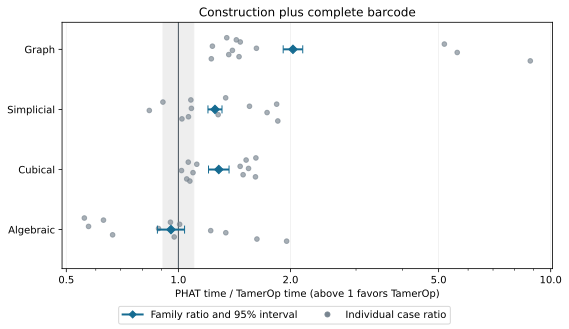
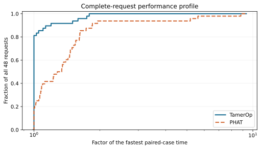
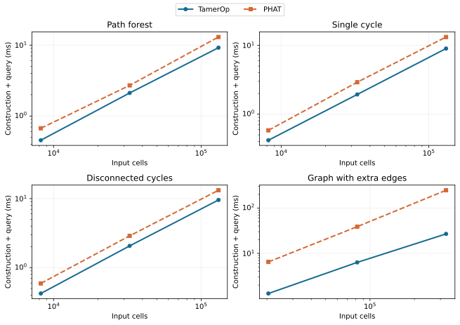
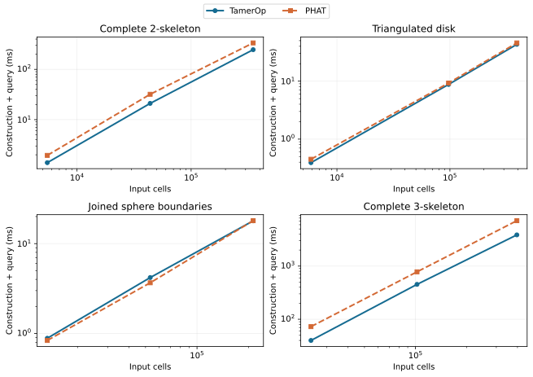
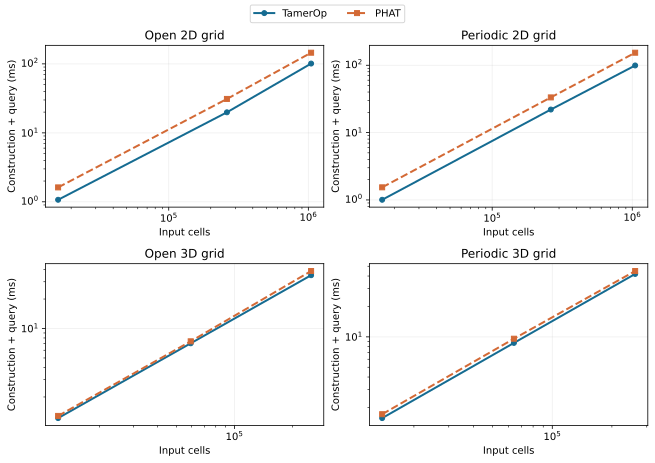
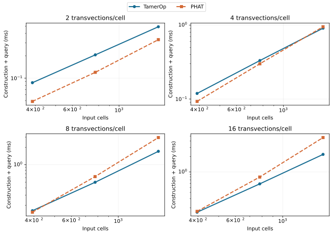

# Ordinary persistence: TamerOp and PHAT

**Study completed 2026-10-04.** Both programs returned verified complete
barcodes for all **48** fixed inputs. TamerOp was **1.33× as fast in the balanced
aggregate** for native construction plus the complete query, corresponding to
about **25% less time** (approximate 95% ratio interval **1.290–1.370×**).
Graphs show the strongest family advantage; the algebraic controls have
similar aggregate performance, with PHAT slightly faster.

These are compiled computations with previous mathematical results discarded.
Inputs range from 387 to 1,048,576 cells. The largest complete 3-skeleton takes
about **3.86 s in TamerOp and 7.14 s in PHAT**. Individual results vary, and
several favor PHAT. The supported conclusion is an aggregate and family-specific
advantage; the study's predeclared criteria for “generally faster on this suite”
were not met.

[All benchmark results](index.md) · [Runtimes and sizes](#actual-runtimes-and-input-sizes) ·
[Scaling curves](#how-runtime-changes-with-input-size) ·
[Machine and versions](#machine-and-versions) ·
[Download the results](#data-and-reproducibility)

## Why compare ordinary persistence?

As a filtration grows, components, holes and higher-dimensional classes appear
and disappear. Their lifetimes form the ordinary barcode. This is a natural
complete-result comparison: both programs receive the same filtered boundary
matrix and must recover the same intervals in every supplied degree.

The inputs specify cell dimensions, integer filtration grades and boundary
columns over F₂. The answer contains every nonempty finite interval and every
essential birth. Equal-grade, zero-length pairs are omitted; surviving classes
are neither discarded nor clipped. For this finite one-parameter problem,
the complete barcode determines the persistence module up to isomorphism.

TamerOp answers directly from a `GradedComplex` through public
`persistence_diagram(...; representatives=false)`. This route does not construct
an `EncodingResult`. Finite encodings remain central when later questions need
the retained module and maps, especially with several parameters; see
[ordinary persistence](../ordinary_persistence.md) and
[finite encodings](../finite_encodings.md).

The comparison uses unchanged [upstream PHAT](https://bitbucket.org/phat-code/phat/)
v1.7 with its default twist reduction and bit-tree pivot columns, on one thread.
It concerns that supported default route, rather than a survey of all PHAT
algorithms or threaded configurations.

## What was measured?

Native construction converts shared decoded boundary data into each program's
representation. The query reduces it and materializes a sorted complete barcode.
PHAT's conversion from cell pairs and recovery of essential births are charged.
TamerOp's ordinary public validation remains enabled. The primary measurement
includes construction and the complete query in one timer.

| Phase | PHAT/TamerOp (95% interval) |
| :--- | ---: |
| Native construction | 0.508 (0.452–0.571) |
| Complete barcode query | 1.629 (1.573–1.686) |
| Construction plus query | 1.329 (1.290–1.370) |

All ratios divide **PHAT time by TamerOp time**; values above one favor TamerOp.
The intervals use five paired process passes. The combined measurement is taken
directly, not obtained by adding separately measured medians. PHAT spends less
time on native construction, while TamerOp's lower query times produce the
combined advantage on this suite.

Parsing, fixture generation, independent checks, reset inspection, answer
serialization, package loading and compilation are outside the timers.
Filtration construction from raw images or point clouds is also outside this
supplied-boundary comparison.

Each phase uses two fresh warmups and three accepted measurements per process
pass. Every request begins with an unreduced PHAT matrix or an input-only
TamerOp complex, with no previous barcode or reduction reused. Reset checks
reject corrupted native inputs. Both programs may reuse intermediate work
within a request. Julia performs a full collection before phase warmup and
charges natural collections during requests.

Five serial paired passes produced 4,320 accepted samples and 2,880 warmup rows.
Every accepted measurement recorded zero compilation and recompilation; no
contaminated attempts were rejected. Tool and case order reverse in alternating
passes. Every produced barcode, including warmups, is checked outside the timer.

## Results by input family

The ratios below use construction plus the complete query. Each family contains
four structural variants at three measured sizes, with equal declared weight.
The confidence intervals describe variation across the five paired passes.

| Family | Cases | PHAT/TamerOp (95% interval) | Practical interpretation |
| :--- | ---: | ---: | :--- |
| Graph | 12 | 2.031 (1.912–2.158) | TamerOp 2.03× as fast |
| Simplicial | 12 | 1.254 (1.201–1.310) | TamerOp 1.25× as fast |
| Cubical | 12 | 1.284 (1.205–1.368) | TamerOp 1.28× as fast |
| Algebraic | 12 | 0.955 (0.878–1.039) | Similar; PHAT about 4.5% less time |

The largest displayed case-median saving for TamerOp is about **3.28 seconds**
on the largest complete 3-skeleton. PHAT's largest saving is about **0.53 ms**
on the middle-sized joined-sphere input: 3.67 ms versus TamerOp's 4.19 ms.
These differences describe the measured requests, not an estimated total for
an unmeasured workload.

A similar family aggregate can conceal substantial individual differences.
PHAT has a clear relative advantage on the low-density algebraic controls.
The smallest takes about 0.049 ms in PHAT and 0.087 ms in TamerOp, with a paired
ratio of 0.559. That absolute difference is small for one request but may matter
across frequent batches.

The blue diamonds summarize ratios, not standalone TamerOp runtimes. Gray points
retain all twelve cases per family. The vertical line marks equal time; the pale
band spans the declared practical range from 1/1.10 to 1.10. It indicates similar
point estimates, not statistical equivalence. The spread of algebraic cases
explains why its aggregate alone is insufficient.
[Open the full-size figure](phat_v2/presentation/family_ratios.svg).

The horizontal axis allows a larger factor of the fastest paired-case time;
the vertical axis is the fraction of all 48 requests within that factor.
The profile uses the same paired geometric case ratios as the family comparison,
with equal weight for each case. TamerOp reaches full coverage at a smaller
factor, while both programs complete every request. This describes relative
time and coverage; the tables below show the actual waiting times.
[Open the full-size figure](phat_v2/presentation/performance_profile.svg).

## Actual runtimes and input sizes

All times in this table and the scaling figures are **milliseconds**
(1,000 ms = 1 second). Each time cell gives the median across the four structural
variants at a family/size level, followed by the minimum and maximum in
parentheses. Each case time is itself the median of five process medians.
These ranges describe different inputs, not timing confidence intervals.

| Family / level | Cells | Boundary entries | Output bars | TamerOp ms | PHAT ms |
| :--- | ---: | ---: | ---: | ---: | ---: |
| Graph / 1 | 8,191–20,480 | 8,190–32,768 | 2,817–13,587 | 0.439 (0.418–1.303) | 0.632 (0.582–6.478) |
| Graph / 2 | 32,767–81,920 | 32,766–131,072 | 11,427–54,064 | 2.092 (1.933–6.324) | 2.900 (2.706–38.809) |
| Graph / 3 | 131,071–327,680 | 131,070–524,288 | 45,622–216,621 | 9.381 (8.983–26.870) | 13.217 (13.009–246.669) |
| Simplicial / 1 | 5,488–24,157 | 11,656–92,484 | 1,202–17,852 | 1.140 (0.392–39.957) | 1.392 (0.449–72.679) |
| Simplicial / 2 | 43,744–102,090 | 98,304–396,760 | 11,683–82,973 | 14.929 (4.193–452.904) | 20.629 (3.667–779.382) |
| Simplicial / 3 | 212,993–396,606 | 393,216–1,555,400 | 46,708–342,462 | 144.954 (17.930–3,862.012) | 190.942 (17.990–7,141.729) |
| Cubical / 1 | 12,167–16,384 | 32,004–41,472 | 447–1,098 | 1.143 (1.004–1.569) | 1.577 (1.281–1.715) |
| Cubical / 2 | 59,319–262,144 | 173,394–524,288 | 2,147–17,439 | 14.284 (7.062–21.993) | 20.309 (7.399–33.311) |
| Cubical / 3 | 250,047–1,048,576 | 738,234–2,097,152 | 8,915–69,567 | 70.654 (34.985–101.147) | 95.072 (38.608–153.654) |
| Algebraic / 1 | 387–396 | 2,218–9,068 | 137–163 | 0.140 (0.087–0.164) | 0.122 (0.049–0.171) |
| Algebraic / 2 | 771–780 | 4,729–38,762 | 294–314 | 0.415 (0.206–0.586) | 0.463 (0.120–0.796) |
| Algebraic / 3 | 1,539–1,548 | 11,470–157,959 | 575–607 | 1.307 (0.492–2.199) | 1.948 (0.330–4.679) |

Cells count generators in all supplied degrees; boundary entries count nonzero
coefficients. Output bars include finite intervals and essential births.
Algebraic controls have fewer cells but much denser boundaries. A size level
is a position within a variant's ladder, not a shared geometric scale.

For a direct comparison of the endpoints, these are the largest inputs of
all sixteen variants:

| Family / variant | Cells | Boundary entries | TamerOp ms | PHAT ms | PHAT/TamerOp |
| :--- | ---: | ---: | ---: | ---: | ---: |
| Graph / Path forest | 131,071 | 131,070 | 9.197 | 13.009 | 1.366 |
| Graph / Single cycle | 131,072 | 131,072 | 8.983 | 13.212 | 1.455 |
| Graph / Disconnected cycles | 131,072 | 131,072 | 9.564 | 13.223 | 1.226 |
| Graph / Graph with extra edges | 327,680 | 524,288 | 26.870 | 246.669 | 8.814 |
| Simplicial / Complete 2-skeleton | 349,632 | 1,040,384 | 246.686 | 336.172 | 1.279 |
| Simplicial / Triangulated disk | 391,171 | 781,320 | 43.221 | 45.712 | 1.064 |
| Simplicial / Joined sphere boundaries | 212,993 | 393,216 | 17.930 | 17.990 | 1.022 |
| Simplicial / Complete 3-skeleton | 396,606 | 1,555,400 | 3,862.012 | 7,141.729 | 1.850 |
| Cubical / Open 2D grid | 1,046,529 | 2,091,012 | 101.147 | 145.291 | 1.492 |
| Cubical / Periodic 2D grid | 1,048,576 | 2,097,152 | 99.329 | 153.654 | 1.611 |
| Cubical / Open 3D grid | 250,047 | 738,234 | 34.985 | 38.608 | 1.053 |
| Cubical / Periodic 3D grid | 262,144 | 786,432 | 41.979 | 44.854 | 1.074 |
| Algebraic / 2 transvections/cell | 1,539 | 11,470 | 0.492 | 0.330 | 0.666 |
| Algebraic / 4 transvections/cell | 1,542 | 47,878 | 0.909 | 0.951 | 0.974 |
| Algebraic / 8 transvections/cell | 1,545 | 119,270 | 1.706 | 2.946 | 1.625 |
| Algebraic / 16 transvections/cell | 1,548 | 157,959 | 2.199 | 4.679 | 1.953 |

Dividing the displayed medians can differ from the reported ratio: ratios pair
process passes before aggregation, whereas these times summarize each tool
separately. The [complete CSV](phat_v2/timings.csv) retains every size and all
three timing phases.

## How runtime changes with input size

Each panel follows one structural variant through its three measured sizes.
TamerOp is the solid blue line with circles; PHAT is the dashed orange line
with squares. Both axes are logarithmic, and panel limits vary to keep each
sequence legible. The lines guide the eye between observations; they are not
asymptotic predictions. All panels include native construction and the complete
barcode query. The [per-case data](phat_v2/timings.csv) provide the exact values.

### Graphs

Every graph case favors TamerOp beyond the practical band. The largest relative
separation occurs for graphs with extra edges: at the largest size, the programs
take about 26.87 ms and 246.67 ms, respectively. The simpler graph variants have
smaller but consistent advantages.
[Open the full-size figure](phat_v2/presentation/graph_scaling.svg).

### Simplicial inputs

The complete 3-skeleton accounts for the largest absolute saving in the suite.
The largest disk and joined-sphere inputs have similar runtimes instead, and
the middle-sized joined-sphere input favors PHAT. These differences would be
lost in a single curve joining all simplicial inputs.
[Open the full-size figure](phat_v2/presentation/simplicial_scaling.svg).

### Cubical grids

The two-dimensional grids show a larger separation than the three-dimensional
grids. At the largest sizes, TamerOp uses about 99–101 ms for the two-dimensional
grids and PHAT about 145–154 ms. The largest three-dimensional cases fall
within the practical band, with TamerOp's measured times slightly lower.
[Open the full-size figure](phat_v2/presentation/cubical_scaling.svg).

### Algebraic controls

These controls change the density of the boundary matrices while retaining a
known barcode. PHAT is faster on all three lowest-density inputs. With eight
or sixteen transvections per cell, the larger inputs favor TamerOp instead.
Cell count alone does not explain the computational difficulty.
[Open the full-size figure](phat_v2/presentation/algebraic_scaling.svg).

## How were answers and aggregates checked?

The examples are synthetic and cover four families with different topology and
boundary structure. Algebraic controls apply compatible filtered basis changes
to elementary intervals, changing arithmetic difficulty while retaining a known
barcode. The independent evidence varies by family:

| Inputs | Independent evidence in addition to complete cross-tool agreement |
| :--- | :--- |
| All 48 cases | Exact filtration, dimensions and d² = 0 checks. |
| 12 graph cases | Complete barcode derived from DFS component-map ranks and graph cycle counts. |
| 12 algebraic cases | Known complete barcode preserved by compatible filtered changes of basis. |
| 12 simplicial and 12 cubical cases | Known terminal Betti numbers. This does not independently certify every birth and death. |
| Eight unscored small controls | Complete rank-invariant oracle and hand-derived answers. |

All 56 qualification inputs matched in TamerOp and PHAT's twist and standard
reductions; only twist is timed. Fifteen harness checks passed, covering malformed
inputs, incorrect or incomplete answers, cache resets, compilation rejection
and fixed-suite selection. Source-identical library acceptance checks were
credited; the package-wide suite was not rerun for this comparison.

Each family receives one quarter of the total weight, divided equally among
its four variants and three sizes. Within a pass, each tool's median of three
samples gives its time. Case ratios are geometric means of the five paired
PHAT/TamerOp process-median ratios. Family and overall aggregates use those
fixed weights. The approximate 95% intervals are t intervals on five paired-block
log aggregates, with four degrees of freedom. They describe repeat-run variation
on these fixed inputs and this host, not uncertainty over arbitrary future data.

For the combined measurement, the aggregate is 1.329 with interval 1.290–1.370
and a pass range of 1.277–1.363. Equal-case weighting gives the same result
because the families and variants contain equal numbers of cases. The
supplementary classification counts use the predeclared practical band:

| Family | TamerOp faster | Within the practical band | PHAT faster |
| :--- | ---: | ---: | ---: |
| Graph | 12 | 0 | 0 |
| Simplicial | 6 | 4 | 2 |
| Cubical | 7 | 5 | 0 |
| Algebraic | 4 | 3 | 5 |

The counts support the interpretation of the ratios; a saving of several seconds
and a microsecond difference do not have equal practical importance. The broad
claim gate requires at least 80% weighted practical advantages, 80% of families
favoring TamerOp, and an aggregate lower interval above 1.10, supported by pass
ranges and equal-case sensitivity. Here the first two shares are 60.4% and 75%.
**The predeclared criteria for “generally faster on this suite” are not met.**
The supported conclusion is the aggregate and family-specific comparison above.

The sixteen largest inputs underwent a bounded feasibility pilot. Every proposed
endpoint fit the budget and was retained. No implementation tuning, favorable
case selection or weight changes followed those measurements. Source, fixtures,
adapters, protocol and runtime identities were frozen before confirmation.
There is no separate held-out performance claim. No pilot or earlier-study
timings enter the reported score.

## Machine and versions

These specifications describe the actual measured candidate and run.

| Component | Recorded configuration |
| :--- | :--- |
| CPU | 13th Gen Intel(R) Core(TM) i7-1365U |
| Logical CPUs / usable RAM | 12 / 31.00 GiB reported by Linux |
| OS | x86-64 Linux 6.8.0-106-generic |
| Julia | 1.12.1 |
| TamerOp source | Accepted development snapshot `phat-2026-10-04`; comparison candidate `phat-v2-2026-10-04` |
| PHAT | v1.7, commit `a74705e4628e447084d47dbf13a16dfb6d2ebd9a` |
| C++ build | g++ (Ubuntu 11.4.0-1ubuntu1~22.04.3) 11.4.0; `-O3 -DNDEBUG -std=c++17` |
| Parallelism | One computation thread; serial workers; one Julia/BLAS thread |

This was a shared desktop with five-second resource monitoring. During final
confirmation, one-minute load ranged from 1.42 to 2.33 and available memory
stayed above 7.39 GiB. System pressure and swap observations are retained in the
metadata; they cannot be attributed to either tool alone.

Limits were 60 seconds per operation, 900 seconds per worker and 4 GiB sampled
worker RSS, with 20 minutes for the pilot and 100 for confirmation. The operation
watchdog includes untimed setup and checks, so it is not an exact query-time
cutoff. No worker failed or reached a resource limit. Fixture generation,
qualification, the pilot and confirmation took about 2.0, 1.1, 6.1 and 19.1
minutes, respectively; preparation and report building are outside the timing
allowance.

The source snapshot includes changes beyond its Git base and is not a tagged
release. The [provenance record](phat_v2/provenance.json) identifies the exact
source, adapters, runtime and inputs. PHAT v2 uses a different workload
distribution from the earlier small-input comparison, with the same accepted
implementation snapshot. A changed aggregate across those studies is not itself
an implementation speedup.

## Memory

TamerOp used substantially more process memory despite its lower aggregate
computation time:

| Tool | Sampled peak worker RSS (MiB) |
| :--- | ---: |
| TamerOp | 1,392.1–1,540.5 |
| PHAT | 155.8–155.8 |

These are ranges of sampled peak worker RSS, including the runtime, compiled
code, temporary storage and untimed work. They are not retained mathematical
storage, and brief peaks may be missed. Julia supplies separate per-request
measurements:

| Julia measurement | Range across complete requests (MiB) |
| :--- | ---: |
| Allocation traffic during the request | 0.109–176.912 |
| Retained native input | 0.043–54.001 |
| Retained normalized barcode | 0.003–8.131 |

Allocation traffic counts bytes allocated during the call, not simultaneous
memory usage. Retained input and barcode sizes are separate `Base.summarysize`
roots. PHAT's allocation and retained-object counters are unavailable and remain
null rather than zero. The speed comparison and these memory measurements
answer different questions.

## Data and reproducibility

The public results accompany this page:

- [Summary JSON](phat_v2/results.json): aggregates, completion, memory and host observations.
- [Per-case CSV](phat_v2/timings.csv): all 144 case/phase summaries, with exact sizes, times and ratios.
- [Per-pass observations](phat_v2/observations.json): times, allocations and retained sizes.
- [Provenance and machine metadata](phat_v2/provenance.json) and
  [original download checksums](phat_v2/SHA256SUMS).
- [Data dictionary](phat_v2/README.md): units, row meanings, uncertainty and missing values.
- [Figure presentation record](phat_v2/presentation/presentation.json) and
  [figure checksums](phat_v2/presentation/SHA256SUMS): the QPA-style exports used here.
- Original sealed figures: [ratios](phat_v2/family_ratios.svg),
  [profile](phat_v2/performance_profile.svg), [graphs](phat_v2/graph_scaling.svg),
  [simplicial inputs](phat_v2/simplicial_scaling.svg),
  [cubical grids](phat_v2/cubical_scaling.svg), and
  [algebraic controls](phat_v2/algebraic_scaling.svg).

The figures are rendered from the unchanged PHAT v2 summaries using the
[shared benchmark style](../benchmark_style.md). The
[figure renderer](../build_scripts/render_phat_figures.py) can regenerate them
with Python and Matplotlib, without running benchmarks. Its presentation record
identifies the input summaries, style and renderer; the original sealed files
remain available alongside the new exports.

The downloads support inspection and recomputation of the summaries. Exact
inputs, validators, raw rows, source snapshots and commands remain in the local
evidence archive; this is not yet an executable reproduction bundle or an
independent clean-machine replication.

The study covers complete ordinary F₂ barcodes from supplied boundaries. It
does not compare raw-data ingestion, representative cycles, other fields,
cohomology, relative or extended persistence, zigzags, incremental updates,
multiparameter computations, startup or every PHAT setting. For measuring
your own workload, follow the [benchmarking manual](../benchmarking.md).
