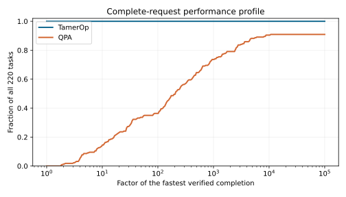
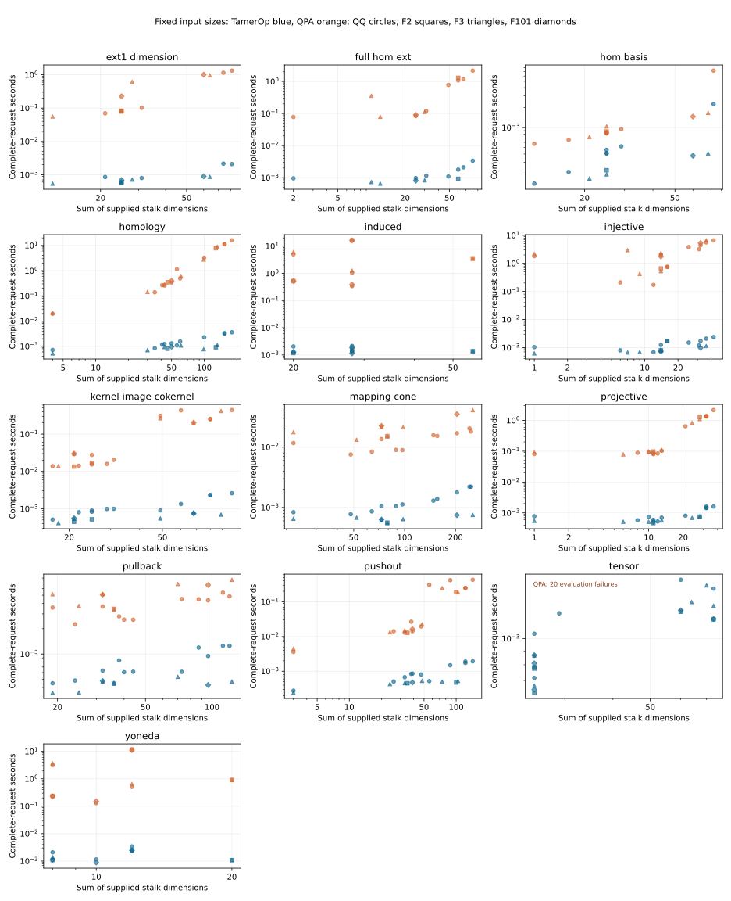

# Finite-module algebra: TamerOp and QPA

**Study completed 2026-10-03.** TamerOp returned independently verified answers
for all **220** fixed requests. QPA returned matching answers for **200**.
On those 200 completed comparisons, TamerOp was faster in every paired pass,
with a weighted geometric mean speed ratio of **135.70×** for native
construction plus the complete query. The approximate 95% interval is
**134.64–136.77×**.

These are measurements of compiled computation with previous mathematical
results discarded. They concern the development snapshot and machine specified
below. QPA's other 20 requests failed during elementary-tensor evaluation;
they remain incomplete comparisons, with no speed ratio.

[All benchmark results](index.md) · [Runtimes and sizes](#actual-runtimes-and-input-sizes) ·
[Machine and versions](#machine-and-versions) ·
[Download the results](#data-and-reproducibility)

## Why compare finite-module algebra?

In a finite encoding, the module on the finite poset is the object on which
we perform algebra. It records a vector space at each label and a linear map
for each order relation. For example, we can ask for all compatible maps from
one such module to another. This is a Hom computation: the answer is a basis
of actual maps, not just the number of maps in a basis.

QPA works with representations of quivers and algebras. The finite-poset
problems here can be expressed in that setting using arrows and relations
that enforce the same compositions. This gives the two programs a common
mathematical problem without requiring them to share data structures or
algorithms. QPA's implementation was left unchanged and used through its
supported interfaces.

The study begins with finite-module data. It does not time the construction
of an encoding from geometric regions or raw data. Ext and the other derived
answers belong to the stated finite category; the comparison does not assert
that they are unchanged when the encoding poset changes. See
[finite encodings](../finite_encodings.md) and
[mathematical categories](../math_categories.md) for that distinction.

## What was measured?

The primary measurement includes constructing the native inputs and producing
the complete requested answer. Separate timers also measure construction and
the query itself. Each phase starts from its own verified reset.

| Phase | Included work | Weighted QPA/TamerOp time |
| --- | --- | ---: |
| Native construction | Build native modules and, where needed, supplied maps, diagrams, and complexes | 3.94× |
| Complete query | Produce the requested mathematical answer from the native input, with no earlier query results | 201.62× |
| **Construction plus query** | **Both stages, measured together in one timer** | **135.70×** |

All three aggregates use the same 200 mathematically matched requests. The
total is measured directly; it is not obtained by adding separately measured
medians. Both tools start from a prepared finite category and decoded scalar
input. Category construction, scalar decoding, package loading, compilation,
answer export, and independent validation are outside these timers.

Methods and measurement wrappers were warmed before sampling. Earlier results,
resolutions, factors, and coordinate plans were then discarded and the reset
checked. Both tools could reuse intermediate work while answering a single
request. Thus the main result measures new computation after compilation,
not retrieval of a previously computed answer.

Five paired process passes used three independently reset samples per
tool, case, and phase, with order reversed between passes. There were **19,200
accepted timing rows** and 4,300 separately recorded warmup rows. Every accepted
row passed the reset checks; every accepted Julia row recorded zero compilation
and recompilation. No non-warmup rows were rejected for contamination.

## Results by mathematical request

The ratio below always uses construction plus the complete query. Ratios above
one favor TamerOp. The request descriptions matter: a dimension-only answer
and a full set of representative maps are different amounts of mathematical
work.

| Requested answer | Matched / planned | Weighted QPA/TamerOp time |
| --- | ---: | ---: |
| Complete Hom basis as module maps | 12 / 12 | 3.60× |
| Dimension of Ext¹ | 12 / 12 | 292.93× |
| Complete Hom maps, positive-degree Ext representatives, and their coordinates | 12 / 12 | 308.10× |
| Kernel, image, and cokernel, including structural maps | 20 / 20 | 78.40× |
| Projective or injective resolution, including its maps | 40 / 40 | 739.15× |
| Pushout or pullback, with canonical maps | 40 / 40 | 23.48× |
| Homology modules or a mapping cone, including maps | 40 / 40 | 132.87× |
| Yoneda product table: Ext¹ × Ext¹ → Ext² | 12 / 12 | 601.71× |
| Induced Ext maps in both arguments, in degrees 1 and 2 | 12 / 12 | 1387.50× |
| Balanced tensor product and elementary-tensor coordinates | 0 / 20 | No ratio: QPA evaluation errors |

For the combined Hom/Ext request and resolutions, the requested maximum degree
is three on the Boolean three-cube and two on the grid and capped crowns.
The product requests compute all products of the chosen Ext bases and express
them in the target basis. The tensor request includes evaluating elementary
tensors, not just returning a tensor-space dimension. Higher-degree Tor is
outside this comparison.

All 200 matched primary comparisons exceed the predeclared 10% practical
speed margin in every pass. The smallest case-level primary ratio is **1.76×**.
Construction alone is less uniform: **eight cases favor QPA in at least one
pass**. Those measurements remain in the downloads rather than being removed
from the study.

The horizontal axis allows a larger factor of the fastest verified completion;
the vertical axis counts the fraction of all 220 requests completed within
that factor. It gives every case equal weight, unlike the weighted aggregate
above. QPA's curve reaches 200/220 because its 20 tensor requests have no
verified completion time. One-sided completion contributes to coverage in
this plot, not to a numerical speedup.

## Actual runtimes and input sizes

Absolute runtimes show the practical size of these differences. The table
below gives construction-plus-query times for every request variant. All times are in
**milliseconds** (1,000 ms = 1 second), rounded to three decimal places.
Each time cell shows the **median across cases**, followed by the smallest
and largest case times in parentheses. Each case time is itself the median
of its five process-pass medians. The ranges describe different inputs, not
confidence intervals or repeated-run variation.

“Input dimension sum” adds the vector-space dimensions across all vertices
in the supplied module records. For a map or diagram request, several
modules contribute to that sum. It is not the number of poset vertices or
the side length of one matrix. The cases mix the stated module families and
fields; a larger sum alone need not mean a longer computation.

| Request | Cases | Input dimension sum | TamerOp ms: median (min–max) | QPA ms: median (min–max) |
| --- | ---: | ---: | ---: | ---: |
| Hom basis | 12 | 12–74 | 0.391 (0.143–2.266) | 0.863 (0.570–7.239) |
| Ext¹ dimension | 12 | 12–81 | 0.757 (0.542–2.154) | 164.583 (56.066–1,335.089) |
| Complete Hom/Ext | 12 | 2–81 | 0.962 (0.653–3.384) | 240.087 (78.012–2,180.459) |
| Kernel, image, cokernel | 20 | 17–99 | 0.803 (0.413–2.610) | 30.026 (13.452–441.323) |
| Projective resolution | 20 | 1–37 | 0.694 (0.465–1.602) | 101.116 (78.825–2,166.712) |
| Injective resolution | 20 | 1–42 | 1.008 (0.621–2.366) | 2,123.944 (171.368–6,637.038) |
| Pushout | 20 | 3–143 | 0.525 (0.240–1.935) | 20.953 (3.603–429.239) |
| Pullback | 20 | 19–123 | 0.509 (0.345–1.253) | 4.414 (2.255–7.638) |
| Homology | 20 | 4–180 | 1.085 (0.526–3.620) | 445.181 (19.458–16,045.105) |
| Mapping cone | 20 | 22–253 | 0.806 (0.552–2.211) | 15.550 (7.547–41.173) |
| Yoneda products | 12 | 8–20 | 1.269 (0.883–3.421) | 776.278 (129.790–11,717.391) |
| Induced Ext maps | 12 | 20–56 | 1.392 (1.147–2.150) | 2,339.180 (338.540–16,328.116) |
| Balanced tensor and evaluations | 20 | 25–73 | 1.109 (0.631–1.646) | No verified completion |

The speedup table above uses weighted, paired geometric means. Dividing
the two across-case medians here will generally give a different number:
these medians show the scale of the waiting time, while the speed ratios
compare the same input in each paired pass. Exact per-case times, sizes,
fields, and ratios are available in the [CSV](qpa_v1/timings.csv).

The tensor row reports TamerOp's 20 verified computations. QPA's failure
does not supply a completion time and is not included as a zero or an
infinite runtime. None of these times include package loading or compilation.

## Which inputs does this cover?

The suite contains 220 requests drawn from bounded synthetic input families,
including 40 base module pairs. Its posets are the Boolean three-cube with
8 vertices, a 4×4 grid with 16 vertices, and capped crowns with 9 or 17 vertices.
Modules include intervals, projective and injective controls, nonsplit
extensions, and modules specified by projective presentations. Pairs can have
different dimensions and supports. The suite also varies dimensions and
rational numerator and denominator sizes.

Coefficients are exact: rational numbers (QQ) or arithmetic modulo the primes
2, 3, and 101 (F₂, F₃, F₁₀₁). Field-specific correctness checks precede the
performance comparison; a field change is not assumed to preserve the answer.

| Coefficients | Matched requests | Weighted QPA/TamerOp time |
| --- | ---: | ---: |
| QQ | 101 | 94.29× |
| F₂ | 21 | 157.04× |
| F₃ | 57 | 167.92× |
| F₁₀₁ | 21 | 136.38× |

The per-request sum of supplied vector-space dimensions ranges from 1 to 253.
That sum is a useful input-size description, but does not determine difficulty:
maps, relations, coefficient sizes, and the requested output also matter.
These are finite, bounded examples, not evidence of asymptotic scaling on
arbitrarily large modules.

Each panel shows one request variant. Both axes are logarithmic. Blue points
are TamerOp and orange points are QPA; circles, squares, triangles, and diamonds
denote QQ, F₂, F₃, and F₁₀₁. The horizontal axis sums vector-space dimensions
over the supplied module records. Different families are not joined
into a single scaling curve. Open the figure to inspect the panels at full size.

The source and suite were frozen before confirmation. Of 36 requests reserved
for evaluation after that freeze, 32 have matched answers and a weighted
speed ratio of **111.82×**; the other four are QPA tensor failures. Those
evaluation cases are now exposed and must not be described as unseen in
future optimization studies.

## How were answers and aggregates checked?

Independent exact checks validate complete maps and their spans, representatives
and coordinates, resolution identities and exactness, diagram universal
properties, and complex differentials and homology. Product and induced-map
checks use comparison maps into an independently constructed normalized bar
resolution. Tensor checks verify the balancing relations. Agreement of
dimensions alone is not the acceptance test.

All 220 TamerOp answers and 200 QPA answers passed their independent checks.
The 20 QPA tensor requests failed elementary-tensor evaluation. All 120 worker
processes finished within their limits, with no operation timeout, worker
timeout, or recorded memory-cap breach. An independent reporting pass checked
the numerical aggregation and accounted for every missing timing cell.

The five mathematical areas each receive one fifth of the original weight:
Hom/Ext and its maps/products; module and tensor constructions; resolutions;
pushouts/pullbacks; and complexes. Within each area, weight is divided equally
among request variants, then fields, then cases. These are declared coverage
weights, not estimates of how often users perform each operation.

Within a pass, the median of three samples gives each tool's time. We divide
QPA's time by TamerOp's and aggregate the logarithms using the fixed weights.
The reported ratio is the geometric mean over the five pass aggregates. The
approximate 95% interval uses a t interval on those five log aggregates
(four degrees of freedom). It describes variation for this fixed suite on
this host, not uncertainty over all possible modules or machines. Giving all
matched cases equal weight instead produces **129.08×**.

The matched pairs account for **90% of the original weight**. That 90% consists
of practical wins; the remaining 10% is unresolved. The predeclared requirement
for a numerical score over all 220 cases was therefore not met. The 135.70×
result is conditional on the 200 completed pairs, alongside a separate
completion advantage. It is not a 220-case speed score.

## Machine and versions

These specifications come from the metadata recorded for the actual run.

| Component | Recorded configuration |
| --- | --- |
| CPU | 13th Gen Intel Core i7-1365U; 10 physical cores, 12 logical CPUs |
| RAM | 32,504,468 KiB reported by Linux, approximately 31.0 GiB usable |
| Platform | x86-64 Linux, kernel 6.8.0-106-generic, glibc 2.35 |
| Julia | 1.12.1 |
| TamerOp | Frozen development candidate `qpa-v1-529681519b5d1b40` |
| Exact-algebra dependencies | Nemo 0.54.1; AbstractAlgebra 0.48.2; FLINT_jll 301.400.1+0 |
| GAP / QPA | GAP 4.16.1 / QPA 1.37 |
| Parallelism | One Julia thread and one BLAS thread; benchmark workers run serially |
| Host use | Shared host, not exclusively reserved; sampled one-minute load 1.14–3.26, median 1.55 |
| Limits | 60 seconds per operation; 900 seconds per worker; 4096 MiB process RSS cap |

GAP used its released source with build configuration enabling its existing
monotonic `clock_gettime` timer (`CPPFLAGS=-D_GNU_SOURCE -include time.h`).
Clock checks passed before measurement. No QPA algorithms or source were
patched. The CPU was not claimed to run at a fixed frequency, and the machine
was not exclusively reserved; the intervals describe the observed runs under
those conditions.

The TamerOp snapshot includes tested changes on top of commit
`7bd0a7c9bb361be022ce6acf2544b803dc8f5577`. The commit alone does not identify
the measured code, and this page does not attribute the results to a tagged
release. The [provenance record](qpa_v1/provenance.json) supplies the candidate,
source-snapshot, dependency-manifest, and evidence hashes.

## Memory

Peak sampled process resident memory was **1494.5 MiB for TamerOp** and
**138.7 MiB for QPA**. TamerOp therefore used substantially more process memory
in this campaign despite its lower computation times.

Resident memory includes the runtime, compiled code, temporary allocations,
and mathematical objects. It is not the retained size of a module or result.
The per-request allocation counters are supplied separately in the data;
Julia's counter excludes native FLINT allocations. This study did not remeasure
retained mathematical storage, and the allocation counters should not be read
as a complete cross-runtime memory comparison.

## Data and reproducibility

The public results accompany this page:

- [Summary JSON](qpa_v1/results.json): full-precision aggregates, intervals,
  field and request breakdowns, completion counts, and resource observations.
- [Per-case CSV](qpa_v1/timings.csv): all 220 cases in all three phases,
  including absolute times, ratios, allocations, weights, and unresolved rows.
- [Per-pass observations](qpa_v1/observations.json): the five process medians,
  sample counts, verification status, pass ratios, and output-file sizes.
- [Provenance and machine metadata](qpa_v1/provenance.json) and
  [SHA-256 checksums](qpa_v1/SHA256SUMS).
- Figures: [performance profile](qpa_v1/performance_profile.svg) and
  [runtime against input size](qpa_v1/input_sizes.svg).
- [Data dictionary](qpa_v1/README.md): units, phase names, missing values,
  weighting, and how to interpret the downloads.

The numerical files and figures are unmodified copies of the reviewed final
report outputs. The provenance record selects machine and source information
without publishing local paths or unrelated host details. This is a public
results package, not yet a portable benchmark runner. The raw samples,
fixtures, adapters, validators, and frozen source are retained in the local
evidence archive; a self-contained reproduction bundle remains separate work.
The downloads support inspection and recomputation of the reported aggregates,
but do not by themselves rerun the mathematical computations.

For measuring your own workload, follow the
[benchmarking manual](../benchmarking.md), particularly its distinction between
compilation, a new computation, and reuse of retained results.
