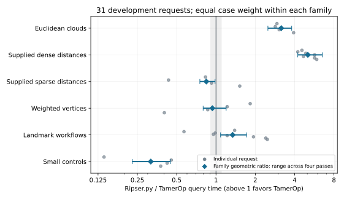
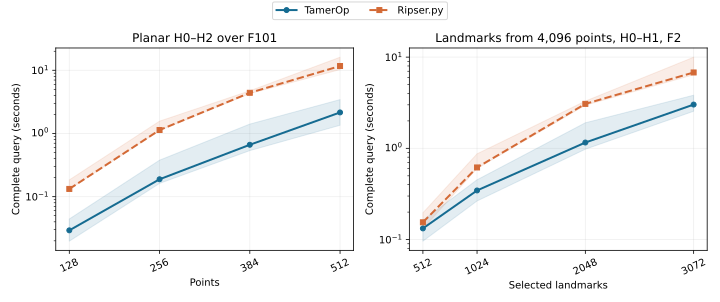

# Vietoris–Rips persistence: TamerOp and Ripser.py

**Final comparison v1, 2026-10-05.** Both programs completed all **37 requests**
with verified outputs: 31 previously studied development requests and six
evaluation cases reserved before optimization. TamerOp's strongest measured
advantages include the larger circle and planar H₂ computations. Landmark
performance depends on the selected subset, and several small requests favor
Ripser.py. The complete tables preserve those differences.

The 1,024-point circle takes **7.01 s versus 30.4 s**;
the 512-point planar H₀–H₂ request takes **2.15 s versus 11.7 s**.
These are compiled computations with fresh mathematical work, not cached
answer retrieval or the time to launch a new Julia session.

[All benchmark results](index.md) · [Actual runtimes](#development-requests) ·
[Reserved evaluation](#reserved-evaluation-cases) · [Machine](#machine-and-versions) ·
[Downloads](#data-and-reproduction)

## The mathematical question

As a distance threshold increases, a Vietoris–Rips complex adds edges between
nearby points and fills every clique with its simplex. Both programs must
return the complete ordinary barcode through the requested homology degree,
including essential classes. Marked requests also retain cocycles: cochains
representing the corresponding cohomology classes. Their coefficients need
not match to describe valid classes.

For this ordinary one-parameter question, the barcode is a complete description
up to isomorphism under the finite-filtration assumptions. TamerOp computes it
directly. Its finite-encoding pipeline remains the route for questions needing
the retained module and maps, particularly with several parameters; this
comparison does not measure those operations.

Inputs include Euclidean clouds, supplied dense and sparse distances, graphs
with weighted vertex births, and landmark selection. A landmark request starts
with a supplied complete distance matrix and includes selecting the subset,
its full distance table and coverage information, and persistence on the
selected points. Sparse omissions are absent edges; stored zeros remain edges.
The fields are F₂, F₃ and F₁₀₁. Requests include H₀–H₁ and H₀–H₂, plus a small
H₃ control. Homology cycles, arbitrary chain complexes, extended and zigzag
persistence, and multiparameter invariants are outside this study.

## Timing and interpretation

The primary timer covers the complete public query from each tool's native
input container. Native construction is timed separately. Construction plus
query is the sum of the two measured stages for each sample; it is **not** a
single uninterrupted end-to-end timer. Parsing, fixture generation, answer
serialization and verification are outside both stages.
Construction starts from eagerly decoded JSON rows: typed Float64 row vectors
in Julia and lists of numbers in Python. Its comparison concerns that declared
adapter boundary, not every possible data-loading workflow.

Native output differences remain explicit. TamerOp's landmark result retains
nearest-distance data; its covering-radius accessor takes the maximum during
verification, outside timing. Ripser.py returns that scalar directly. Cocycles
requested from TamerOp also include H₀ information, whereas Ripser.py retains
positive-degree representatives. That additional native work stays in the timer.
Scale-specific extraction of TamerOp cocycles is used for verification here;
it is not an additional timed capability shared with Ripser.py.

Four paired process passes reverse tool order and case order on alternate
passes. Each case receives a discarded warmup, followed by three accepted
computations on fresh inputs and call-local mathematical state. TamerOp uses
`cache=nothing`; neither tool reuses a previous graph, reduction or answer.
Normal reuse within a computation is preserved. All **888 accepted samples**
passed input/reset and output-consistency checks; Julia's accepted native
construction and query samples recorded zero compilation and recompilation.
There were **0 rejected compilation-contaminated samples**.

Times in the tables are medians of four process medians. Speed ratios are
geometric means of the four paired process ratios, so they need not equal the
quotient of the displayed median times. Ranges show the minimum and maximum
across those four passes, **not confidence intervals**. The symmetric practical
similarity band is 1/1.10–1.10. Small absolute delays and substantial multi-second
savings have different practical importance even when their relative ratios
look similar.

An untimed adapter-order error was caught at the start of the second pass.
The affected partial attempts were preserved and excluded, and that pass was
restarted with the declared case order. The valid first pass remains. The
final accepted workers all match their recorded case order; neither library
changed. The local archive retains the correction and recovery records.

## Results by development family

These are the **31 development requests used during optimization**. They
measure the final candidate on familiar workloads. Cases receive equal weight
within each family; the six families receive equal weight in the explicitly
labeled development aggregate. They are not a random sample of user workloads.

| Family | Requests | Query ratio | Paired-pass range | Interpretation |
| :--- | ---: | ---: | ---: | :--- |
| Euclidean clouds | 4 | 3.16 | 2.5–3.8 | TamerOp 3.16× as fast |
| Supplied dense distances | 7 | 5.05 | 4.23–6.53 | TamerOp 5.05× as fast |
| Supplied sparse distances | 4 | 0.843 | 0.752–0.984 | Ripser.py 1.19× as fast |
| Weighted vertices | 4 | 0.938 | 0.797–1.2 | Similar; Ripser.py slightly faster |
| Landmark workflows | 8 | 1.34 | 1.08–1.72 | TamerOp 1.34× as fast |
| Small controls | 4 | 0.317 | 0.229–0.448 | Ripser.py 3.16× as fast |

All ratios divide Ripser.py time by TamerOp time; values above one favor TamerOp.

| Development aggregate phase | Ripser/TamerOp | Paired-pass range |
| :--- | ---: | ---: |
| Native construction | 4.11 | 3.51–5.23 |
| Complete query | 1.32 | 1.18–1.49 |
| Construction plus query | 1.79 | 1.58–2 |

The family-balanced query aggregate is **1.32**. It summarizes
this declared development suite; it does not establish a universal speedup or
give the reserved cases the status of an independent replication of that aggregate.

Gray points retain individual requests, including losses. Blue diamonds show
family ratios; bars show paired-pass ranges. The shaded band marks practical
similarity, not statistical equivalence. The horizontal scale is logarithmic.
[Full-size figure](ripser_v1/presentation/family_ratios.svg).

## Development requests

Times are **milliseconds**; a degree label H₂ includes H₀, H₁ and H₂. Input size
means points or vertices, with the selected landmark count shown separately.
The interval count includes all returned degrees and essential bars, excluding
zero-length intervals. Retained cocycles are computed inside the query timer.

| Request | Input size | Field / through | Cocycles | Intervals | TamerOp (ms) | Ripser.py (ms) | Ripser/TamerOp |
| :--- | ---: | :--- | :--- | ---: | ---: | ---: | ---: |
| Circle (point cloud) | 96 | F2 / H1 | No | 97 | 5.81 | 20 | 2.93 |
| Sphere (point cloud) | 64 | F3 / H2 | Yes | 81 | 13.8 | 41.8 | 2.84 |
| Sphere (point cloud) | 128 | F101 / H2 | No | 166 | 156 | 530 | 3.04 |
| Circle (distances) | 1,024 | F2 / H1 | No | 1025 | 7,010 | 30,400 | 4.55 |
| Sphere (distances) | 96 | F3 / H2 | Yes | 128 | 39.6 | 162 | 4.23 |
| Planar points (distances) | 128 | F101 / H2 | No | 154 | 29.3 | 133 | 4.87 |
| Grid graph | 256 | F2 / H1 | No | 481 | 0.469 | 0.341 | 0.831 |
| Cycle graph | 96 | F3 / H1 | Yes | 97 | 0.363 | 0.144 | 0.433 |
| Octahedral components | 96 | F101 / H2 | Yes | 112 | 0.598 | 0.499 | 0.924 |
| Grid graph (weighted vertices) | 256 | F2 / H1 | Yes | 481 | 0.794 | 1.26 | 1.83 |
| Grid graph (weighted vertices) | 4,096 | F2 / H1 | No | 8065 | 4.16 | 4.15 | 1.22 |
| Octahedral components (weighted vertices) | 96 | F101 / H2 | Yes | 112 | 0.658 | 0.51 | 0.865 |
| Greedy landmarks | 256 / 32 landmarks | F2 / H1 | No | 41 | 0.546 | 0.721 | 1.39 |
| Greedy landmarks | 2,048 / 128 landmarks | F2 / H1 | No | 186 | 13.9 | 7.66 | 0.569 |
| Greedy landmarks | 256 / 64 landmarks | F3 / H1 | Yes | 89 | 2.28 | 2.35 | 0.988 |
| Greedy landmarks | 512 / 96 landmarks | F101 / H1 | Yes | 136 | 5.29 | 5.03 | 0.956 |
| 3-sphere control | 8 | F2 / H3 | No | 9 | 1.45 | 0.188 | 0.139 |
| Octahedral components | 6 | F3 / H2 | Yes | 7 | 0.313 | 0.128 | 0.455 |
| Equal-grade control | 8 | F101 / H2 | Yes | 8 | 0.31 | 0.121 | 0.423 |
| Stored-zero cycle | 6 | F2 / H1 | Yes | 5 | 0.262 | 0.097 | 0.377 |
| Planar points (distances) | 512 | F101 / H2 | No | 643 | 2,150 | 11,700 | 5.69 |
| Greedy landmarks | 4,096 / 512 landmarks | F2 / H1 | No | 766 | 133 | 155 | 1.22 |
| Greedy landmarks | 4,096 / 1,024 landmarks | F2 / H1 | No | 1548 | 346 | 618 | 1.94 |
| Greedy landmarks | 4,096 / 3,072 landmarks | F2 / H1 | No | 4426 | 3,020 | 6,790 | 2.4 |
| Circle (point cloud) | 512 | F2 / H1 | Yes | 513 | 643 | 2,850 | 3.93 |
| Circle (distances) | 256 | F2 / H1 | No | 257 | 59.4 | 304 | 4.68 |
| Grid graph | 4,096 | F2 / H1 | No | 8065 | 2.66 | 4.07 | 1.52 |
| Cycle graph (weighted vertices) | 96 | F3 / H1 | Yes | 97 | 0.371 | 0.145 | 0.402 |
| Planar points (distances) | 256 | F101 / H2 | No | 313 | 189 | 1,130 | 5.68 |
| Planar points (distances) | 384 | F101 / H2 | No | 477 | 663 | 4,400 | 5.91 |
| Greedy landmarks | 4,096 / 2,048 landmarks | F2 / H1 | No | 3071 | 1,160 | 3,070 | 2.47 |

Bands show the range of four process medians. Lines connect the declared
instances; they do not predict unmeasured sizes. The planar instances also
differ in geometry. The landmark sequence uses the same 4,096-point metric.
Vertical scales are logarithmic to keep both short and long requests visible.
[Full-size figure](ripser_v1/presentation/bounded_sizes.svg).

The small-subset landmark request takes **13.9 ms versus
7.66 ms** at 2,048 points and 128 landmarks. The 3,072-landmark
request takes **3.02 s versus 6.79 s**.
TamerOp validates the complete supplied distance matrix and retains its normal
public outputs. Both implementations use farthest-point selection. These
different outcomes should not be reduced to a single claim about all landmark
workflows. Small sparse, weighted and algebraic controls likewise retain their
measured relative losses even where the absolute delay is below a millisecond.

## Reserved evaluation cases

These **six recipes were reserved before optimization** and first generated
after the candidate was frozen. They include a jittered circle, new planar and
spherical samples, relabeled grid and octahedral graphs, and a new dyadic
landmark metric. No code was tuned after seeing their outcomes. Relabeling
tests sensitivity to vertex order; it does not introduce a new module type.
They are a small separate generalization check, not evidence about all inputs.

| Request | Input size | Field / through | Cocycles | Intervals | TamerOp (ms) | Ripser.py (ms) | Ripser/TamerOp |
| :--- | ---: | :--- | :--- | ---: | ---: | ---: | ---: |
| Jittered circle (point cloud) | 512 | F2 / H1 | Yes | 513 | 854 | 3,510 | 4.13 |
| Random planar (distances) | 128 | F101 / H2 | No | 159 | 25.4 | 127 | 4.83 |
| Random sphere (distances) | 96 | F3 / H2 | Yes | 124 | 49.7 | 186 | 3.81 |
| Permuted grid | 4,096 | F2 / H1 | No | 8065 | 4.19 | 7.69 | 1.85 |
| Permuted octahedra (weighted vertices) | 96 | F101 / H2 | Yes | 112 | 0.747 | 0.621 | 0.832 |
| Greedy landmarks | 2,048 / 128 landmarks | F2 / H1 | No | 187 | 15.7 | 7.9 | 0.546 |

## Correctness and remaining limits

All **148 paired case/pass checks** passed. Supplied grades are exactly
Float32-representable, so complete interval multisets agree exactly. Native
Euclidean clouds form a separate numerical lane: TamerOp uses Float64 distances,
while Ripser.py converts filtration grades to Float32. Endpoints are compared
at eight Float32 epsilons times their scale; possibly collapsed tiny bars are
counted explicitly in the downloadable verification record.

Independent checks reconstruct landmark choices, retained tables and covering
radii. Small controls use oriented boundary reduction; graph families use
independent formulas or componentwise reduction. Every accepted computation
matches its process's first complete mathematical export, covering all bars,
requested landmark metadata and the selected witness cochains.

The verifier checks up to six longest positive-degree cocycles per degree.
All **520 sampled witness checks** establish closure and nontriviality,
with restriction to an earlier scale where applicable. For large connected H₂
examples, a separate exact sparse linear-system test proves that the sampled
cochain is not a coboundary. This closes the earlier sampled nontriviality gap;
it does **not** certify every returned cochain or identify all large-output
bases across tools. Small controls also compare complete class spaces.

The frozen mathematical implementation matches the one that passed 1,147,270
focused Rips, A115 and A117 assertions. Its only subsequent source difference
is a visualization builder outside these calls. That owner-level evidence and
the final cross-tool checks are not a claim that the entire package test suite
was rerun. The strengthened verifier also passes its independent test set.

## Machine and versions

| Item | Configuration |
| :--- | :--- |
| Processor | 13th Gen Intel(R) Core(TM) i7-1365U; 10 physical cores / 12 logical CPUs |
| RAM | 31.00 GiB OS-visible |
| System | Linux-6.8.0-138-generic-x86_64-with-glibc2.35 |
| Julia | 1.12.1 |
| Python | 3.12.3 |
| Comparator | Ripser.py 0.6.15, Robin Hood 3.11.5, `-O3` |
| Execution | One numerical thread; serial workers pinned to logical CPU 0 |
| Limits | 7 GiB worker RSS; 180 s per phase; 420 s startup; 3,600 s per worker |
| Host activity | One-minute load min/median/max: 1.29 / 4.12 / 7.02 |

No worker hit a time or memory limit. Completed workers took about
**53.5 minutes in total**, including loading, compilation,
warmup, input decoding, output checks and compression. That duration is not the
time spent on the mathematical requests alone. The machine was not exclusively
reserved; monitored activity and run-to-run variation remain part of the evidence.

This uses Ripser.py's supported optimized source build, not a search over all
compiler configurations. Its extension hash was checked before launch.
TamerOp is the frozen development source listed in the downloadable hashes,
including unreleased improvements; a version number or Git commit alone does
not identify this working-tree snapshot. Existing package-cache flags were
used for loading, so first-use records are diagnostic and do not measure a
normal freshly installed package's startup.

## Allocations and memory

Julia allocation traffic, native retained-output estimates, current process
RSS and process high-water RSS are distinct measurements. The downloads keep
them separate. Python allocation traffic is unmeasured; it must not be treated
as zero. Neither runtime's retained-output estimate is an exact measure of
mathematical storage. Full-process RSS includes runtime and compiled code,
inputs, working memory and allocations retained by the allocator.

The largest monitored worker RSS was **3.09 GiB**.
Per-case Julia allocations and per-tool RSS/output estimates are in the CSV.
No memory-based speed ranking is substituted for elapsed computation time.

## Data and reproduction

- [All case times, sizes, allocations and memory estimates](ripser_v1/summary.csv).
- [Process medians, paired ratios and family summaries](ripser_v1/summary.json).
- [Every accepted timed sample](ripser_v1/accepted_samples.json),
  [rejected samples](ripser_v1/rejected_samples.json) and [first-use diagnostics](ripser_v1/first_use.json).
- [Mathematical verification](ripser_v1/verification.json) and
  [completion checks](ripser_v1/completion_checks.json).
- [Fixed manifest](ripser_v1/manifest.json), [reserved recipes](ripser_v1/heldout_reservation.json),
  [source hashes](ripser_v1/candidate_hashes.json), [harness hashes](ripser_v1/harness_hashes.json),
  [comparator build](ripser_v1/build_verified.json) and [Python dependencies](ripser_v1/python-freeze.txt).
- [Machine record](ripser_v1/machine.json), [data notes](ripser_v1/README.md) and
  [integrity checksums](ripser_v1/SHA256SUMS).

The public data support checking the tables and figures. The complete local
archive also retains input files, frozen sources, worker scripts, compressed
mathematical outputs and resource logs. That archive and the benchmark harness
are intentionally excluded from Git; this download is **not yet a portable
bundle for rerunning the computations**. A later reproduction release must
include the inputs and pinned environments. No previous development times are
pooled into this final study.

This closes the fixed Ripser.py v1 comparison. It establishes the reported
workload-specific performance and correctness evidence; it does not assert
that every possible optimization is exhausted or rank TamerOp's broader
finite-encoding functionality against a Rips persistence engine.

The [benchmarking manual](../benchmarking.md) explains the shared protocol.
Comparator references: [Ripser.py interface](https://ripser.scikit-tda.org/en/latest/reference/stubs/ripser.ripser.html),
[supported source build](https://ripser.scikit-tda.org/en/latest/), and
[Ripser algorithms](https://doi.org/10.1007/s41468-021-00071-5).
