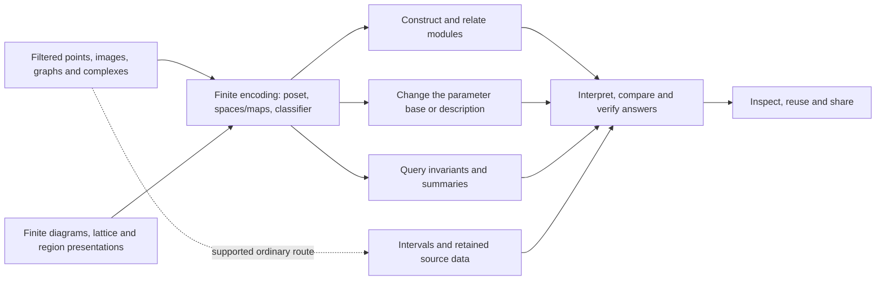

# A coherent documentation programme

This is an authoring plan for the whole library, including the complete
mathematical, computational and visualization programme in the project review.
It explains how the five main article families fit together. It does not
advertise planned operations as available. The [article catalog](article_inventory.toml)
owns individual questions, scopes, canonical sources and migration decisions;
the [coverage manifest](api_coverage.toml) owns API coverage. Implementation
status and validation evidence remain in development records.

## The argument that holds the manual together

A persistence module can come from filtered points, images, graphs or supplied
complexes. It can also be specified directly: a finite diagram of spaces and
maps, a lattice presentation, or regions and a coefficient matrix on a real
parameter domain. Those are first-class mathematical inputs. They do not need
a point-cloud interpretation to justify their place in the library.

The central junction is a **finite encoding**: a finite poset, the module on
it, and the classifier relating it to the original parameter domain. Explain
how that description recovers spaces and maps before asking what we can do
with it. Exact recovery concerns the chosen input module; it does not undo an
earlier approximation, truncation, grid choice or numerical geometry decision.
Lazy evaluation can preserve the same mathematical description while computing
only what a question requires.

From that junction, give algebraic and categorical work as much prominence as
invariants. Readers should recognize morphisms, kernels, images, quotients,
sums and tensor products, universal constructions, resolutions, Ext/Tor,
complexes, connecting maps, change of poset and Kan extensions as useful
questions they can pursue. Filtration-derived modules can use these tools too.
State category and comparison hypotheses where they matter; retaining an
ambient module does not make every finite-category derived computation
independent of its encoding.

Ranks, slices, signed summaries, decompositions, features and figures then
answer selected questions about the object. They retain different information.
Ordinary persistence has a legitimate compact direct route to intervals when
those intervals supply the answer; do not imply that every such call constructs
a materialized encoding. Source representatives, cohomological products,
relative/extended constructions and temporal computation have their own
explicit data and map requirements.

This is a narrative overview, not an execution graph for every API call or the
mathematical poset underlying an example. Individual pages explain the route
their actual computation takes.

## Five purposes, developed vertically

The mathematical collection develops understanding. Library guides explore
capabilities and consequential choices. Recipes finish already-defined tasks.
API reference settles precise contracts. Implementation accounts explain how
the computation works and why its representation and algorithm choices matter.
These are independent entrances, not five compulsory stages or difficulty
levels. A topic may need several treatments; a small optimization rarely needs
a new article in every family.

The stable IDs below are authoring references, not links to unwritten pages.
Lists express meaningful grouping and possible progression; they do not
duplicate article status or source paths from the catalog.

### Mathematics: a complete curriculum around the finite object

The current full plan contains 50 lessons. Preserve the first two entrances:
the ring example and definitions of persistence modules. Teach finite
encodings as their shared junction, then make input construction, algebra,
transport and invariant branches visible. Derived algebra must not become a
prerequisite for selecting a rank query or interpreting a feature vector.

Keep a small family of reusable examples rather than one universal dataset:

- Ring, triangle and filling: intervals, chains, cocycles and source data.
- Square and two-square presentation: classifier recovery, active matrices,
  sums, slices, support and signed reconstruction.
- Diamond and two-source fork: naturality, exactness, generated submodules,
  Hom, splitting and generalized-rank distinctions.
- A nonzero complex/resolution: degree, signs, Betti/Bass, Ext/Tor, connecting
  maps and successive pages. Choose an example that exhibits the claimed effect.
- A voxel cavity and a small geometric cloud: construction choices, topology,
  boundaries, periodicity, exact grades and known events.
- A finite chain/add-delete sequence: pairs, extended and zigzag intervals,
  induced matching and incremental versus independently recomputed answers.
- An aligned small collection: signed transport, features, distortion and
  statistical variation with stated assumptions.

Coefficient changes receive their own lesson; they are neither basis changes
nor merely a display setting. Cohomology is a foundation for products and
coordinates. Relative pairs precede a separate extended-persistence lesson.
Interleaving witness equations have a separate treatment from choosing and
interpreting a distance. These splits keep substantial new definitions out of
already broad guides and preserve the approachable opening of each lesson.

#### One graph, several views, complete mathematical coverage

Every authored and published mathematical article should appear as a node in
at least one focused map view and in the same accessible outline. That includes
advanced and definition-led chapters. The present `math_categories` chapter is
an existing example of a page reached by a continuation but lacking its own
map node; the expanded map must close that coverage gap.

Use a compact overview and focused branch diagrams of **one graph**. Start with
Foundations, Inputs and descriptions, Maps and algebra, Resolutions and derived
questions, Transport, Summaries and comparisons, and Topological variants.
Subgroups in the complete relation below can be local sections of those views.
Show a lesson's local neighborhood when that helps orientation. An expandable
outline supplies the complete mathematical collection without JavaScript.
Do not shrink dozens of cards onto the introductory canvas.

The graph is a recommended reading order; its acyclic relation induces an order
on articles. Its arrows are not persistence-module structure maps, and incoming
arrows do not mean all predecessors must be read. Keep three relations distinct:

1. Knowledge needed for an example, which a reader may already possess or a
   lesson may supply briefly.
2. Suggested learning continuations, used by the map and lesson endings.
3. Thematic cross-links, used by the separate topic map across all five families.

At implementation time, extend the existing route owner and renderer rather
than adding an independently maintained graph for each view. The article
catalog supplies identity/type and publication supplies availability; route
metadata supplies edges, entry choices, focused-view membership and footer
destinations. Reconcile the current short node aliases with stable article IDs
without breaking URLs. Compute overview/focused views from that joined graph;
store layout choices separately from prerequisite meaning.

Keep both entry choices visible at narrow widths, setup beside the lesson,
optional detours labelled and distinguishable without color, and a usable
keyboard/text outline. A footer can offer one primary and one optional
continuation even when a focused map exposes several branches. Check cycles,
published-lesson coverage, endpoint links, unclipped mathematics and real
desktop/mobile/light/dark rendering. The current fixed-coordinate diagram
needs a deliberate renderer/data-model change for this expansion; this plan
does not silently wire nonexistent pages into it.

The complete planned lesson relation appears in the appendix below. It is an
authoring design; migrate actual routes only as sources are ready and reviewed.

### Library use: investigations with a clear stopping boundary

A guide begins with a recognizable mathematical object and explores useful
operations and choices on it. Figures belong beside the investigation. Common
session setup or export controls are shared explanations, so every algebraic
guide need not become another GUI manual.

| Investigation | Canonical guide IDs | Boundary and progression |
| --- | --- | --- |
| Choose and construct an input | `guide_inputs`, `ingestion_options`, `guide_presentations` | Overview first; input decisions and direct finite/lattice/region construction have their own sustained treatment. All routes return to the finite-object question. |
| Understand geometric construction choices | `multicover`, `rhomboid_depth`, `exact_grades` | Coverage, depth and grade semantics remain beside use; geometry algorithms belong in implementation. Ordinary input choices link here as appropriate. |
| Investigate one module or a map between modules | `guide_spaces_maps`, `guide_morphisms`, `guide_generated_submodules` | Structure maps inside one object, natural transformations between objects and propagation-generated subobjects are distinct questions. Include actual algebraic views at the relevant step. |
| Request algebraic computations | `guide_resolutions`, `guide_derived`, `guide_complexes`, `numerical_algebra` | Cheap tables/dimensions before full terms and representatives; category, variance, signs, numerical decisions and output costs are explicit. |
| Change a description or base | `compare_encodings` | Restriction, realized refinement and Kan transport with actual maps; distinguish changed representation from changed question. |
| Follow topology and source information | `ordinary_persistence`, `guide_representatives`, `guide_temporal_persistence`, `guide_persistent_products`, `guide_coordinates` | Intervals, retained chains/cochains, time-dependent diagrams, multiplication and coordinate construction each have their own data and guarantee. |
| Choose a summary or comparison | `guide_generalized_rank`, `guide_decomposition`, `guide_approximation`, `exact_matching`, `guide_slices_diagrams` | Scalar queries and witnesses, true summands, approximation guarantees, finite-window optimization and interval exploration remain separately scoped. |
| Analyze results and collections | `guide_features`, `guide_signed_transport`, `guide_uncertainty`, `guide_learned_gril` | Feature choices precede collection analysis; signed mass, sampling uncertainty and learned parameters retain their own contracts. |
| Inspect and share a view | `visualization`, `guide_live_inspection`, `guide_comparisons`, `guide_visualize_share` | Choose a view; manage live selection; align compared objects; compose/export/reopen. Subject-specific mathematics stays in its guide. |
| Repeat or exchange work | `lazy_inspection`, `reuse_computations`, `guide_data_io` | Know what is already represented, what computation is requested, what is reused and what survives an artifact or external interface. |

These 35 guide homes include existing articles to narrow or extend. A guide
may offer a small variation, but should not collect every operation sharing a
source module. A growing section becomes an article only when it owns a
distinct reader question, input/output contract and coherent example.

### Recipes: bounded tasks rather than shortened manuals

Organize recipes by the desired result, preserving installation as a permanent
entrance. Each starts from known input, performs a runnable computation, and
ends with an answer the reader can recognize and check. Link optional
exploration at the point of need; do not duplicate an entire guide's choices.

| Task group | Recipe IDs | Recognizable outcome |
| --- | --- | --- |
| Start or diagnose a session | `installation`, `julia_basics`, `troubleshooting`, `optional_integrations`, `contract_errors` | A working environment, activated capability or understood contract failure. |
| Bring in or define an object | `external_data`, `build_module`, `build_presentation`, `construction_budget`, `voxel_cavity`, `python_workflow` | A checked mathematical input, known cavity interval or verified interface result. Direct module construction is as visible as raw data. |
| Do algebra or transport a query | `query_structure_map`, `kernel_quotient`, `compute_hom_ext`, `transport_encoding` | An actual map/subquotient/class and the equations establishing its meaning. |
| Obtain a summary or witness | `chosen_slice`, `query_region_invariant`, `distance_witness`, `verify_interleaving` | A specified interval/rank/cost or validated pair of certificate equations. |
| Relate topology to source or coefficients | `relative_pair`, `trace_source_class`, `choose_coefficients` | A quotient-class answer, active source chain or interpreted field change. |
| Compare or repeat an experiment | `ordinary_analysis`, `feature_table`, `repeat_queries`, `cdd_concurrency` | Compatible columns or results, verified reuse, or a safely owned concurrent calculation. |
| Preserve a result | `save_reload`, `export_figure`, `reopen_session`, `compose_figure` | Recovered mathematical queries, a faithful figure, or explicitly supported reopened interaction. |

The plan has 30 recipe homes, including existing rewrites. This is not a recipe
for every feature or option. In particular, `cdd_concurrency` currently states
an important contract; its recipe migration needs a runnable task and
recognizable result, while internal lock mechanics move to B49. A catalogue of
optional integrations should not replace the bounded activation procedure.

Exploratory input/visual recipes are notebook-first. Deterministic scripts can
check their mathematics without becoming a second independently authored
tutorial. Gallery entries reuse canonical examples and figure identities;
do not maintain a competing notebook for the same calculation.

### API reference: canonical contracts with several ways to find them

Reference is organized by mathematical task and result, with owner and symbol
indexes as lookup aids. One generic can have materially different method
families; aliases should lead to one canonical contract for each family. A
visual consumer links to the rank or Hom contract it calls rather than copying
it. A first-path reference is a curated entrance to those entries, not a second
set of signatures to maintain.

| Reference group | Article IDs | Ownership |
| --- | --- | --- |
| Orientation and shared option rules | `ref_first_learning_path`, `ref_api_organization`, `option_contracts` | Mathematical entrypoints, root/Advanced/qualified access and effective-option rules; links to domain methods. |
| Inputs and finite descriptions | `ref_inputs`, `ref_modules`, `ref_encodings` | Construction, finite diagrams/presentations/morphisms and ambient classifier/query contracts. |
| Algebra and categorical transport | `ref_complexes`, `ref_resolutions`, `ref_derived`, `ref_change_of_posets` | Degrees, variance, category, exactness, bounds, returned maps and comparison hypotheses. |
| Persistence computations | `ref_ordinary_persistence`, `ref_persistence_variants` | Shared ordinary result/analysis contracts versus pair/extended/zigzag/update applicability. |
| Queries, comparisons and features | `ref_invariants`, `ref_comparisons`, `ref_decomposition`, `ref_features` | Query domains versus measured objects/witnesses, certified structural results and numerical/learned/statistical outputs. |
| Views and interaction | `ref_visualization`, `ref_visual_sessions` | Specification/render/style/export versus selected state, events, editor mutation, lifecycle and offline assets. |
| Shared execution and exchange | `ref_io`, `ref_results`, `ref_fields` | Saved data/validation, cheap accessors/provenance/retention and field/grade/numerical policies. |

The 21 reference homes are page plans, not evidence of method completion.
Keep existing API family/owner assignments provisional where method review is
pending. New subordinate destinations do not manufacture new public symbols.
Review shared generic methods and overrides on the integrated runtime, then
update coverage once. Generated inventories remain generated.

Every substantive entry explains the mathematical object, accepted input,
field/category/degree/window conventions, exact or numerical guarantees,
returned data and semantic accessors, errors and unsupported cases, and
consequential work/storage costs. Document cheap defaults and optional
materialization explicitly. Examples and availability must match the package
version used by the page; a planned article never proves a callable API exists.

### Implementation: follow coherent computations, including optimization

Preserve B01-B70 identities. Add B71 for learned-probe/differentiation machinery
and B72 for ensemble alignment/statistical inference: those are substantial
computations, distinct from the individual transforms in B43. The remaining
optimization programme extends the relevant account; a benchmark campaign or
threshold adjustment does not receive a new algorithm chapter by default.

| Computation family | Account IDs | Internal progression and links |
| --- | --- | --- |
| Arithmetic and routing | B01-B05 | Exact coordinates, rank/nullspaces, fields, numerical contracts, selected backend policy. |
| Finite algebraic representation | B06-B08 | Posets/maps, presentation fibers and universal constructions. |
| Encodings and transport | B09-B15 | Signature/lattice/box/polyhedral descriptions, exact grades, geometric observables and change of poset. |
| Filtered input and lazy evaluation | B16-B17 | Graded-complex construction and task-specific homology/rank/Euler work. |
| Geometric constructions | B18-B26 | Rips, Cech/Delaunay/alpha, reductions, function/core models and exact multicover variants. Share geometry predicates instead of repeating them. |
| Ordinary topology and complexes | B27-B30 | Reduction, cubical boundaries, source lifting and connecting-map machinery. |
| Resolutions and derived computation | B31-B35 | Terms/maps, Hom constraints, Ext/Tor, products and spectral pages. |
| Queries and comparisons | B36-B42 | Ranks, restrictions/arrangements, distances, signed measures and sampled tracks with explicit contracts. |
| Numerical features | B43 | Individual transforms, normalization, layouts and batches; link specialized consumers. |
| Views and sessions | B44-B47 | Specifications/composition/batching, classifier geometry, session state and truthful interval/member views. |
| Persistence of data and computation | B48-B50 | Owned/external interchange, cache/concurrency/retention, loading/specialization/optional backends. |
| Further algebra and invariants | B51-B62 | Alternative engines and H0 specialization; exact multiplicities; generalized rank/GRIL; hooks, HN, contours, pruning, supports, Jordan data, signed transport and induced matching. |
| Further geometric/topological engines | B63-B70 | Implicit Rips, cohomology, products, relative/extended, zigzags, updates, sparse multicover and coordinates. |
| Learning and ensemble consumers | B71-B72 | Justified differentiation/selection and supported statistical procedures; retain fixed exact references and assumptions. |

Read B01 as the accepted model for explanatory depth, not a rigid template.
Follow purpose through representation, actual default/selection/fallback,
algorithm, certificates, reuse and cost. Distinguish library routing from a
dependency's algorithm. A small example or diagram should expose a meaningful
choice, and academic/software attribution belongs beside the method used.

B51 explains supported alternative Hom/resolution mechanisms and their
hypotheses; B31/B32 state how current canonical calls reach them. It must not
become a history of every optimization attempt. Similarly, B44/B46 explain
shared visual mechanics while B08/B30/B35 explain the mathematics consumed by
algebraic viewers. Avoid one account for every renderer recipe.

## Horizontal integration by mathematical topic

The topic map crosses article families; it is not another prerequisite graph.
Use the existing broad topics as entrances. As published content grows, add
focused thematic sections or facets within them, generated from article
identity and associations. Do not duplicate sources into per-topic folders.
Each listing identifies the article's purpose so a reader can choose meaning,
workflow, task, contract or mechanism.

| Topic | Mathematics | Usage and bounded task | Reference and implementation |
| --- | --- | --- | --- |
| Direct descriptions and recovery | `persistence_modules`, `indicator_presentations`, `representation_domains`, `finite_encodings` | `guide_inputs`, `guide_presentations`; `build_module`, `build_presentation` | `ref_modules`, `ref_encodings`; B06-B12 |
| Geometric inputs and source topology | `filtrations_homology`, cloud/image/graph lessons, `geometric_bifiltrations` | `ordinary_persistence`, `multicover`, `guide_representatives`; `voxel_cavity`, `trace_source_class` | `ref_inputs`, `ref_ordinary_persistence`; B16-B29 |
| Maps, subobjects and categorical constructions | `diamond_maps`, `module_operations`, `hom_spaces`, `universal_constructions` | `guide_morphisms`, `guide_generated_submodules`; `kernel_quotient` | `ref_modules`; B06-B08, B32 |
| Refinement and base change | `change_of_posets`, `pushforwards_lesson`, `math_categories` | `compare_encodings`; `transport_encoding` | `ref_change_of_posets`; B15 |
| Resolutions, derived algebra and complexes | `resolutions_lesson`, `derived_functors`, complex/product lessons | `guide_resolutions`, `guide_derived`, `guide_complexes`; `compute_hom_ext` | Relevant algebra reference; B30-B35, B51-B52, B55 |
| Ranks, slices and signed summaries | `slices_invariants`, `slice_barcodes`, `signed_summaries`, `generalized_rank_lesson` | `guide_slices_diagrams`, `guide_generalized_rank`; `chosen_slice`, `query_region_invariant` | `ref_invariants`; B36-B38, B41, B54 |
| Structure and approximation | Support/decomposition, hooks, HN, contours, Jordan and interleaving lessons | `guide_decomposition`, `guide_resolutions`, `guide_approximation`; `verify_interleaving` | `ref_decomposition`, `ref_invariants`, `ref_comparisons`; B53-B60, B69 |
| Cohomology and its consumers | `cohomology_lesson`, `persistent_products_lesson`, `cohomological_coordinates_lesson` | `guide_representatives`, `guide_persistent_products`, `guide_coordinates` | `ref_complexes`, `ref_features`; B64-B65, B70 |
| Pairs, extended and temporal persistence | Relative, extended and temporal lessons | `ordinary_persistence`, `guide_temporal_persistence`; `relative_pair` | `ref_persistence_variants`; B66-B68 |
| Comparison, features and inference | `distances_stability`, `features_lesson`, `uncertainty_lesson`, `morphism_matchings_lesson` | Diagram, feature, signed, uncertainty and learning guides; `distance_witness`, `feature_table` | `ref_comparisons`, `ref_features`; B39-B43, B61-B62, B71-B72 |
| Interpretation and interaction | `reading_module_figures` plus the subject lesson for each view | Subject guides plus `guide_live_inspection`, `guide_comparisons`, `guide_visualize_share`; `compose_figure`, `reopen_session` | `ref_visualization`, `ref_visual_sessions`; B44-B48 |
| Exactness, execution and reproducibility | `coefficients_lesson`, category/encoding assumptions at point of use | `numerical_algebra`, `lazy_inspection`, `reuse_computations`, `guide_data_io`; field/reuse/save recipes | `ref_fields`, `ref_results`, `ref_io`; B01-B05, B48-B50, measured C-series reports |

Use the same example's mathematical identities across these treatments: field,
category, parameter units, grades, map bases, source cells and expected answer.
Each article interprets that example for its own question rather than copying
the same paragraphs or wrapper code. Shared fixtures can validate several
presentations; one canonical notebook remains the source for its page,
download and gallery figures.

At a handoff, the feature owner names the lesson/guide/recipe sections affected,
the one canonical API contract, the relevant B-account, the example and the
measured-report destination. Do not require five new pages per A-item. Do
require the links needed to understand and use the supported feature.

## Existing articles: planned migrations with preserved entrances

| Current source | Intended action | Authoritative destination and completion condition |
| --- | --- | --- |
| `ordinary_persistence.md` | Narrow its growing input-to-interval guide; retain first calls and conventions. | Move source cycles/cocycles to `guide_representatives`, exploration/matching to `guide_slices_diagrams`, features to `guide_features`, interchange choices to `guide_data_io`. Keep useful anchors until replacements have executed examples and links. |
| `visualization.md` | Retain concise discovery/conventions; distribute substantial investigations. | Current morphism/Hom/lift material goes to `guide_morphisms`/`guide_complexes`; slices to their guide, session mechanics to `guide_live_inspection`, sharing to `guide_visualize_share`. No parallel complete visualization manual. |
| `spaces_and_maps.md` | Retain intra-module investigation and presentation inspection. | Link inter-module algebra and generated objects separately; reuse live controls without removing mathematical interpretation. |
| `math_categories.md` | Keep the mathematical category/comparison argument. | Move operational API/conversion/cache tables to transport/derived usage or reference when ready; never move away hypotheses needed by the argument. |
| `exact_matching.md` | Keep operational scope and a meaningful witness. | B40 owns the optimizer proof; comparison and interleaving lessons own general meaning. Preserve a direct link and essential hypotheses at use. |
| `lazy_inspection.md` | Keep cheap inspection versus requested computation. | Specialized products move to derived usage; lifecycle/reuse choices go to the reuse guide. |
| `multicover.md`, `rhomboid_depth.md`, `exact_grades.md` | Extend useful input choices without becoming algorithm transcripts. | B13 and B23-B26 own internal grade transport, exact construction and cap/discovery mechanisms. |
| `option_contracts.md` | Keep shared effective-option rules. | Detailed method keywords move to canonical domain reference entries, avoiding two specifications. |
| Existing foundations | Preserve the worked reasoning; strengthen direct-input and onward-algebra entrances. | `representation_domains` and the direct-construction guide supply breadth; the encoding lesson remains a coherent recovery argument. |
| Planned `relative_extended_lesson` | Preserve its identity but narrow it to filtered pairs. | New `extended_persistence_lesson` owns the later ordinary-to-relative interval construction. No published source or URL is being removed. |

Move rather than copy only when the replacement exists. Review incoming links,
anchors, math notation, example outputs, notebook downloads and route endings
together. A migration note in the catalog is not evidence that prose has moved.
Retain correctness explanations in an implementation account even if an
optimization replaces the original mechanism; update the actual current route
instead of keeping a historical algorithm as the default story.

## Optimization is a continuing thread

Optimization work will affect ingestion, algebra, queries, numerical features,
rendering, startup, retained memory and repeated use. Keep mathematical meaning
and user contracts stable wherever the optimization preserves them. Update the
lesson only when accepted inputs, hypotheses, information retained or the
reader's consequential choices actually change.

For each owner, the implementation account explains representation, routing,
temporary versus retained work, cache identity/invalidation, budgets and
conversion costs. Usage explains practical choice and explicit materialization.
Reference owns observable contracts. Benchmark reports own versioned timings,
first-use versus compiled-uncached versus reuse regimes, memory, failures and
measured domains of benefit. Do not scatter changing speedup tables through
mathematical chapters.

Cover visual costs as carefully as algebra: first scene, update, export,
reopen, object counts, output size and retained data. Fewer drawn objects must
not silently change the underlying complex, selected class, field, precision
or query. Optional GPU or Python execution includes transfer, ownership and
synchronization rather than timing a free prepared input on one side.

Use current improved engines as the baseline, preserve completed studies, and
respect the [bounded comparison programme](benchmark_suites.md) and
[measurement methodology](benchmarking.md). An evaluated candidate may be
rejected with evidence; do not preserve dormant branches merely to give an
article more alternatives. An adopted optimization updates its existing
algorithm account and the relevant contract/example checks.

## Authoring and publication as integrated work

First reconcile implementation status and preserve the working tree; that
preparation is recorded separately from this enduring article design. The
full review remains the eventual scope, including visual consumers. An
implemented mathematical engine does not automatically complete its viewer,
article, browser acceptance or public release.

Each implementation chat authors its own mathematical and example changes.
One integration owner applies shared API/catalog/bibliography/publication
changes against the combined source tree. The five-family plan is shared by
both chats; visual and nonvisual work do not maintain competing manuals.

Publish coherent ready groups: the existing entrance and first reference;
direct-description and maps/algebra paths alongside data input; ordinary and
source/cohomology workflows; summaries/comparisons; resolutions/transport;
then supported temporal, approximation and research-consumer branches. These
are opportunities for parallel authoring, not a gate requiring all 50 lessons
before any release. Preserve A18's bounded original tutorial obligations;
do not redefine it as completion of the entire documentation programme.

For every batch, check the following independently:

- Mathematical and API correctness, with an interpretable example and actual
  maps when needed by the claim.
- The article's purpose, scope and horizontal links; one canonical source
  and no duplicate contract or tutorial.
- Executed examples, default outputs and optional-heavy work, with package
  and environment versions declared.
- Complete published-mathematics map coverage, matching footer choices,
  collection/topic/search discovery and accessible outline.
- Rendered desktop/narrow/light/dark readability, mathematical notation,
  figure meaning, keyboard behavior and static/offline limits.
- Publication and public URLs after the reviewed site artifact is deployed.

`state = "existing"` still means only that article source exists. Route and
deployment records determine publication. No build needs ignored audit files,
benchmark workspaces or another project. The exact article scopes are in the
catalog, teaching examples in [the learning brief](learning_path.md), and
writing/build principles in [the writing guide](writing.md) and
[publication instructions](README.md).

## Appendix: the complete planned mathematical relation

The table below lists every mathematical article once. Minimum prior knowledge
is knowledge, not mandatory page reading: `or` gives alternative preparation.
Suggested predecessors define a separate acyclic learning relation. Theme
links can be reciprocal without becoming learning edges. Authored lesson
footers and publication availability are resolved later by the route owner.

| Article ID | Focused view | Minimum prior knowledge by lesson ID | Suggested map predecessor |
| --- | --- | --- | --- |
| `ring` | Foundations | None | Entry |
| `persistence_modules` | Foundations | None | Entry |
| `two_parameters` | Foundations | ring | ring |
| `finite_encodings` | Foundations | persistence_modules or two_parameters | persistence_modules, two_parameters |
| `square` | Foundations | finite_encodings | finite_encodings |
| `indicator_presentations` | Foundations | finite_encodings | finite_encodings |
| `tameness` | Foundations | indicator_presentations | indicator_presentations |
| `practical_tameness` | Foundations | tameness | tameness |
| `math_categories` | Foundations | finite_encodings | practical_tameness |
| `filtrations_homology` | Inputs and coefficients | ring or persistence_modules | ring |
| `coefficients_lesson` | Inputs and coefficients | persistence_modules | persistence_modules |
| `cohomology_lesson` | Inputs and coefficients | filtrations_homology, coefficients_lesson | filtrations_homology |
| `point_cloud_lesson` | Inputs and coefficients | filtrations_homology | filtrations_homology |
| `image_lesson` | Inputs and coefficients | filtrations_homology | filtrations_homology |
| `graph_lesson` | Inputs and coefficients | filtrations_homology | filtrations_homology |
| `geometric_bifiltrations` | Inputs and coefficients | point_cloud_lesson, two_parameters | point_cloud_lesson |
| `representation_domains` | Inputs and coefficients | finite_encodings, indicator_presentations | indicator_presentations |
| `diamond_maps` | Maps and constructions | finite_encodings | square |
| `module_operations` | Maps and constructions | diamond_maps | diamond_maps |
| `hom_spaces` | Maps and constructions | diamond_maps | diamond_maps |
| `universal_constructions` | Maps and constructions | diamond_maps | diamond_maps |
| `module_complexes` | Maps and constructions | diamond_maps | diamond_maps |
| `resolutions_lesson` | Resolutions and derived algebra | diamond_maps, indicator_presentations | diamond_maps |
| `derived_functors` | Resolutions and derived algebra | hom_spaces, resolutions_lesson, module_complexes, math_categories, module_operations | resolutions_lesson |
| `products_lesson` | Resolutions and derived algebra | derived_functors | derived_functors |
| `complexes_spectral_sequences` | Resolutions and derived algebra | module_complexes | module_complexes |
| `change_of_posets` | Transport | finite_encodings | finite_encodings |
| `pushforwards_lesson` | Transport | change_of_posets, universal_constructions | change_of_posets |
| `slices_invariants` | Summaries | finite_encodings | square |
| `slice_barcodes` | Summaries | slices_invariants | slices_invariants |
| `signed_summaries` | Summaries | slices_invariants | slices_invariants |
| `generalized_rank_lesson` | Summaries | slices_invariants | slices_invariants |
| `support_geometry_lesson` | Summaries | finite_encodings | slices_invariants |
| `algebraic_support` | Structure | diamond_maps | diamond_maps |
| `decomposition_lesson` | Structure | module_operations | module_operations |
| `relative_rank_exact_lesson` | Structure | resolutions_lesson, generalized_rank_lesson | resolutions_lesson |
| `hn_skyscraper_lesson` | Structure | module_operations, algebraic_support | algebraic_support |
| `jordan_multirank_lesson` | Structure | slices_invariants, coefficients_lesson | slices_invariants |
| `distances_stability` | Comparisons and features | slice_barcodes or ring | slice_barcodes |
| `interleavings_lesson` | Comparisons and features | change_of_posets, diamond_maps | change_of_posets |
| `contours_stable_rank_lesson` | Comparisons and features | module_operations, interleavings_lesson | interleavings_lesson |
| `features_lesson` | Comparisons and features | slices_invariants or ring | slices_invariants |
| `uncertainty_lesson` | Comparisons and features | features_lesson, distances_stability | features_lesson |
| `morphism_matchings_lesson` | Comparisons and features | diamond_maps, slice_barcodes | slice_barcodes |
| `relative_extended_lesson` | Topology variants | filtrations_homology | filtrations_homology |
| `extended_persistence_lesson` | Topology variants | relative_extended_lesson | relative_extended_lesson |
| `temporal_persistence_lesson` | Topology variants | filtrations_homology | filtrations_homology |
| `persistent_products_lesson` | Topology variants | cohomology_lesson | cohomology_lesson |
| `cohomological_coordinates_lesson` | Topology variants | cohomology_lesson | cohomology_lesson |
| `reading_module_figures` | Interpreting views | finite_encodings | square |
