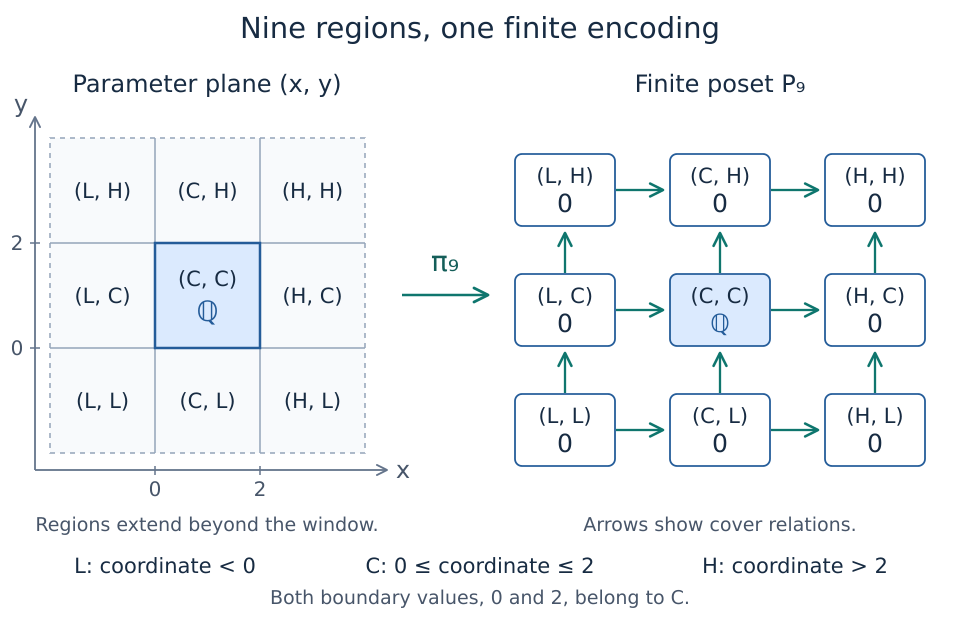
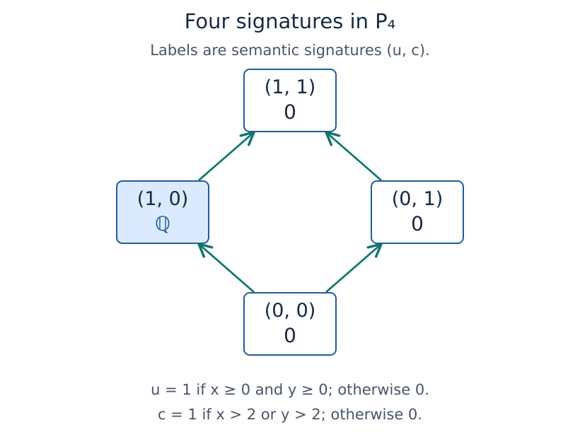

# Finite encodings: recovering a module from finite data

The [previous background page](persistence_modules.md) explained what a
persistence module retains: a vector space at each parameter and a compatible
linear map for each comparison. Over the real plane, there are infinitely
many parameters. How can we keep the whole module in a form that a computer
can use?

A **finite encoding** answers this question by assigning parameters to
finitely many labels. The labels form a poset, and a module on that poset
supplies the spaces and maps. The assignment tells us how to recover them at
the original parameters. It is an essential part of the description.

We will build two encodings of the same square-supported module and check
what they recover. You need the previous page's notions of a poset, a
structure map, and composition, together with basic linear algebra. No Julia
installation is needed; the final sections connect the mathematics to
TamerOp's result objects.

## Specify the module before encoding it

Let $Q=\mathbb{R}^2$ with coordinatewise order. Fix the coefficient field
$\mathbb{k}=\mathbb{Q}$ and the closed square $S=[0,2]^2$. Our module has
one independent vector at each parameter in $S$, and no nonzero vectors
elsewhere:

$$
M(q)=
\begin{cases}
\mathbb{k}, & q\in S,\\
0, & q\notin S.
\end{cases}
$$

The coefficient field has changed from F₂ in the ring example to ℚ here.
The parameters still range over all real pairs; coefficients inside a vector
space are a separate choice from the coordinates indexing that space.
We are specifying this module directly, without claiming that the earlier
ring calculation produced it.

We must also specify the maps. For $q\leq r$, let $M(q\leq r)$ be the
identity on $\mathbb{k}$ when both points lie in $S$. Otherwise it is the
unique zero map between the stated source and target spaces. The matrix of
a map has one row per target basis vector and one column per source basis
vector:

| Source and target | Structure map | Matrix size |
| --- | --- | --- |
| Both inside $S$ | Identity | $1\times1$ |
| Outside to inside | Zero map $0\to\mathbb{k}$ | $1\times0$ |
| Inside to outside | Zero map $\mathbb{k}\to0$ | $0\times1$ |
| Both outside | Unique map $0\to0$ | $0\times0$ |

Each row assumes that the original parameters are comparable in the stated
direction. The unique endomorphism of the zero space is both its zero map
and its identity map.

These rules define a module because they respect composition. If
$q\leq r\leq s$ and both endpoints lie in the square, the intermediate
point lies there too: each of its coordinates is between the corresponding
endpoint coordinates. The three maps are identities. In every other case
at least one endpoint space is zero, so both the direct map and the composite
are zero. A subset with this between-points property is called **order-convex**.

The square is the module's **support**, meaning the set where its stalks are
nonzero. It is not a restriction on the query domain. Points outside the
square still have well-defined zero spaces. The boundary also matters:
$(0,0)$, $(2,2)$, and every point along the four edges belong to the support.
This is a closed square, distinct from the half-open interval $[0,5)$ in the
ring example.

## A finite model with nine labels

For each real coordinate $x$, record which of three bands contains it:

$$
b(x)=
\begin{cases}
L, & x<0,\\
C, & 0\leq x\leq2,\\
H, & x>2.
\end{cases}
$$

The letters mean lower, central, and higher, with order $L<C<H$. Increasing
$x$ can keep its label unchanged or move it upward in this order; it cannot
move it downward.

Take the nine pairs of band labels as a finite poset
$P_9=\{L<C<H\}\times\{L<C<H\}$, ordered coordinatewise. Assign a parameter
$q=(x,y)$ its label by

$$
\pi_9(x,y)=(b(x),b(y)).
$$

If $q\leq r$, then $\pi_9(q)\leq\pi_9(r)$: both coordinate labels move
in the permitted direction. A map with this property is **order preserving**.
A **fiber** of $\pi_9$ is the set of parameters assigned to one label;
here the fibers are exactly the nine regions specified by the band pairs.

*The left panel shows part of the original plane; its outer regions extend
beyond the displayed window. Coordinates equal to 0 or 2 belong to band C.
The right panel is the finite poset of labels, with spaces attached. Arrows
show its immediate comparisons, called covers; longer comparisons follow
by composition.
This is an authored schematic, not a claim about the number or numbering of
labels returned by the package.*

Define a module $N_9$ on this finite poset by placing $\mathbb{k}$ at
$(C,C)$ and zero at the other eight labels. Every map between distinct
comparable labels is zero, since at least one of its spaces is zero.
Every label also has its identity map, including the identity of
$\mathbb{k}$ at $(C,C)$.

We can now recover a space at any original parameter by first finding its
label, then using the space stored there:

| Parameter $q$ | Label $\pi_9(q)$ | Recovered space $N_9(\pi_9(q))$ |
| --- | --- | --- |
| $(-1,1)$ | $(L,C)$ | $0$ |
| $(1/4,1/2)$ | $(C,C)$ | $\mathbb{k}$ |
| $(1,3/2)$ | $(C,C)$ | $\mathbb{k}$ |
| $(2,2)$ | $(C,C)$ | $\mathbb{k}$ |
| $(3,1)$ | $(H,C)$ | $0$ |

The same procedure recovers maps. The points $(1/4,1/2)\leq(1,3/2)$ have
the same central label, so their map is the identity at $(C,C)$. For
$(1,3/2)\leq(3,3/2)$, use the finite map from $(C,C)$ to $(H,C)$: the
zero map from $\mathbb{k}$ to zero. For $(-1,1)\leq(0,1)$, use the
map from $(L,C)$ to $(C,C)$, whose matrix has one row and no columns.

An infinite collection of space and map queries is now answered by a finite
module together with an explicit rule for finding labels. The rule works
throughout ℝ²; this construction is not limited to the sample points in the
table.

## What the definition requires

For a module $M$ on a poset $Q$, a **finite encoding** consists of a finite
poset $P$, a module $N$ on $P$ with finite-dimensional stalks, and an
order-preserving map $\pi:Q\to P$, such that

$$
M\cong\pi^*N=N\circ\pi.
$$

This is the finite-encoding definition in
[Ezra Miller's *Homological algebra of modules over posets*, Definition 4.1](https://arxiv.org/html/2008.00063#S4.SS1).
The map $\pi$ is often called the **encoding map** or **classifier**: it
assigns an original parameter to a finite label.

The notation $\pi^*N$, called the **pullback** of $N$, means the module on
$Q$ obtained by those lookups:

$$
(\pi^*N)(q)=N(\pi(q)),\qquad
(\pi^*N)(q\leq r)=N(\pi(q)\leq\pi(r)).
$$

Order preservation ensures that the finite comparison on the right exists
whenever the original comparison on the left exists. The identity and
composition rules for $N$ then give the corresponding rules for the
pullback. For example, a chain $q\leq r\leq s$ is sent to a chain of
labels, so the finite model's composite agrees with its direct map.

The symbol $\cong$ allows the recovered spaces to use different bases from
the original ones. More precisely, there must be invertible linear maps
$\alpha_q:M(q)\to N(\pi(q))$ such that, for every $q\leq r$,

$$
\alpha_r\circ M(q\leq r)
=N(\pi(q)\leq\pi(r))\circ\alpha_q.
$$

Starting with a vector in $M(q)$, we can either follow the original map and
then change coordinates, or change coordinates first and follow the finite
map. Both routes must give the same vector. This compatibility is called
**naturality**. It is stronger than merely finding vector spaces of the same
dimensions. In the original bases, the recovered map is

$$
M(q\leq r)
=\alpha_r^{-1}\circ N(\pi(q)\leq\pi(r))\circ\alpha_q.
$$

For our square, we used the same copy of $\mathbb{k}$ and the same basis
throughout the support, so the identifications can be taken to be identities.
In a computation, different basis choices can change matrix entries while
these compatibility equations still hold.

Keeping $P$ and $N$ without $\pi$ would leave us unable to locate an original
parameter. Keeping $P$ and $\pi$ without the maps of $N$ would leave us unable
to follow vectors. The finite poset, its module, and the encoding map all
contribute to the representation.

The definition makes the poset and its vector-space data finite. Computation
also needs a usable description of $\pi$, such as the inequality tests in
our example. The existence of an abstract encoding alone does not supply
an algorithm for evaluating its classifier.

## Why equal dimensions do not define the labels

The square has only two stalk dimensions, zero and one. Could we therefore
use just an exterior label $z$ and an interior label $a$?

Consider the comparable chain

$$
(-1,1)\leq(1,1)\leq(3,1).
$$

Its proposed labels would be $z,a,z$. Order preservation would force both
$z\leq a$ and $a\leq z$. Antisymmetry in a poset would then force $z=a$.
But one label cannot carry both a zero-dimensional and a one-dimensional
space. This two-label assignment cannot be an encoding.

Thus even zero spaces may need several labels to record how they lie before,
after, or beside the nonzero part. More generally, a partition by dimensions
need not respect either the parameter order or the structure maps. A picture
colored only by dimension does not provide an encoding map automatically.

Conversely, equal labels do not force original parameters to be comparable.
The points $(1/4,3/2)$ and $(3/2,1/4)$ both have label $(C,C)$, but neither
precedes the other. The identity at that finite label supplies a map only
when we start with a valid comparison in $Q$. Order preservation is a
one-way implication; it does not reconstruct the order of the original
parameters from their labels.

> **Available now: recover a space and a map.** The
> [inspection notebook](tutorials/inspect_encoding.ipynb) shows the parameter
> plane, the returned finite poset, and a selected matrix in one figure.
> It checks included boundary points, exterior zero spaces, and incomparable
> parameters with no prescribed structure map. Selections are code arguments;
> clicking across linked panels remains planned.

## Another valid encoding has four labels

The nine-label model is convenient to draw, but a finite encoding is not
unique. For this same square, record two yes-or-no facts about $q=(x,y)$:

$$
u(q)=
\begin{cases}1,&x\geq0\text{ and }y\geq0,\\0,&\text{otherwise},\end{cases}
\qquad
c(q)=
\begin{cases}1,&x>2\text{ or }y>2,\\0,&\text{otherwise}.\end{cases}
$$

The first bit says that both lower thresholds have been reached. The second
says that at least one upper threshold has been exceeded. Both bits can
change from 0 to 1 as parameters increase, but cannot change back. Notice
the strict inequality in $c$: coordinates equal to 2 remain inside the
closed support.

Set $\pi_4(q)=(u(q),c(q))$ and order the four possible pairs coordinatewise,
using $0<1$. All four pairs occur, so they form the four-label poset $P_4$.
The map $\pi_4:Q\to P_4$ is order preserving. Put $\mathbb{k}$ at the
label $(1,0)$ and zero at the other three labels to obtain a finite module
$N_4$; as before, maps between distinct comparable labels are zero and
endomorphisms are identities.

| Signature $(u,c)$ | Example parameter | Space |
| --- | --- | --- |
| $(0,0)$ | $(-1,1)$ | $0$ |
| $(1,0)$ | $(1,1)$ | $\mathbb{k}$ |
| $(0,1)$ | $(-1,3)$ | $0$ |
| $(1,1)$ | $(3,1)$ | $0$ |

*This authored schematic uses the two mathematical bits as labels, not numeric
vertex IDs from a package result. Arrows show the finite order. Every drawn
arrow has a zero structure map, while the identity at the nonzero label
recovers maps between comparable points inside the square. Both routes
around the diamond compose to the unique map between its zero endpoint
spaces.*

The condition $u=1,c=0$ is exactly $0\leq x\leq2$ and $0\leq y\leq2$.
Thus stalk lookup recovers $M$ everywhere. For comparable points inside the
square it recovers an identity; in every other case it recovers the required
zero map. This proves that the four-label construction encodes the same
module as the nine-label construction.

A label need not describe one connected geometric region. The signature
$(0,1)$ covers both the upper-left region $x<0,y>2$ and the lower-right
region $x>2,y<0$. These disconnected pieces can share a label in this
encoding. There is no requirement that the regions be rectangular cells or
that the finite diagram reproduce their Euclidean positions.

## Relate the two finite models

There is an explicit map $\rho:P_9\to P_4$ connecting the models. Given a
band pair, set $u=1$ when neither coordinate label is $L$, and set $c=1$
when at least one is $H$:

| Nine-label regions | Four-label signature |
| --- | --- |
| $(L,L)$, $(L,C)$, $(C,L)$ | $(0,0)$ |
| $(C,C)$ | $(1,0)$ |
| $(L,H)$, $(H,L)$ | $(0,1)$ |
| $(C,H)$, $(H,C)$, $(H,H)$ | $(1,1)$ |

Moving upward in $P_9$ cannot turn either bit from 1 back to 0, so $\rho$
is order preserving. The label assignments satisfy

$$
\pi_4=\rho\circ\pi_9.
$$

We can therefore label a point directly by its two bits, or first find its
band pair and then apply $\rho$. Both routes give the same label. The spaces
and maps also agree:

$$
N_9=\rho^*N_4,\qquad
M=\pi_9^*N_9=\pi_4^*N_4
$$

with the explicit choices made here. For example, several zero labels can
merge under $\rho$ because their finite maps then become the identity on
the zero space, which is also its unique zero map. Checking the labels and
the maps establishes the comparison; counting nine versus four vertices
would not establish it.

> **Coming visualization: compare the two encodings.** A linked view will
> color the nine regions by their four signatures. Selecting a point or a
> comparable pair will trace both routes through $\pi_9$, $\rho$, and
> $\pi_4$, displaying the same recovered spaces and maps. The two separated
> pieces with signature $(0,1)$ will share a color and an explicit label.

## What the package returns for this example

The [verified mathematical example](build_scripts/check_first_encoding.jl)
constructs the square using a region defined by lower bounds, a region
defined by upper bounds, and a one-by-one coefficient matrix $[1]$ over ℚ. With
`backend=:pl_backend` and `poset_kind=:signature`, the encoder returns a
poset with the four signatures just described, ordered as the diamond.
The second bit records the **complement** of membership in the region
defined by the upper bounds. Taking the complement makes that bit increase
with the parameters.
The [indicator-presentations chapter](indicator_presentations.md) explains
this input construction.

The returned numeric vertex IDs are bookkeeping choices. Find labels with
the returned encoding map and inspect the actual poset. Neither the
nine-region schematic nor a particular ordering of the four signatures is
a requirement on all encoders. A different representation can still satisfy
the same recovery equations.

The existing example check covers both boundaries, interior and exterior
points, comparable-pair maps, and their compositions. It also checks an
incomparable pair with a shared label. Those finite checks support the
implementation on the example; the constructions and arguments above
establish why the two mathematical models recover the module on all of ℝ².
The checked geometric endpoints and query coordinates are exactly representable
as `Float64`, while the linear algebra uses ℚ. This example makes no claim
that arbitrary real geometric inputs are represented exactly by floating-point
coordinates; see [exact grades](exact_grades.md) for the supported contracts.

## What recovery guarantees

Once the represented module $M$ is fixed, a finite encoding recovers its
stalks and its structure maps up to the compatible identifications described
above. In particular, it recovers the dimensions of stalks and the ranks of
maps at specified comparable parameters. The finite labels themselves are
not persistent classes, and an encoding is not an interval decomposition:
one label can carry a higher-dimensional space and nontrivial matrices can
connect different labels in other examples.

Earlier modeling choices still matter. Selecting a filtration, truncating
a complex, or changing the grid used to define an input can change $M$.
An encoding of the chosen module does not by itself undo those changes.
Likewise, replacing the square's upper closed boundary by an open one would
change its stalk at $(2,2)$; it would describe a different module, not merely
rename this encoding's labels.

Recovering a module also does not identify all algebraic computations over
different base posets. In particular, Ext or Tor over a finite encoding
poset need not equal the corresponding groups over the original parameter
poset, or over another encoding. These computations require their own
category and comparison hypotheses; the
[category guide](math_categories.md) develops that distinction.

## Why the name TamerOp?

TamerOp stands for **Toolkit for Algebraic Module Encodings over
$\mathbb{R}^n$ and Other Posets**. The project began as an implementation of
Ezra Miller's theory of modules over posets. Finite encodings remain the
central objects connecting its constructions, algebra, and summaries.

The name also recalls **tameness**, a finiteness condition on how a module
varies, including its maps. For modules with finite-dimensional stalks, Ezra
Miller's [finite-encoding theorem](https://arxiv.org/html/2008.00063#S4.SS4)
relates finite encodings to finite constant subdivisions: partitions into
finitely many regions whose spaces can be identified while keeping the maps
between regions consistent. Encoding fibers form such a subdivision,
with the additional organization supplied by an order-preserving map.
A given constant subdivision need not itself provide these fibers.
Grouping all exterior zero spaces above illustrates why order compatibility
is an additional requirement on the labels. The
[tameness and scope chapter](tameness.md) develops the hypotheses and
the connections to presentations and resolutions.
The theorem's generality does not imply an implemented encoder for every
abstract input.

## From an input to the encoded object

The mathematical description helps us recognize what a package result must
contain. Inputs can come from a point cloud, graph, or image with a chosen
filtration, or from a presentation specifying a module through algebraic
pieces and maps. An already finite-poset module is another starting point.
For supported inputs, the public workflow `encode` produces an
`EncodingResult` connecting the finite object to its parameter domain and
recorded construction.

| Mathematical question | Operation |
| --- | --- |
| What does this result contain? | `describe(enc)` |
| Which conventions and construction were recorded? | `provenance(enc)` |
| What is the finite poset $P$? | `encoding_poset(enc)` |
| What is the assignment $\pi$ from original parameters? | `encoding_map(enc)` |
| What are the dimensions at finite labels? | `dimensions(enc)` |
| What is the finite module $N$, including its maps? | `encoding_module(enc)` |

Some ingestion results defer expensive calculations: `dimensions` computes
the dimensions, while `encoding_module` explicitly computes the module and
its maps if needed. The [inspection guide](lazy_inspection.md) explains this
distinction. A request for an intermediate `stage`, or a direct
[ordinary-persistence calculation](ordinary_persistence.md), should not be
mistaken for a completed `EncodingResult`.

## From this encoding to the next question

In this example we specified the spaces and maps first, then built a finite
model by hand. A practical next question is how to describe a module so that
an encoder can construct such a model. For the square, the region defined
by the lower bounds $x\geq0,y\geq0$ and the region defined by the upper
bounds $x\leq2,y\leq2$, linked by the coefficient $1$, provide exactly
that description. Continue with
[**indicator presentations**](indicator_presentations.md): what these
region-supported pieces mean, how the image of their map produces the
square module, and how two overlapping summands produce larger spaces
with inclusion and projection maps.

For existing guides that continue in other directions:

- [Data and filtrations](ingestion_options.md) explains fields, axes, stages,
  and construction choices; [multicover](multicover.md) develops radius and
  coverage count as parameters.
- [Inspection and explicit computation](lazy_inspection.md) explains how to
  examine a result before requesting heavier objects.
- [Categories and comparison](math_categories.md) explains where algebraic
  computations take place; [numerical algebra](numerical_algebra.md) covers
  floating-point coefficients.
- [Exact matching](exact_matching.md) explains comparisons by slices in a
  stated finite window.
- [Optional integrations](optional_integrations.md) and the
  [first-figure walkthrough](../README.md#make-your-first-figure) explain
  available plotting and export routes. The linked interactive views
  described on this page remain planned.
