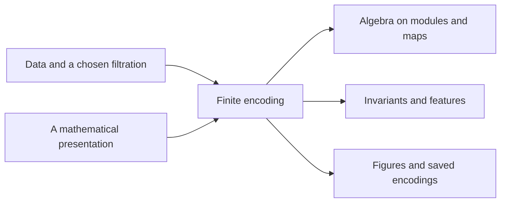

# Why finite encodings?

TamerOp is built around a question: how can we keep a persistence module,
including the maps that relate its parameter values, in a form that a computer
can use? The answer guiding the library is to construct a **finite encoding**.
Once we have this object, we can ask several different questions of it.

This introduction follows that idea from ordinary persistence to the finite
model and then to the computations it supports. For installation and a first
calculation, begin with the [README](../README.md#install-tamerop).

## From one parameter to several

Imagine an image whose squares appear at different parameter values. At first
there might be a ring, and later a square fills its hole. Ordinary persistence
records the life of that hole as an interval. For familiar finite
one-parameter filtrations, the collection of intervals describes the homology
module completely.

Now suppose we also vary a density threshold. Increasing the distance scale
and tightening the density threshold need not move us through the same sequence
of spaces. Some parameter pairs can be compared and others cannot. There is
generally no decomposition into intervals that plays the same role as the
ordinary barcode.

We can still count classes at each parameter, measure which ones survive to
another parameter, or examine a one-dimensional slice. Each choice answers a
particular question. To keep asking other questions, we need to retain the
module's vector spaces **and** its linear maps.

## What must we keep?

A persistence module assigns a vector space to each parameter value. When one
parameter precedes another, it also assigns a linear map between those spaces.
In persistent homology, the spaces contain homology classes and the maps tell
us how those classes continue as parameters change.

The comparisons between parameters form a *partially ordered set*, or *poset*.
For two coordinates, the usual order compares both coordinates:
$(a_1,a_2)\leq(b_1,b_2)$ when $a_1\leq b_1$ and $a_2\leq b_2$.

A finite encoding consists of three pieces:

- A finite poset $P$, whose elements are labels.
- A module $M_P$ on those labels: finitely many finite-dimensional vector
  spaces and the linear maps relating them.
- An order-preserving map $\pi$ assigning each original parameter a label in
  $P$. Order-preserving means comparable parameters receive labels with a
  compatible order.

Write $Q$ for the original parameter poset and $M$ for the original module.
The statement that these pieces encode $M$ is

$$
M \cong M_P\circ\pi.
$$

In words, to find the space at $q$, use the finite model's space
$M_P(\pi(q))$. To find the map from $q$ to $r$, use the finite model's map from
$\pi(q)$ to $\pi(r)$. The symbol $\cong$ allows compatible changes of basis;
the spaces and maps together describe the same module.

This recovery is often called *pullback* along $\pi$. Keeping only the number
of dimensions at each label would not supply the maps needed for recovery.

## A small example

Consider a module with one independent class whenever both coordinates lie
in the closed interval $[0,2]$, and no class elsewhere. Thus its vector space
is a copy of a chosen field $\mathbb{k}$ inside that square and the zero space
outside. Between comparable points inside the square, the map is the identity.
Every other structure map is zero.

We can describe this module using nine labels. For each coordinate, record
whether it is below 0, between 0 and 2 inclusive, or above 2. A pair of these
labels specifies one of nine regions. Order the labels in each coordinate
and use the coordinatewise order on the pairs.

The finite module has the space $\mathbb{k}$ at the middle-middle label and
zero at the other eight labels. The encoding map assigns a point its pair
of labels. For example:

| Original parameter | Finite label | Vector space |
| --- | --- | --- |
| $(-1,1)$ | below, middle | $0$ |
| $(1/4,1/2)$ | middle, middle | $\mathbb{k}$ |
| $(1,3/2)$ | middle, middle | $\mathbb{k}$ |
| $(3,1)$ | above, middle | $0$ |

The two interior points are comparable and have the same finite label. Their
structure map is recovered as the identity map at that label. The map from
$(1,3/2)$ to $(3,3/2)$ is recovered as the zero map into the above-middle
label's zero space.

An infinite parameter domain has become a finite description that still
answers both space and map queries. General modules can require more labels,
higher-dimensional spaces, and nontrivial linear maps. Grouping points only
because their spaces have the same dimension would not be sufficient.

## Why the name TamerOp?

TamerOp stands for **Toolkit for Algebraic Module Encodings over
$\mathbb{R}^n$ and Other Posets**. The project began as an implementation of
Ezra Miller's [Homological algebra of modules over posets](https://arxiv.org/abs/2008.00063).
Its development remains tied to that theory: finite encoding is the common
mathematical object around which the library's computations are organized.

The expanded name describes both the object and its setting. “Module
Encodings” identifies the finite descriptions we construct and retain.
“Algebraic” points to the vector spaces and maps on which further algebra is
possible. “Over $\mathbb{R}^n$ and Other Posets” reflects supported real
parameter domains, integer lattices, and finite partially ordered sets.

The name also recalls **tameness**. An infinite domain need not require an
infinite amount of data to describe how a module varies. Ezra Miller's tameness
condition makes that finiteness precise. His theory relates finite encodings,
presentations, and resolutions by basic modules supported on order-theoretic
regions, under the hypotheses stated in the paper. These are the mathematical
connections TamerOp set out to make computational.

The toolkit has grown to include data construction, invariants, features, and
visualization. These additions give ways to build and examine the encoded
object; the original finite-encoding principle continues to organize them.
The library implements supported constructions from this framework. The
theory's generality does not imply that every abstract input has an implemented
encoder or that every ambient derived functor is computed.

## From an input to the encoded object

Inputs arrive in different forms. A point cloud, graph, or image first needs
a filtration: a rule specifying which cells are present at each parameter.
A mathematical presentation instead describes the module through algebraic
pieces and maps between them. An already finite-poset module is the simplest
case; it is already in the setting we want to reach.

The main workflow is:

For presentation-based encoding, identifying where the same pieces of a
presentation are active helps construct the finite model. For filtered data,
grades and the chosen axes determine the represented parameter structure.
The input determines how we reach the encoded object.

The public entry point is `encode`. A completed `EncodingResult` connects the
finite model with its original parameter domain and recorded construction.
The most useful ways to examine it are:

| Question | Operation |
| --- | --- |
| What does this result contain? | `describe(enc)` |
| What conventions and construction were recorded? | `provenance(enc)` |
| What is the finite poset? | `encoding_poset(enc)` |
| How are original parameters assigned to labels? | `encoding_map(enc)` |
| What are the dimensions? | `dimensions(enc)` |
| What is the module, including its maps? | `encoding_module(enc)` |

Some results defer expensive calculations. For an ingestion encoding,
`dimensions` computes only the dimensions, while `encoding_module` explicitly
computes the module and its maps if needed. The
[inspection guide](lazy_inspection.md) explains this distinction.

The `stage` option can also return a filtered complex or another intermediate
result before completing an encoding. Direct
[ordinary-persistence routines](ordinary_persistence.md) provide a separate
short route to a one-parameter barcode. Neither case should be mistaken for a
completed `EncodingResult`.

## What can we ask next?

With the module available, we can ask about maps to another module or how it
is assembled from simpler pieces. This leads to Hom spaces, kernels, images,
resolutions, and derived computations. The
[category and comparison guide](math_categories.md) explains where those
computations take place and what comparison between encodings requires.

We can also choose a summary. Dimensions tell us the size of each space;
ranks measure how much passes between comparable parameters; slices follow
the module along selected chains. Features and figures then give ways to
compare or communicate chosen aspects of those results. The encoded module
remains available when a different question calls for another view.

Some qualifications matter to that interpretation. Selecting a filtration,
truncating a complex, or changing a grid can change the module being
represented. Exact recovery by an encoding refers to that represented module
on its stated domain. Likewise, computing Ext or Tor over the finite poset
does not automatically compute the corresponding groups over the original
parameter poset.

## Continue with the question you want to answer

- **How do I turn data into a module?** Read the
  [ingestion guide](ingestion_options.md) for fields, axes, stages, and
  construction choices. The [multicover guide](multicover.md) develops the
  example of varying a ball radius and coverage count.
- **How do I inspect a result without computing everything?** Read
  [inspection and explicit computation](lazy_inspection.md).
- **What does an algebraic computation mean for this encoding?** Read
  [categories and comparison](math_categories.md), then
  [numerical algebra](numerical_algebra.md) if using floating-point coefficients.
- **How can I compare modules by slices?** Read
  [exact matching in a finite window](exact_matching.md).
- **How can I render or export my results?** Read
  [optional integrations](optional_integrations.md) for plotting and file
  packages, and the [first-figure walkthrough](../README.md#make-your-first-figure).
