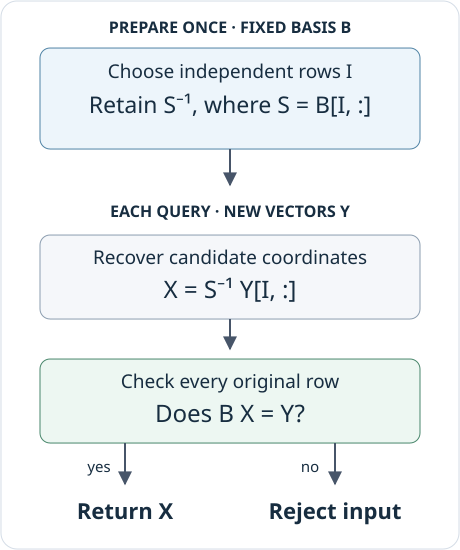

# Exact rational coordinates

Many computations with a finite encoded module eventually ask the same
linear-algebra question: **how do we express these vectors in this basis?**
An image basis identifies a subspace, but a map into that subspace must also
be written in its coordinates. Homology adds another step: express a cycle
in a cycle basis, then pass to coordinates modulo boundaries.

This account follows TamerOp's exact rational full-column solver, the reusable
data behind it, and its specialization for homology coordinates. The central
choice is to use a small invertible row minor to recover candidate coordinates,
while retaining a check against the original problem. Its performance depends
on where that work happens, which data can be reused, and when conversion to
a native exact-arithmetic library pays for itself.

The discussion describes the source reviewed on **4 October 2026**.
[Source locations and the review fingerprint](#source-and-review-record)
identify that implementation; the benchmark section separately identifies
historical development measurements. The main external connections are
[Nemo/Hecke](https://doi.org/10.1145/3087604.3087611),
[FLINT](https://flintlib.org/doc/fmpq_mat.html), and
[rational reconstruction](https://doi.org/10.1145/1089292.1089293).
Their roles are made explicit below and collected in the
[implementation bibliography](references.md).

## The problem and its certificate

Let $B\in\mathbb Q^{m\times n}$ have independent columns, with $m\geq n$.
Its columns are the chosen basis of a subspace of $\mathbb Q^m$.
Given $Y\in\mathbb Q^{m\times r}$, we seek

$$
B X=Y,\qquad X\in\mathbb Q^{n\times r}.
$$

There is at most one answer. There is an answer precisely when every column
of $Y$ belongs to the image of $B$. A coordinate routine therefore has two
jobs: recover the coefficients and establish that they describe the supplied
vectors. This is an exact membership question. A small floating-point residual
does not settle it.

TamerOp selects $n$ independent rows of $B$, in an ordered index list $I$.
The square matrix $S=B[I,:]$ is invertible, so any solution must satisfy

$$
X=S^{-1}Y[I,:].
$$

This gives a candidate without eliminating the whole augmented matrix on
every query. It does not, by itself, establish membership. If $E_I$ selects
the rows in $I$, then $L=S^{-1}E_I$ satisfies $LB=I_n$. Thus $BL$ is a
projection onto the image of $B$, and the remaining question is whether
$BLY=Y$. In the general solver this becomes the complete check $BX=Y$.



*The candidate uses selected rows; the certificate covers the original
equation. Reuse is valid only while the basis matrix remains unchanged.*

### A row that the candidate calculation cannot see

Consider

$$
B=\begin{bmatrix}1&2\\2&4\\0&1\end{bmatrix},\qquad
y=\begin{bmatrix}1\\2\\-1\end{bmatrix}.
$$

The first two rows are dependent. The ordered row selection is $I=(1,3)$,
giving

$$
S=\begin{bmatrix}1&2\\0&1\end{bmatrix},\qquad
S^{-1}=\begin{bmatrix}1&-2\\0&1\end{bmatrix},\qquad
x=S^{-1}\begin{bmatrix}1\\-1\end{bmatrix}
=\begin{bmatrix}3\\-1\end{bmatrix}.
$$

Multiplication verifies $Bx=y$. Now replace $y_2=2$ by $3$. The selected
rows are unchanged, so the candidate is still $(3,-1)^\mathsf T$.
But its second image coordinate is $2$, not $3$: the new vector is outside
the subspace. A cached inverse without the membership check would silently
return coordinates for the wrong vector.

Here is the owner API for this example:

```julia
using TamerOp

FL = TamerOp.FieldLinAlg
field = TamerOp.CoreModules.QQField()
K = Rational{BigInt}

B = K[1 2; 2 4; 0 1]
y = K[1, 2, -1]
factor = FL.factor_fullcolumn(field, B;
                              backend=:julia_exact, cache=false)
x = FL.solve_fullcolumn(field, B, y;
                       factor, backend=:julia_exact)
@assert x == K[3, -1]
```

The explicit backend makes this an example of the retained Julia factor
path. With automatic routing, problems whose relevant dimensions are all
at most four take a specialized tiny solver before factor dispatch, even
if a factor was supplied. That solver uses the same minor-inverse idea,
enumerating small row subsets. This distinction matters when measuring reuse;
it does not change the answer.

## What factor construction actually does

The internal `FullColumnFactor` holds two pieces of information: the selected
row indices and the inverse of the selected square matrix. It does not hold
the original matrix. The internal Nemo variant holds the inverse in Nemo's
matrix representation.

### Native rational elimination

For a dense rectangular matrix, the Julia implementation selects independent rows
by finding pivot columns of $B^\mathsf T$. It scans columns in order and uses
forward elimination: eliminate below each pivot and continue. Full reduced
row-echelon form would also identify these pivots, but would do unnecessary
normalization and elimination above them. The selected indices preserve the
existing ordered basis convention. CSC sparse row selection uses the separate
streaming sparse RREF machinery; the forward-elimination optimization described
here belongs to the dense path.

After selection, the implementation obtains $S^{-1}$ by reducing
$[S\mid I_n]$. A square input takes a shorter route: reduce $[B\mid I_n]$
once, both checking invertibility and obtaining the inverse. These are exact
rational elimination routines. They are not an implementation of the
fraction-free Bareiss algorithm.

The explicit inverse is a choice for repeated application. A new right-hand
side needs row selection and matrix multiplication, without another solve
against $S$. This choice can create dense data and large rational coefficients;
it is not a claim that an explicit inverse is optimal for every exact system.

### Try a likely minor before searching for one

The Nemo factor path can first try the leading $n\times n$ block when the
dense eligibility conditions below hold. If it is invertible, the answer is
already the first possible ordered row basis. General row selection would
return those same rows, so the shortcut preserves the factor's mathematical
convention.

If that block is singular, the implementation falls back to row selection
using the RREF of $B^\mathsf T$, then inverts the selected minor. The small
example above explains why fallback is necessary, although its size does not
activate this optimization. Only the backend's specific noninvertibility
error is caught; unrelated failures are propagated.

This attempt trades a possible failed inverse for avoiding row selection
when the leading block works. Its unfavorable case was measured, rather
than assumed negligible.

## Where native exact arithmetic earns its conversion cost

Julia's `Rational{BigInt}` representation is convenient for the surrounding
code. Nemo offers rational matrices backed by FLINT, where dense exact
operations can be substantially cheaper. The
[Nemo/Hecke paper](https://doi.org/10.1145/3087604.3087611) explains the
combination of Julia algorithms and specialized native libraries;
[Nemo's matrix documentation](https://nemocas.github.io/Nemo.jl/stable/matrix/)
identifies the FLINT-backed rational matrix type. TamerOp uses these
implementations directly.

Conversion is real work. A dense Julia container can also hold a mostly zero
matrix whose native computation is already cheap. The extra dense factor
and product paths therefore use the following **default eligibility rules**:

| Operation | Conditions for the additional dense path |
| :--- | :--- |
| Factor an $m\times n$ basis | Nemo enabled; $m\ge n\ge16$; dense array-backed storage; at least half of all entries nonzero; at least half of the leading $n\times n$ block nonzero |
| Multiply an $a\times b$ matrix by a $b\times c$ matrix | Nemo enabled; $b\ge16$, $a\ge4$, $c\ge4$, and $abc\ge1024$; both operands dense array-backed and at least half nonzero |

These are local crossover heuristics, not mathematical restrictions or a
complete description of public backend routing. The public solver also has
separate operation, shape, and sparsity thresholds. Explicit backend choices
remain meaningful, and explicit Julia-only solves retain their backend.

The leading-block density condition is especially deliberate. An embedding
$B=[I_n;A]$ has an immediately available identity minor even when the lower
block makes the whole matrix dense. Converting such a problem to a general
dense backend can lose badly. Requiring density in the leading block keeps
these inexpensive embeddings out of this additional dense factor path. Counting actual nonzeros
also avoids treating a dense array containing an identity matrix as a dense
arithmetic problem.

The native multiplication routines skip zero contributions and traverse stored
entries of CSC sparse matrices. Structured and sparse inputs therefore need
not be expanded merely to use the dense optimization. This is a representation
decision as much as a size decision.

[FLINT's rational-matrix documentation](https://flintlib.org/doc/fmpq_mat.html)
describes denominator clearing and several exact solving strategies, including
fraction-free, Dixon, and multimodular methods. Those are relevant backend
capabilities. This account does not infer which internal FLINT routine a
particular Nemo operation selects; that requires inspecting the pinned
dependency and the operation being called.

## Applying a factor without weakening the contract

For a matrix right-hand side, the native factor path first exposes the selected
rows as a view. At nine or more right-hand-side columns it instead gathers
them into contiguous column-major storage. The copy costs time and memory,
but avoids repeated irregular row access during wider products. A vector
right-hand side is gathered directly. The threshold is an implementation
choice; vector and matrix input shapes remain distinct in the returned answer.

After multiplication, certificate evaluation follows the storage and workload:

- Small or structured native calculations use dot products that can stop at
  the first unequal entry.
- CSC sparse certificates traverse stored coefficients and reuse one
  $m$-entry accumulator for each right-hand-side column.
- Eligible dense batches use a complete exact product and comparison. On the
  Nemo solve path, the candidate can remain in Nemo through this check and
  be converted back only after it passes.

The dense certificate reduces the cost of valid wide queries, but gives up
the scalar check's immediate rejection of an early mismatch. Both preserve
the equation $BX=Y$; their failure costs differ.

`check_rhs=true` is the default. Turning it off bypasses the membership
certificate and makes membership a caller precondition. In particular, the
altered vector in the example can no longer be expected to be rejected.
Rank-deficient bases are not a request for a particular solution: they violate
this solver's full-column contract.

### A separate route through modular arithmetic

The direct rational solver also has a modular route, distinct from reusable
factor construction. It solves over several independent prime fields,
combines residues with the Chinese remainder theorem, reconstructs rational
entries, and, under the default `check_rhs=true`, checks the candidate over
$\mathbb Q$. Unusable prime images
are skipped. If the bounded reconstruction attempt does not produce an
accepted answer, the public solve falls back to exact elimination. Requesting
a reusable factor selects a reusable native or Nemo factor instead.

Rational reconstruction asks for a small fraction compatible with a residue.
The Euclidean reconstruction method and its uniqueness bounds are classical;
see [Wang, Guy, and Davenport (1982)](https://doi.org/10.1145/1089292.1089293).
For bounds $|u|\le N$ and $0<v\le D$, with the denominator invertible modulo
$M$, the condition $2ND<M$ guarantees uniqueness of a reduced compatible
fraction. [FLINT states this contract explicitly](https://flintlib.org/doc/fmpq.html#modular-reduction-and-rational-reconstruction).
With that default, TamerOp still checks the resulting matrix equation: uniqueness within a bound
does not establish that the reconstructed entries solve the original problem.

This is a mathematical connection to an implemented technique, not evidence
that the local code was transcribed from that paper. It should also be
distinguished from [Dixon's p-adic method](https://doi.org/10.1007/BF01459082),
which lifts using successive powers of one prime. TamerOp's local modular
route combines independent primes. The names are not interchangeable.

## Specializing the idea for homology coordinates

A generic full-column solve computes all coefficients in a basis. A homology
query may need only their image in a quotient. TamerOp can retain a more
specialized plan for this repeated question.

Let the columns of $Z$ form a cycle basis, choose independent rows $I$, and
write $J$ for the remaining rows and $S=Z[I,:]$. An input vector $z$ is a cycle
precisely when

$$
z[J]=Z[J,:]S^{-1}z[I].
$$

Agreement on the rows in $I$ is automatic. Thus the plan can retain
$C=Z[J,:]S^{-1}$ and test only the complementary rows. If $Q$ sends cycle
coordinates to the chosen homology coordinates, retain $P=QS^{-1}$ as well.
Each subsequent query then performs

$$
Cz[I]=z[J]\quad\text{and, if this holds,}\quad h=Pz[I].
$$

This combines coordinate recovery with quotient projection. It avoids
recovering an intermediate vector merely to immediately project it, and
does not require materializing homology representatives. The projection is
derived from the existing boundary-coordinate RREF, preserving the package's
chosen quotient basis. Cohomology uses the corresponding construction.

Even zero-dimensional homology does not make every input a cycle. Membership
is checked before returning the empty coordinate vector, and an invalid first
query fails before installing the quotient plan. These details prevent a
performance shortcut from silently changing the mathematical domain of the
operation.

## Retained state, temporary work, and ownership

The internal inverse payload retains $n$ row indices and $n^2$ rational
entries. For dense native arithmetic, applying it costs roughly
$O(n^2r)$ field operations, while a complete certificate costs
$O(mnr)$. Gathering the selected rows requires up to $O(nr)$ temporary
entries. These are arithmetic-operation and entry counts: rational numerator
and denominator sizes also affect time and memory.

The public `FullColumnSolveFactor` retains more than this internal payload.
It also contains an elimination summary, including RREF and an image basis.
Consequently, the internal $O(n^2)$ count does **not** describe the entire
public object. Nor does a payload cache hit imply that rebuilding the public
wrapper avoids all elimination. Retaining the returned factor avoids
repeatedly asking for that wrapper.

Homology and cohomology results own their internal factors and coordinate
plans. Publication uses a shared lock for factor slots and a per-result lock
for coordinate plans. Factor computation occurs outside the lock, so concurrent
first requests may duplicate computation before one complete result is kept.
There are also weak factor caches in `FieldLinAlg`. Their values do not keep
the input matrix alive. These dictionaries do not provide a blanket guarantee
for concurrent global cached solves; they should not be confused with the
locking of owned state or tested read-only reuse of an explicit factor.

All reuse assumes an unchanged basis matrix. The factor contains no mutation
fingerprint and does not automatically repair itself after an entry of $B$
changes. Cache eligibility also depends on the input's Julia representation;
immutable wrappers are not necessarily cached. An explicitly retained factor
is the clearest way to state the intended reuse.

Memory measurements must distinguish this reachable mathematical state from
temporary allocation and process memory. Julia allocation counts do not
include all native FLINT allocations. A reduction in Julia allocation bytes
therefore does not, by itself, establish a smaller total-memory footprint.

## What the benchmark iterations changed

The following are **TamerOp before/after development measurements**, taken
from the [QPA development record](../benchmark_suites.md#qpa-results-and-development-record).
They describe successive historical candidates on the recorded size-16
controls, not a fresh benchmark of the source reviewed for this page.
Different rows have different baselines; their speedups must not be multiplied.

| Decision | Observation supporting it | Boundary or unfavorable result |
| :--- | :--- | :--- |
| Use forward elimination when only pivot indices are needed | Rational factor kernel: 1.38–1.39× faster, about 26% fewer Julia allocation bytes | Complete workflows were mixed; unchanged controls also showed host drift |
| Selectively use Nemo for dense factors and products, charging conversion | Complete dense controls: 2.07–4.06×; retained queries: 1.45–2.06× | Broad conversion regressed on identity-block embeddings; small and other workflows did not uniformly improve |
| Try the leading inverse and use a dense complete certificate | Complete size-16 requests: 1.35–3.91×; retained batches of eight: 3.47–5.02× | Retained scalar queries were approximately unchanged; the measured gains combine both changes |
| Keep fallback and measure failure paths | Singular leading blocks still returned the same factors and answers | Failed inverse added 0.261–0.842 ms before fallback |
| Accept loss of early exit on eligible wide certificates | Valid wide queries benefited from the complete-product path | Rejection at the first invalid entry rose from about 23 μs to 1.15–1.41 ms |

The dense controls supplied cycle and boundary bases. Their complete timers
included result construction and the requested answer, not deriving those
bases from a chain complex. Retained-query timers began with reusable
mathematical state already available. Accepted samples excluded timed
compilation and checked their reset conditions. The machine was not
exclusively reserved, and the reported ranges are observations across process
pairs, not confirmation confidence intervals.

These observations explain the selection rules and the split between factor
construction and repeated application. They do not establish a universal
matrix-size crossover. They also retain meaningful losses: the final combined
study reported mixed workflow results, including rational Hom and
kernel/image/cokernel cases that lost in both pairs, without establishing
their cause. Reachable storage was unchanged across its dense and retained
controls; the improvement was in computation, not a smaller mathematical
representation.

The separate [completed QPA comparison](../benchmarks/qpa.md) concerns full
matched algebraic requests. Its aggregate ratios cannot be attributed to
this coordinate kernel. QPA is an independent comparator, not a dependency
or a documented source of this implementation. Its
[module-homomorphism manual](https://gap-packages.github.io/qpa/doc/chap7.html)
also makes its row-vector convention explicit; comparisons must account for
that convention when translating matrices.

The [public QPA evidence bundle](../benchmarks/qpa_v1/README.md) permits
inspection and reaggregation of the final comparison. It does not contain
every development runner or raw sample behind the historical table above.
Those rows are supported here by the public development narrative, a weaker
reproducibility record than a published executable experiment.

## How the contract is tested

The maintained [field-linear-algebra tests](../../test/test_field_linalg.jl)
exercise independent mathematical answers as well as agreement between routes.
For example, dense factors use the known identity

$$
(I+uv^\mathsf T)^{-1}
=I-\frac{uv^\mathsf T}{1+v^\mathsf T u},
\qquad 1+v^\mathsf T u\ne0,
$$

This is the rank-one inverse identity commonly called the Sherman–Morrison
formula; [Hager's account](https://doi.org/10.1137/1031049) gives the formula
and its history. Here it supplies an independent test answer, not an update
algorithm in the production solver. A matching result therefore does not
merely compare two calls to the same routine.
Other cases prescribe $X$, form $Y=BX$, and introduce an inconsistency in a
row that the selected minor cannot see.

The testsets **“Selective dense rational Nemo routing preserves exact algebra”** and
**“Dense certificates and leading minors preserve exact solutions”** cover
sizes around the dense gate, singular leading blocks with full-rank fallback,
exact factor/coordinate agreement, and backend conversion behavior. Nearby
tests cover large denominators, sparse matrices and wrappers, views,
vector/matrix shapes, empty right-hand sides, nonfinite rational coefficients,
and both sides of the selected-row gathering threshold. Coordinate tests
also preserve the chosen homology basis and reject invalid inputs even when
the quotient is zero.

This is the implementation's validation design, not a claim that timing
alone establishes correctness. The full-row certificate is part of the
operation itself; the tests check that shortcuts preserve it and that the
represented answer retains its conventions.

## Source and review record

| Concern | Source and useful symbols |
| :--- | :--- |
| Public solve and retained factor contracts | [`public_api.jl`](../../src/field_linalg/public_api.jl): `factor_fullcolumn`, `solve_fullcolumn`, `FullColumnSolveFactor` |
| Ordered rows, inverse payloads, products, complete certificates | [`qq_engine.jl`](../../src/field_linalg/qq_engine.jl): `_pivot_columnsQQ`, `_factor_fullcolumnQQ`, `_solve_fullcolumnQQ`, `_verify_solveQQ` |
| Dense conversion gates and general routing | [`thresholds.jl`](../../src/field_linalg/thresholds.jl), [`backend_routing.jl`](../../src/field_linalg/backend_routing.jl) |
| Homology/cohomology plans and ownership | [`ChainComplexes.jl`](../../src/ChainComplexes.jl): `_fullcolumn_factor!`, `_checked_quotient_coordinates`, `coordinates` |
| Exact regression oracles | [`test_field_linalg.jl`](../../test/test_field_linalg.jl) |

The [review fingerprint](../assets/implementation/qq_coordinates_review.json)
records hashes of these local source files and the public benchmark narratives,
plus the checkout and dependency manifests inspected. The source links above
follow the repository; the hashes distinguish this reviewed content from
later revisions. They identify files but do not replace an archived source
release. This review used existing performance evidence and made no new
performance measurements.

The [bibliography](references.md) records the external algorithms, software,
and comparison conventions discussed here. In particular, the retained minor,
layout gates, and quotient plan are explained from the implementation and
their algebra; no undocumented historical attribution is asserted for those
local design choices.
