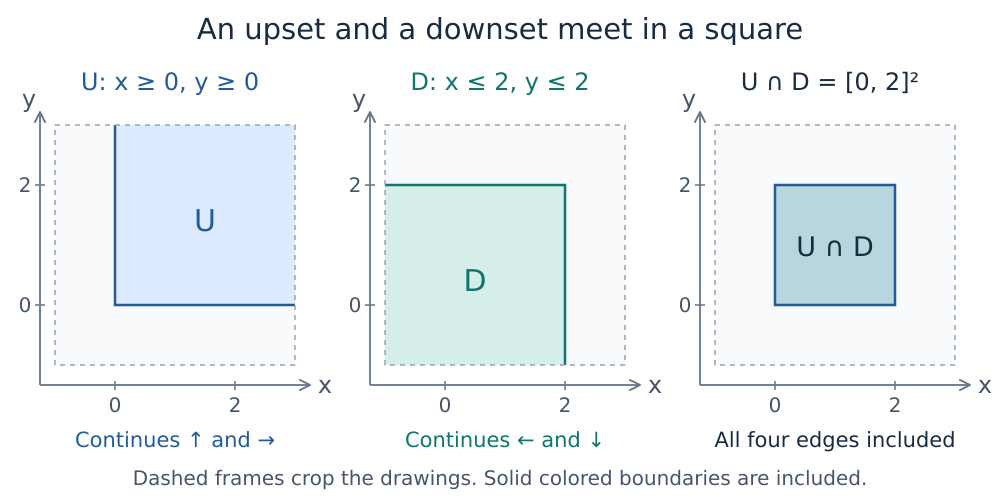
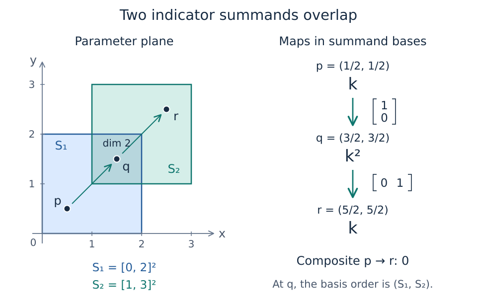

# Indicator presentations: building a module from regions and a matrix

The [finite-encodings chapter](finite_encodings.md) began with a module
supported on a square and explained how finite data recover its spaces and
maps. To give that module to an encoder, we need a finite description of
the input itself. How can regions and a small matrix specify a module over
the whole real plane?

We will construct the square from two simpler modules, then combine two
overlapping squares. The second example has spaces of dimensions one, two,
and one along an increasing path. Its maps will explain why the vector
visible at the start does not survive to the end, even though neither of
the two successive maps is zero.

You need the previous chapters' notions of a poset, a module, and compatible
structure maps, together with matrix multiplication. We continue with
$Q=\mathbb{R}^2$, coordinatewise order, and coefficient field
$\mathbb{k}=\mathbb{Q}$. Parameters are real pairs; matrix entries are
rational numbers. No Julia installation is needed to follow the chapter.

## Separate the square's lower and upper bounds

Our square is $S=[0,2]^2$. Its inequalities fall into two groups:

$$
U=\{(x,y):x\geq0,\ y\geq0\},\qquad
D=\{(x,y):x\leq2,\ y\leq2\}.
$$

Their intersection is $S$. Each region has a useful relationship to the
order. Once a point belongs to $U$, increasing either coordinate keeps it
in $U$. A subset with this property is an **upset**:
$q\in U$ and $q\leq r$ imply $r\in U$.
For $D$, decreasing coordinates preserves membership. Such a subset is a
**downset**: $r\in D$ and $q\leq r$ imply $q\in D$.

The names describe the direction in which membership persists. In this
picture, the lower bounds define the upset, extending toward the upper
right; the upper bounds define the downset, extending toward the lower
left. Neither region is bounded.

*The panels show cropped portions of unbounded regions. The solid boundary
lines belong to the regions. Their intersection includes all four edges
and corners of the square.*

General upsets and downsets need not have a single corner or rectangular
boundaries. These particular regions let us introduce the construction
without additional geometry.

## Turn a region into an indicator module

The **indicator module** $\mathbb{k}[U]$ puts one copy of $\mathbb{k}$
at each point of $U$ and the zero vector space elsewhere:

$$
\mathbb{k}[U](q)=
\begin{cases}
\mathbb{k},&q\in U,\\
0,&q\notin U.
\end{cases}
$$

For a comparison $q\leq r$, its map is the identity if both points lie in
$U$, and the unique zero map otherwise. Define $\mathbb{k}[D]$ by the
same rule with $D$ in place of $U$.

These are modules, including their maps. Along an increasing sequence of
parameters, the upset indicator can change from $0$ to $\mathbb{k}$ but
cannot leave its support once it enters. The downset indicator can change
from $\mathbb{k}$ to $0$ but cannot reenter after leaving. Consequently,
the identity and zero maps compose as required. More generally, an
intersection of an upset and a downset is order-convex, the property used
to check the square module in the previous chapter.

The bracket notation means a module, rather than just the numerical
function recording membership. It includes structure maps. The
coefficient $1$ below is also different from a membership bit: it specifies
a linear map over $\mathbb{k}$.

## Recover the square as an image

Define a map of modules

$$
\varphi:\mathbb{k}[U]\longrightarrow\mathbb{k}[D]
$$

by multiplication by $1$ wherever both spaces are nonzero. Elsewhere,
$\varphi_q$ is the unique zero map between the two spaces. At each parameter:

| Location of $q$ | Source | Target | Matrix of $\varphi_q$ | Image |
| --- | --- | --- | --- | --- |
| $U\cap D$ | $\mathbb{k}$ | $\mathbb{k}$ | $[1]$ | $\mathbb{k}$ |
| $U\setminus D$ | $\mathbb{k}$ | $0$ | $0\times1$ zero matrix | $0$ |
| $D\setminus U$ | $0$ | $\mathbb{k}$ | $1\times0$ zero matrix | $0$ |
| Outside both | $0$ | $0$ | $0\times0$ matrix | $0$ |

Here the **image** of a linear map is the subspace of its target consisting
of all output vectors. Thus $\operatorname{im}\varphi_q$ has exactly the
space we want at $q$.

The pointwise maps $\varphi_q$ must also respect the structure maps. For
every $q\leq r$ we require

$$
\mathbb{k}[D](q\leq r)\,\varphi_q
=
\varphi_r\,\mathbb{k}[U](q\leq r).
$$

In words, applying $\varphi$ and then moving forward gives the same answer
as moving forward and then applying $\varphi$. If $q\in U$ and $r\in D$,
upward closure of $U$ and downward closure of $D$ put both points in
$U\cap D$; both sides are the identity. Otherwise the source at $q$ or
the target at $r$ is zero, so both sides are zero.

This compatibility lets the target structure maps carry images to images.
Define $M(q)=\operatorname{im}\varphi_q$, and obtain $M(q\leq r)$ by
restricting the target map to that image, with codomain
$\operatorname{im}\varphi_r$. We recover the earlier square module:
identity maps between comparable points in $S$, and correctly shaped zero
maps otherwise.

The compact input is therefore **one upset, one downset, and the
one-by-one matrix $[1]$**. The module is the image of the map they describe.
Changing $[1]$ to $[0]$ gives the zero module on the entire plane; the
regions alone do not determine the answer.

## Several indicators and one coefficient matrix

Now choose a finite list of upsets $U_1,\ldots,U_m$ and downsets
$D_1,\ldots,D_n$. Form

$$
F=\bigoplus_{i=1}^{m}\mathbb{k}[U_i],
\qquad
E=\bigoplus_{j=1}^{n}\mathbb{k}[D_j].
$$

A direct sum keeps the summands as independent coordinates. At a point
belonging to two upsets, for example, $F(q)$ has two independent basis
vectors, even if the regions overlap geometrically.

An $n\times m$ matrix $A=(a_{ji})$ specifies a map
$\varphi:F\to E$: the block from $\mathbb{k}[U_i]$ to
$\mathbb{k}[D_j]$ multiplies by $a_{ji}$ throughout $U_i\cap D_j$.
Outside that intersection its pointwise map is zero. We use **target
downsets as rows and source upsets as columns**, so matrices act on column
vectors. If an intersection is empty, its block is zero; take the
corresponding coefficient to be zero as well.

The same compatibility argument as for the square works for every block.
We can therefore define $M=\operatorname{im}\varphi$. A module isomorphic
to this image is also said to have the specified presentation.

This particular kind of indicator presentation is called a **fringe
presentation**. In Ezra Miller's terminology, its component maps are
*connected*: each uses one scalar throughout its intersection. For an
arbitrary poset, a general map between two indicators can have different
scalars on components that cannot be joined by a zigzag of comparisons
within the intersection. The single-scalar requirement is part of this
presentation convention.
See [Definitions 3.14–3.17 in *Homological algebra of modules over posets*](https://arxiv.org/html/2008.00063#S3.SS2).

If you know presentations by generators and relations, keep the output
operation in view: here $M$ is an **image**. A usual presentation
$F_1\to F_0\to M\to0$ describes $M$ as a cokernel. These are different
ways to specify a module. The terms “birth upsets” and “death downsets”
describe the two sides of the fringe construction; they do not assert
that its rows and columns are a minimal list of topological events.

### Read a stalk from the active rows and columns

At a parameter $q$, let

$$
I(q)=\{i:q\in U_i\},\qquad J(q)=\{j:q\in D_j\}.
$$

These index the active source and target coordinates. Keep their original
list order when forming matrices. Then

$$
F(q)=\mathbb{k}^{I(q)},\quad
E(q)=\mathbb{k}^{J(q)},\quad
\varphi_q=A[J(q),I(q)].
$$

The last expression means: retain exactly the rows indexed by $J(q)$ and
columns indexed by $I(q)$. Hence

$$
M(q)=\operatorname{im} A[J(q),I(q)],
\qquad
\dim M(q)=\operatorname{rank} A[J(q),I(q)].
$$

Rank counts independent output vectors. It can be smaller than either the
number of active rows or the number of active columns. Empty row or column
sets give zero-dimensional images, with the usual empty matrix shapes.

### Recover maps by following target coordinates

When $q\leq r$, upset coordinates can appear and downset coordinates can
disappear:

$$
I(q)\subseteq I(r),\qquad J(r)\subseteq J(q).
$$

The source map inserts zeros in newly available coordinates. The target
map projects onto the coordinates that remain in $J(r)$. Restrict this
projection to $M(q)$ to obtain $M(q\leq r)$. Its values land in $M(r)$
because the presentation map commutes with the source and target maps.

An image subspace is often stored using its own basis. If $B_q$ and $B_r$
have columns forming bases for the two images in target coordinates, and
$P_{q,r}$ is the target projection, the structure matrix $C_{q,r}$ satisfies

$$
B_r C_{q,r}=P_{q,r} B_q.
$$

This equation says to project each source basis vector and express the
answer in the target image basis. The dimensions alone cannot supply
$C_{q,r}$. Different basis choices can change its entries while preserving
the represented linear map.

## Two overlapping squares

Take two pairs of regions:

$$
\begin{aligned}
U_1&=\{x\geq0,\ y\geq0\},&D_1&=\{x\leq2,\ y\leq2\},\\
U_2&=\{x\geq1,\ y\geq1\},&D_2&=\{x\leq3,\ y\leq3\},
\end{aligned}
\qquad
A=\begin{bmatrix}1&0\\0&1\end{bmatrix}.
$$

Each source coordinate maps only to the matching target coordinate.
Consequently,

$$
M\cong\mathbb{k}[S_1]\oplus\mathbb{k}[S_2],
\qquad S_1=[0,2]^2,\quad S_2=[1,3]^2.
$$

Here $\mathbb{k}[S_i]$ uses the identity and zero maps already defined for
a square. The dimension is two on the closed overlap $[1,2]^2$, one where
exactly one square is present, and zero outside their union.

*This schematic shows the two summands in different colors. The map diagram
uses the summand bases: first-square coordinate first, second-square
coordinate second. The zero composite follows from which coordinate
survives.*

Follow the comparable points
$p=(\tfrac12,\tfrac12)\leq q=(\tfrac32,\tfrac32)\leq
r=(\tfrac52,\tfrac52)$.
The presentation matrices and their images are:

| Parameter | Active upsets $I$ | Active downsets $J$ | Presentation matrix | Image in target coordinates |
| --- | --- | --- | --- | --- |
| $p$ | $\{1\}$ | $\{1,2\}$ | $\begin{bmatrix}1\\0\end{bmatrix}$ | $\operatorname{span}(e_1)\subseteq\mathbb{k}^2$ |
| $q$ | $\{1,2\}$ | $\{1,2\}$ | $\begin{bmatrix}1&0\\0&1\end{bmatrix}$ | $\mathbb{k}^2$ |
| $r$ | $\{1,2\}$ | $\{2\}$ | $\begin{bmatrix}0&1\end{bmatrix}$ | $\mathbb{k}$, in the $D_2$ coordinate |

The target has two coordinates at $p$, but the image has dimension one.
At $r$ the source still has two coordinates, but the image again has
dimension one. This is why we take ranks of the selected matrices.

In the stated summand bases the module maps are

$$
\mathbb{k}
\xrightarrow{\left[\begin{smallmatrix}1\\0\end{smallmatrix}\right]}
\mathbb{k}^2
\xrightarrow{\left[\begin{smallmatrix}0&1\end{smallmatrix}\right]}
\mathbb{k}.
$$

The first map preserves the first-square vector in the overlap. The second
retains only the second-square vector after the first square has ended.
Thus both maps have rank one, but

$$
M(p\leq r)=M(q\leq r)\,M(p\leq q)
=\begin{bmatrix}0&1\end{bmatrix}
 \begin{bmatrix}1\\0\end{bmatrix}
=\begin{bmatrix}0\end{bmatrix}.
$$

The last matrix is a $1\times1$ zero map between nonzero spaces. It differs
from a map whose source or target is zero. The vector at $p$ has disappeared
by $r$; the nonzero space at $r$ belongs to the other summand. A dimension
plot by itself does not show this.

### Check a point away from the diagonal

At $t=(\tfrac12,\tfrac52)$, only $U_1$ and $D_2$ are active. There is
one source coordinate and one target coordinate, yet

$$
\varphi_t=A[\{2\},\{1\}]=[0],\qquad M(t)=0.
$$

Geometrically, $t$ lies in neither square. Algebraically, the off-diagonal
coefficient is zero. Merely checking whether some upset and some downset
are present would give the wrong answer.

Boundaries provide another useful check. Both $(1,1)$ and $(2,2)$ lie in
both closed squares, so both stalks have dimension two. The query domain
remains all of $\mathbb{R}^2$, including parameters outside the support.

### Inspect the calculation in the package

The [inspection notebook](tutorials/inspect_encoding.ipynb) constructs these
two square summands and follows the hand calculation with the reusable
`:presentation_inspector` recipe. A static selection shows membership in a
chosen upset and downset on the actual encoding regions, identifies active
rows and columns of the full coefficient matrix, and displays their block.
Requesting an image basis adds its embedding in the active target coordinates.
At $t$, that basis has shape $1\times0$: the ambient target has one coordinate,
and its image has no basis vectors. The active $1\times1$ zero block is shown
as zero, rather than as missing support.

For a comparable pair, the figure displays the endpoint blocks and image
bases, the coordinate projection, and the induced map. The notebook checks
the equation $B_r C_{q,r}=P_{q,r}B_q$ and multiplies the two successive induced
maps to obtain the zero composite. The projection and the induced map can
have different shapes: their source and target coordinates describe different
spaces, even when both arise from the same presentation.

The package exposes these ingredients through `presentation_stalk`,
`active_rows`, `active_columns`, `presentation_matrix`, and `image_basis`.
`presentation_map` with `source` and `target` returns the endpoint stalks,
`ambient_projection`, and `induced_map`. A stalk query computes only the
active block and its rank unless `basis=true`; a map query computes the bases
it needs. See the [visualization guide](visualization.md#from-a-presentation-matrix-to-its-image)
for calling conventions and supported inputs.

These queries inspect the finite presentation retained by the encoding, in
its chosen image bases. Those bases need not be the coordinates of an
arbitrary stored module, and they do not identify input cycles. Inspection
does not invent a presentation when none is retained. It also works from
finite labels without a geometric parameter picture.

> **Coming interaction: follow a chosen vector.** The static support,
> active-block, basis, and induced-map views are available. Moving a point
> to update every panel, selecting a vector to follow through its images,
> and a linked three-point composition view remain planned. The notebook
> already verifies the three-point composition through explicit queries.

## How the presentation leads to a finite encoding

A finite list of regions supplies finitely many membership patterns.
For the square, the previous chapter used the two increasing bits

$$
u(q)=\mathbf{1}_{U}(q),\qquad c(q)=\mathbf{1}_{Q\setminus D}(q).
$$

Membership in an upset is increasing; membership in a downset is decreasing,
so its **complement** gives an increasing bit. For our closed $D$, leaving
means $x>2$ or $y>2$, with strict inequalities.

For a general finite fringe presentation, collect one such bit for each
upset and each complemented downset. The resulting map into a finite
Boolean poset is order-preserving. A pattern determines the active rows
and columns, their image space, and the coordinate projections for
comparable patterns. These data give a finite module whose pullback
recovers the presented module.

This explains the connection between the two descriptions. The
presentation supplies regions and coefficients. An encoding supplies a
finite poset, a module on it, and a map assigning original parameters to
finite labels. The coefficient matrix is needed even after the membership
patterns have been found.

The package can organize the finite representation according to the chosen
encoder. Use its returned classifier and poset rather than assuming a
particular list or numbering of labels. In particular, the square's
nine-region illustration remains valid even though the signature encoder
used in our checks returns four labels.

## Recognize the construction in TamerOp

For the examples here, the public workflow takes the region lists, the
coefficient matrix, and encoding options:
`OP.encode(upsets, downsets, coefficients, options)`,
where `OP` denotes `TamerOp`. The mathematical ingredients correspond to:

| Ingredient | Package expression or choice |
| --- | --- |
| Upset with lower corner $(0,0)$ | `TamerOp.Advanced.BoxUpset([0.0, 0.0])` |
| Downset with upper corner $(2,2)$ | `TamerOp.Advanced.BoxDownset([2.0, 2.0])` |
| Rational linear algebra | `TamerOp.CoreModules.QQField()` and coefficients of type `TamerOp.QQ` |
| Selected encoder | `TamerOp.Advanced.EncodingOptions` with `backend=:pl_backend`, `poset_kind=:signature`, and the chosen `field` |
| Finite poset, classifier, and module | `encoding_poset(enc)`, `encoding_map(enc)`, `encoding_module(enc)` |
| Dimensions at the finite labels | `dimensions(enc)` |

The region constructors describe unbounded upsets and downsets despite the
word `Box` in their names. Their intersection gives a bounded square.
To query an original parameter, locate its finite label with
`TamerOp.Advanced.locate` on the returned classifier. For comparable
parameters, obtain `N = OP.encoding_module(enc)` and inspect its map with
`TamerOp.Advanced.structure_map(N; source=i, target=j)`.
The matrix is expressed in the returned module's bases; relate those bases
to any independently chosen mathematical bases before comparing entries.

The self-contained
[presentation check](build_scripts/check_indicator_presentations.jl)
verifies the square and the overlapping-square construction through these
public APIs. It checks dimensions, boundaries, zero spaces, comparable
maps, and composition against the specified summands. The earlier
[first-encoding check](build_scripts/check_first_encoding.jl) also verifies
the square's four-signature representation. These are executable checks
of particular examples; the arguments above explain their behavior over
the entire parameter plane.

The presentation check uses integer and half-integer geometric coordinates,
represented exactly as `Float64`. This is separate from the exact rational
coefficient field. See [exact grades](exact_grades.md) for the package's
broader geometric input contracts.

## What this construction prepares us to ask

The identity coefficient matrix made our second example a direct sum of
two square modules. General matrices couple source and target summands,
and general upsets and downsets need not bound rectangles. A fringe
presentation does not assert a rectangle decomposition or provide a
multiparameter barcode classification.

We can now distinguish three tasks: describe a module by regions and a
map, construct a finite encoding of it, and inspect the recovered spaces
and maps. The next mathematical question is which modules admit such
finite descriptions. The [**tameness and scope** chapter](tameness.md)
explains the finiteness hypotheses relating presentations, encodings, and
resolutions, together with the distinction between existence theorems and
implemented constructions.

For computations beyond these examples, the
[category guide](math_categories.md) explains why algebra over an encoding
poset requires its own interpretation when compared with algebra over the
original parameter poset.
