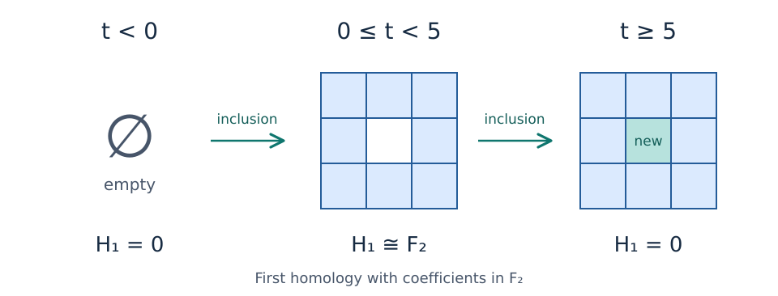

# Persistence modules over posets

When a shape changes with a parameter, we can ask how many connected
components or holes it has. We can also ask a more revealing question: how
does a class observed at one parameter continue to another? A persistence
module records the vector spaces in which these classes live and the linear
maps that follow them through the changes.

This page develops that idea from the ring in the
[first computation](../README.md#your-first-computation). We will see why
several parameters lead to a partially ordered set, what a module over that
set contains, and why keeping only the dimensions loses information. These
are the ingredients needed to understand the next step: a
[finite encoding](finite_encodings.md).

You need familiarity with vectors, linear maps, and matrix multiplication.
No Julia installation or previous knowledge of homology is needed to follow
the examples.

## Begin with a ring that fills in

Imagine nine unit squares arranged in a three-by-three grid. Assign each
square an appearance value:

$$
\begin{pmatrix}
0 & 0 & 0 \\
0 & 5 & 0 \\
0 & 0 & 0
\end{pmatrix}.
$$

At a real parameter $t$, include every square whose value is at most $t$,
together with its edges and vertices. There are no identifications between
opposite sides of the grid. Write $X_t$ for the resulting shape. Before 0 it
is empty; from 0 up to 5 it is a ring; at 5 the center appears and fills the
hole.

*The squares enter at their assigned values. The arrows between shapes are
inclusions. This is an authored schematic of the example; the vector spaces
underneath describe its first homology over F₂.*

Because squares are added and never removed, $X_s$ is contained in $X_t$
whenever $s\leq t$. Such a nested family is called a **filtration**. This is
a *sublevel* filtration: membership is determined by a value being less than
or equal to the parameter.

To describe its holes algebraically, fix the coefficient field
$\mathbb{k}=\mathbb{F}_2$, the field with two elements. A field supplies the
scalars for our vector spaces; in $\mathbb{F}_2$, addition is modulo two.
The first homology space, written $H_1(X_t;\mathbb{k})$, records loops up to
the relation that a loop bounding a filled patch represents zero. More
generally, it allows linear combinations of loops with coefficients in
$\mathbb{k}$.

For the ring, there is one independent nonzero loop class around the hole.
Once the center is filled, that loop bounds a filled patch and its class is
zero. Thus, if we write $M(t)=H_1(X_t;\mathbb{k})$, we obtain

$$
M(t)\cong
\begin{cases}
\mathbb{k}, & 0\leq t<5,\\
0, & t<0\text{ or }t\geq5.
\end{cases}
$$

Here $0$ denotes the zero vector space, which has only the zero vector.
The subscript 1 in $H_1$ specifies the **homological degree**: we are studying
loop classes. The dimension of $H_1$ tells us how many independent such
classes there are. A degree-one homology space can have dimension zero, one,
or more; the degree and the dimension are different quantities.

## Follow the class through linear maps

The inclusion $X_s\subseteq X_t$ sends a loop in the earlier shape to the
same loop in the later shape. It induces a linear map

$$
M(s\leq t):M(s)\longrightarrow M(t).
$$

The notation records both the starting parameter $s$ and the ending
parameter $t$. This map tells us what becomes of every class from the earlier
space. It is called a **structure map** of the persistence module.

For example, choose the loop around the ring as a basis for its one-dimensional
homology. At parameters 1 and 4 the same loop generates the same class, so the
map is represented by the identity matrix $[1]$. At parameter 5 that class
becomes zero:

$$
\underbrace{M(1)}_{\mathbb{k}}
\xrightarrow{[1]}
\underbrace{M(4)}_{\mathbb{k}}
\xrightarrow{0}
\underbrace{M(5)}_{0}.
$$

The final arrow is the unique linear map from a one-dimensional space to
the zero space. Its matrix has zero rows and one column; the label $0$
denotes that zero map. The direct map from parameter 1 to parameter 5 is
also zero: following the class in two steps gives the same answer as following
it in one step.

This example explains why an inclusion of shapes can induce a homology map
that is not injective. The loop remains present as a geometric curve inside
the filled square, but its homology class has become zero.

The **barcode interval** $[0,5)$ packages the life of this class. It includes
0 because the ring is already present there, and excludes 5 because the
hole is already filled there. An interval module places one copy of the
field at each parameter in its interval, zero elsewhere, and identity maps
between parameters inside the interval. It therefore specifies maps as well
as dimensions.

For a one-parameter filtration of a finite simplicial or cubical complex,
homology over a field has a barcode that describes the resulting persistence
module up to compatible changes of basis: the module is a direct sum of
interval modules. The interval decomposition
theorem extends to real-indexed modules whose vector space at every parameter
is finite dimensional. See William Crawley-Boevey's
[decomposition theorem](https://arxiv.org/abs/1210.0819).

We have concentrated on $H_1$. In degree zero, which records connected
components, this example has one class born at 0 that persists forever. Its
interval is $[0,\infty)$. The [ordinary-persistence guide](ordinary_persistence.md)
explains how TamerOp computes these intervals over F₂. That direct barcode
calculation returns a persistence diagram; it does not require constructing
an `EncodingResult`.

> **Coming visualization: follow the ring class.** An interactive view will
> let you move $t$ through the filtration while the shape, its $H_1$ space,
> and the interval $[0,5)$ update together. Selecting an earlier and a later
> parameter will show the induced map and highlight the class becoming zero
> when the later parameter reaches 5. The static schematic above supplies the
> three stages in the meantime.

## What changes with two parameters?

Now imagine that each square has two measured values, $f$ and $g$. We include
a square when both $f\leq a$ and $g\leq b$, again including all of its faces.
The shape $X_{(a,b)}$ depends on two thresholds. Raising either threshold
allows more squares to enter, so

$$
a\leq a'\ \text{and}\ b\leq b'
\quad\Longrightarrow\quad
X_{(a,b)}\subseteq X_{(a',b')}.
$$

These directions are part of the construction. A rule that retains points
*above* a density threshold instead shrinks its selected set when that
threshold increases. To use increasing coordinates throughout, we would
reverse that coordinate's order or reparameterize it, for example by negating
the threshold. We must choose the order to agree with the direction of the
inclusions.

For two increasing coordinates, write

$$
(a,b)\leq(a',b')\quad\text{when}\quad a\leq a'\text{ and }b\leq b'.
$$

This is the **coordinatewise order**. It allows some pairs of parameters to
be compared, but not every pair. Consider four points:

$$
p=(1/4,1/4),\qquad q=(1/4,3/2),\qquad
r=(3/2,1/4),\qquad s=(3/2,3/2).
$$

We have $p\leq q\leq s$ and $p\leq r\leq s$. But $q$ and $r$ are
**incomparable**: the first coordinate increases from $q$ to $r$, while the
second decreases. Neither point is at most the other.

*Arrows show comparisons among these four selected points. The comparison
$p\leq s$ also holds and can be reached along either route. The diagram
shows a finite sample of the parameter plane, not all of ℝ². Moving right or
up increases a parameter; $q$ and $r$ have no order relation in either direction.*

At each of these parameters we can compute a homology space. The specified
inclusions give maps from the space at $p$ to those at $q$ and $r$, and from
each of those spaces to the one at $s$. The parameter order supplies no
structure map from $q$ to $r$ or from $r$ to $q$. This does not assert that
no linear map could be written between their spaces; it says that neither
direction is one of the comparisons prescribed by this module.

The ring was controlled by one real number, so every two parameter values
could be ordered. With two coordinates we now have several directions of
continuation, and these directions must agree wherever they meet.

## A poset records the comparisons

A **partially ordered set**, or **poset**, is a set $Q$ together with a relation
$\leq$ satisfying three rules. Each $q$ satisfies $q\leq q$ (reflexivity).
If $q\leq r$ and $r\leq q$, then $q=r$ (antisymmetry). If $q\leq r$ and
$r\leq s$, then $q\leq s$ (transitivity). These rules describe a consistent
order without requiring that every pair be comparable.

The real line with its usual order is a poset in which every pair can be
compared, also called a **total order**. The coordinatewise order on ℝ² is
a partial order that is not total. A finite chain or the four selected
points above, with their inherited comparisons, is also a poset. The same
language can therefore describe one-parameter persistence, several
parameters, and finite sets of comparisons.

The elements of $Q$ are parameters or labels; they are not the points of the
shape $X_q$. For example, $(a,b)$ is a pair of thresholds specifying a shape,
not a location inside that shape.

## The spaces and maps must fit together

Fix a poset $Q$ and one coefficient field $\mathbb{k}$. A **persistence module
over $Q$**, also called a **$Q$-module** or a **representation of $Q$**, consists
of a vector space $M(q)$ for each $q\in Q$ and a linear map
$M(q\leq r):M(q)\to M(r)$ for each comparison $q\leq r$. The space
$M(q)$ is often called the **stalk** at $q$.

These data satisfy two compatibility rules:

$$
M(q\leq q)=\operatorname{id}_{M(q)},
\qquad
M(q\leq s)=M(r\leq s)\circ M(q\leq r)
\quad\text{for }q\leq r\leq s.
$$

The first rule says that staying at a parameter leaves its vectors unchanged.
The second says that following a vector through an intermediate parameter
gives the same result as taking the direct map. Composition is read from
right to left: first use $M(q\leq r)$, then $M(r\leq s)$.

For the four points in the figure, this requires

$$
M(q\leq s)\circ M(p\leq q)
=M(p\leq s)
=M(r\leq s)\circ M(p\leq r).
$$

Thus the two routes from $M(p)$ to $M(s)$ must give the same linear map.
This is what it means to say that the square **commutes**. Choosing a matrix
for each drawn arrow is not enough: the two matrix products must agree.
The omitted direct map is determined by either product.

For a filtration, this agreement comes from the inclusions of shapes: both
routes include $X_p$ into the same $X_s$, and homology respects their
composition. The abstract definition also allows modules to be specified
directly by spaces and compatible maps, without first constructing shapes.
In categorical language, it says that $M$ is a *functor* from the poset to
vector spaces. Ezra Miller gives this formulation and the filtration
construction in [Definition 2.1 and Example 2.3 of *Homological algebra of
modules over posets*](https://arxiv.org/html/2008.00063#S2.SS1).

All stalks use the same coefficient field. The field supplies the scalars
inside a stalk; it is a separate choice from the parameter domain. A module
can be indexed by real pairs while its vector spaces are over F₂ or ℚ.
In the examples here the stalks are finite dimensional, although the poset
indexing them can be infinite.

> **Coming visualization: compare two parameters.** A view of the parameter
> plane will let you select a source and a target and see whether they are
> comparable. For a worked module, it will display their stalks and, when the
> source precedes the target, the corresponding matrix. An incomparable
> selection will be labelled as having no prescribed structure map. A
> four-point selection will show the two compositions around a square and
> their common result.

## Equal dimensions can hide different behavior

Even on two ordered parameters $u<v$, the dimensions do not determine the
module. Over the same field, consider

$$
A:\quad \mathbb{k}\xrightarrow{[1]}\mathbb{k},
\qquad
B:\quad \mathbb{k}\xrightarrow{[0]}\mathbb{k}.
$$

Each module has dimension one at both $u$ and $v$. In $A$, a nonzero vector
at $u$ continues to a nonzero vector at $v$. In $B$, every vector from $u$
maps to zero; the nonzero vectors at $v$ are not inherited from $u$.

The **rank** of a map is the dimension of its image: how many independent
vectors reach the target. The displayed map has rank one in $A$ and rank
zero in $B$. Changing bases cannot turn a zero map into an identity map,
so these are different modules even after allowing changes of coordinates
in their stalks. A dimension plot would look identical for both.

This loss of information already occurs with one parameter. An ordinary
barcode avoids it by recording continuation as well as dimensions: on this
two-point poset, $A$ has one interval covering both points, whereas $B$ has
two singleton intervals. With several parameters, arbitrary modules do not
have an interval decomposition that plays the same general role as the
ordinary barcode. The vector spaces and their compatible maps remain the
object we need to retain; the broader distinction is discussed in
[Ezra Miller's account of bar codes and their extensions](https://arxiv.org/html/2008.00063#S1.SS6).

As a small check, return to the ring and compare the map from parameter 1
to parameter 4 with the map from 1 to 5. Their ranks are one and zero,
respectively. The first preserves the loop class; the second kills it.
Then return to $q=(1/4,3/2)$ and $r=(3/2,1/4)$. Asking for the rank of
“the structure map from $q$ to $r$” is not a valid query: that comparison
does not exist in the coordinatewise order.

## How can we keep this object in finite form?

We now know what must be retained: a space at each parameter and a
compatible map for each comparison. Over ℝ², that is an infinite collection.
A dimension heatmap would omit the maps; a single increasing path would
inspect only some of the parameters and comparisons.

The next question is when we can describe all of this with finitely many
spaces and maps, together with a rule telling us which part of that finite
description applies at an original parameter. That is the purpose of a
finite encoding. Such a description requires hypotheses on the module;
it is not available for every arbitrary assignment satisfying the module
axioms.

Continue with [finite encodings](finite_encodings.md), where a module
supported on the closed square $[0,2]^2$ supplies the next worked example.
There we can check exactly how a finite model recovers both its spaces and
its structure maps.
