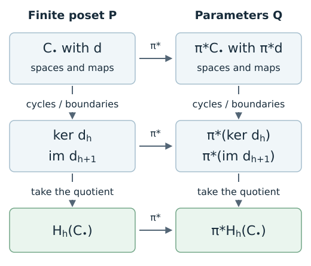

# Why finite computations stay tame

The [tameness chapter](tameness.md) characterized modules that admit finite
encodings. It also showed that a module can have one-dimensional stalks
everywhere and still fail that condition. Does this mean we must prove a
new tameness theorem before every calculation?

For the finite constructions used throughout these lessons, the construction
already supplies the reason. A filtration of a fixed finite complex has a
finite encoding. Our square comes with one explicitly. Once the relevant
maps are encoded too, taking kernels, images, quotients, and homology keeps
us in the finite setting. This is the practical justification for building
on Ezra Miller's framework.

We will first see that mechanism, then explain the stronger closure results
involving **abelian categories**. You need spaces, structure maps, and
[recovery by pullback](finite_encodings.md#what-the-definition-requires).
The preceding chapter supplies the full equivalence theorem; here, remember
that “tame” means admitting a finite encoding with finite-dimensional spaces.
No Julia session or prior category theory is required.

## A finite filtration supplies its own encoding

Let $K$ be a finite simplicial or cubical complex, and suppose each parameter
$q$ in a poset $Q$ selects a subcomplex $K_q$, with
$K_q\subseteq K_r$ whenever $q\leq r$. Take $P$ to be the finite poset of
all subcomplexes of $K$, ordered by inclusion. Then

$$
\pi:Q\longrightarrow P,\qquad \pi(q)=K_q
$$

is order-preserving. Fix a field $\mathbb{k}$ and a homological degree $h$.
On $P$, assign $N(L)=H_h(L;\mathbb{k})$ and the maps induced by inclusions.
These spaces are finite-dimensional. The persistence module of the
filtration is exactly $\pi^*N$, including its maps. This is the observation
in [Ezra Miller's Remark 1.4](https://arxiv.org/html/2008.00063#S1.SS3).

For the ring lesson, the selected shapes are empty before grade $0$, the
ring from $0$ to just below $5$, and the filled square from $5$ onward.
Those three states already give an encoding; their first homology is
$0,\mathbb{F}_2,0$. The two-parameter variant still selects subcomplexes
of the same finite collection of cells, so the argument still applies.

Listing every subcomplex is a proof of existence, not an efficient
implementation prescription. An encoder can retain far fewer labels.
The argument also concerns the mathematical filtration: a direct ordinary
persistence call need not construct a TamerOp `EncodingResult`.

## Follow one map on the square

Return to $M=\mathbb{k}[[0,2]^2]$, our square module, now with
$\mathbb{k}=\mathbb{Q}$. Take two copies and add their vectors:

$$
f:M\oplus M\longrightarrow M,\qquad f_q(a,b)=a+b
\quad\text{for }q\in[0,2]^2.
$$

Outside the square, $f_q$ is the unique map $0\to0$. Inside, its matrix is
$[\,1\ \ 1\,]$. These component maps commute with the structure maps:
interior comparisons use identities, and comparisons entering or leaving
the support give zero on both routes. Thus $f$ is a **module morphism**,
a compatible family of linear maps between two modules.

Before computing, predict which pairs map to zero. At every point of the
square, the answer is the line spanned by $(1,-1)$.

| Operation on $f_q$ | Inside the square | Outside |
| --- | --- | --- |
| Kernel: vectors sent to zero | $\operatorname{span}\{(1,-1)\}$ | $0$ |
| Image: vectors reached in the target | $\mathbb{k}$ | $0$ |
| Cokernel: target modulo the image | $0$ | $0$ |

Following a comparable pair inside the square carries $(1,-1)$ to
$(1,-1)$. Leaving it sends that vector to zero. We have checked the maps,
so $\ker f\cong M$ as a module, not merely a match of dimensions. Likewise
$\operatorname{im}f\cong M$ and $\operatorname{coker}f=0$.

The same finite labels that describe the square describe all these answers.
In this example, we can reuse either of its earlier encodings: at the square
label use $[\,1\ \ 1\,]$, and at the zero labels use the empty matrix.

## Why the finite calculation recovers the original one

Suppose $A$ and $B$ are modules on a finite poset $P$, and
$g:A\to B$ is a module morphism on that same poset. For an order-preserving
map $\pi:Q\to P$, the pulled-back morphism has component
$(\pi^*g)_q=g_{\pi(q)}$. Consequently,

$$
\ker(\pi^*g)\cong\pi^*(\ker g),\qquad
\operatorname{coker}(\pi^*g)\cong\pi^*(\operatorname{coker}g).
$$

Both sides take the kernel or quotient of the same matrix at each parameter.
Their structure maps are the same restrictions or induced quotient maps.
Images work the same way. This property is called **exactness of pullback**.
It explains why we can do these operations on the finite model and recover
the answer on the original domain.

For homology, retain a chain complex $C_\bullet$ on $P$: modules $C_h$ with
boundary morphisms $d_h:C_h\to C_{h-1}$ satisfying $d_h d_{h+1}=0$.
Its cycles are $\ker d_h$, its boundaries are $\operatorname{im}d_{h+1}$,
and its homology is their quotient. Thus

$$
H_h(\pi^*C_\bullet)\cong\pi^*H_h(C_\bullet).
$$

*Schematic of the calculation, not a package plot. Horizontal arrows mean
pullback along the same classifier $\pi$. Vertical arrows mean taking
cycles and boundaries, then their quotient. The differential maps belong
to the encoded data, which is why both routes recover the same answer.*

For any fixed degree, finite-dimensional terms at the finitely many labels
give finite-dimensional homology there. No new global subdivision argument
is needed after taking homology. The square calculation above is the small
linear-algebra version of this mechanism.

## The role of abelian categories

A category specifies objects and the maps allowed between them. For our
purposes, the useful consequence of being **abelian** is that finite direct
sums, kernels, cokernels, and images exist internally, with the usual
relation between image and quotient. Homology can therefore be formed
without leaving the category. Modules of finite-dimensional vector spaces
on a fixed finite poset have this property: the operations are performed
label by label and the induced maps fit together.

There is a distinction when starting with modules on an infinite domain.
Encoding two objects need not encode every morphism between them. Ezra
Miller obtains an abelian category by requiring **tame morphisms** too:
their components are constant under compatible identifications on a common
finite subdivision. See
[Definition 4.27 and Proposition 4.31](https://arxiv.org/html/2008.00063#S4.SS5).

For the square, the map $f$ meets that requirement explicitly. For a complex
already supplied over a finite poset, the differential matrices do too.
Merely knowing that its terms are tame, while leaving its differentials
uncontrolled, would not establish the homology conclusion.

### When all morphisms are covered

Waas strengthens this through **connective encoding structures**, whose
[set-closure conditions](https://arxiv.org/html/2407.08666v1#S2.SS2) govern
the allowed fibers. Each allowed order-convex set must have finitely many
components connected by zigzags of comparable points, also allowed.
Order-convex means containing every point between comparable endpoints.
His [Theorem 3.4 and Proposition 3.5](https://arxiv.org/html/2407.08666v1#S3)
give a full abelian subcategory. Any finite family of modules in that class
admits a common finite encoding with fully faithful, exact pullback. “Full” includes every
ambient module morphism between its objects; “fully faithful” means those
morphisms correspond bijectively to maps on this finite model.

On $\mathbb{R}^n$, [Theorem 1.1](https://arxiv.org/html/2407.08666v1#S1)
covers fibers formed by finite Boolean combinations of topologically closed
piecewise-linear upsets, or closed semialgebraic upsets. Boolean combinations
use finite unions, intersections, and complements. These are sufficient
hypotheses; arbitrary piecewise-linear fibers do not suffice, as
[Example 3.1](https://arxiv.org/html/2407.08666v1#S3) demonstrates.

A particularly useful class allows finite unions of axis-aligned boxes,
including open or closed endpoints and unbounded intervals. Modules encoded
with these fibers form a full abelian subcategory; see Barbara Giunti,
John S. Nolan, Nina Otter, and Lukas Waas,
[Example 3.8, Remark 3.20, and Corollary 3.23](https://arxiv.org/html/2107.09036v5#S3).
Our closed square belongs to this class: its nine-region encoding uses
products of the bands $(-\infty,0)$, $[0,2]$, and $(2,\infty)$.
Consequently the closure statement covers every morphism between modules
in this box-encoded class, beyond the particular addition map we checked.

Endpoint conventions remain part of these statements. The general
closed-upset theorem and the box class just described are different choices
of allowed geometry. We use the latter for the square, preserving its
closed upper boundary.

These results explain the practical advantage: within an established
construction and its allowed operations, the finiteness argument can be
settled once and reused. They do not assert that every module is tame or
that every supplied encoding already encodes all ambient morphisms.

## What the construction settles for a TamerOp user

The relevant starting point determines where the guarantee comes from.

| Starting point | Reason finiteness is already available |
| --- | --- |
| A finite poset module with validated spaces and maps | It is already the finite object on which the linear algebra operates. |
| A supported finite fringe presentation, such as the square | The regions and coefficients specify a tame module; the encoder constructs its finite representation under its geometry contracts. |
| A filtration by subcomplexes of one fixed finite complex | The subcomplex argument gives a finite encoding of its homology module. |
| A module morphism or complex retained on a common finite base | Kernels, images, quotients, and homology pull back to the corresponding operations on the represented objects. |

The package's [construction and geometry contracts](tameness.md#from-an-existence-theorem-to-an-implemented-construction)
still determine which inputs it can process. Waas's general refinement
theorem is not a claim that TamerOp accepts arbitrary symbolic regions or
constructs a fully faithful common encoding for every such input.

There is also a separate modeling question. A finite image, a truncated
complex, or a chosen grid defines the module being computed. Its tameness
does not prove that it equals the persistence of an underlying continuous
space. Establishing that comparison may need an exactness or approximation
result for the particular model. Similarly, a finitely written program can
specify the [infinitely changing module](tameness.md#a-short-rule-and-a-finite-window-are-different-claims)
from the previous chapter. Computability alone is insufficient.

The meaning of “tame” also matters when reading the literature. The work
of Ulrich Bauer, Cameron Gusel, and Luis Scoccola describes broad
applicability of **q-tameness**, while explicitly distinguishing it from
Ezra Miller's stronger finiteness condition; see its
[motivation and context](https://arxiv.org/html/2603.12049v1#S1.SS1).
The previous chapter's [q-tame counterexample](tameness.md#distinguish-this-from-q-tameness)
already shows why that broader condition does not supply a finite encoding.

## Which category does the calculation use?

The square's construction supplies tameness, and its retained finite data
support the calculations we have described. Exact pullback and the closure
results explain why kernels, images, quotients, and homology stay within
this framework. They do not automatically identify Ext or Tor over an
arbitrary finite encoding with ambient derived functors.

Continue with [categories and comparison](math_categories.md) to identify
the category in which an algebraic computation takes place and the
hypotheses needed to compare its answer with one over another poset.
