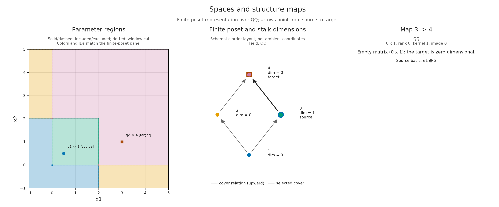

# Exploring spaces and maps

You have an encoding. Which space belongs to a parameter you care about, and
what happens to its vectors when you move to another parameter? TamerOp lets
you answer these questions numerically, examine the corresponding matrices,
and connect the answer to a picture of the finite representation.

This guide starts with an `EncodingResult` and follows those choices. You need
the meaning of a [space and structure map](persistence_modules.md), but need
not work through another construction lesson first. The
[square notebook](tutorials/inspect_encoding.ipynb) develops the mathematics
through a complete worked example; here the emphasis is on choosing queries
you can reuse with your own encoding. If you already have a finite `PModule`,
you can begin with finite-label queries and omit parameter lookup.

## Start from a recognizable object

The following setup makes the square-supported module: a one-dimensional
space on the closed square `[0,2] × [0,2]`, zero elsewhere, with identity maps
between comparable interior parameters. Its coefficients are rational.
Replace this setup with your own `enc` when exploring another object.

```julia
import TamerOp as OP
import TamerOp.Advanced as OA
import TamerOp.CoreModules: QQField

options = OA.EncodingOptions(; backend=:pl_backend,
    poset_kind=:signature, field=QQField())
enc = OP.encode([OA.BoxUpset([0, 0])], [OA.BoxDownset([2, 2])],
    reshape(OP.QQ[1], 1, 1), options);
```

`OP` provides the main workflow. `OA` gives access to the more detailed
queries used below, including finite-label lookup and presentation inspection.
The two indicator regions and their coefficient describe the input; `encode`
returns the finite representation. See [indicator presentations](indicator_presentations.md)
for the construction, including what the active rows and columns mean.

An encoding keeps the finite poset, the assignment from parameters to its
labels, and the encoded module together. Ask what is retained before choosing
what to compute:

```julia
OP.describe(enc)
OP.provenance(enc)
```

The summary describes stored information; provenance records the construction
and its conventions, including the field. This square constructor already
computes its module. Some ingestion workflows instead return a *lazy* result:
enough information to compute spaces and maps when requested. Displaying such
a result leaves that work deferred.

| What you need | Query | What it asks for |
| --- | --- | --- |
| Finite labels and their order | `OP.encoding_poset(enc)` | The retained poset |
| Assignment from parameters to labels | `OP.encoding_map(enc)` | The retained classifier |
| Every stalk dimension | `OP.dimensions(enc)` | A dimension vector, computing it if needed |
| Spaces with their structure maps | `OP.encoding_module(enc)` | The finite module, materializing it if needed |
| A retained indicator presentation | `OP.encoding_presentation(enc)` | The finite fringe, or `nothing` if absent |

Dimension queries can do mathematical work even though they return only
integers. Having the dimensions does not imply that lazy structure maps have
been computed. The [deferred-computation guide](lazy_inspection.md) explains
reuse and costs across ingestion, algebra and geometry.

## Find a parameter's space

Keep the poset and its parameter assignment available, then ask for dimensions:

```julia
P = OP.encoding_poset(enc)
classifier = OP.encoding_map(enc)
dims = OP.dimensions(enc)
```

`dims[q]` is the dimension at finite label `q`. These integers are labels in
the returned poset, not parameter coordinates or ranks in a sorted list.
The signature encoder used here returns four labels; the nine-region picture
in [finite encodings](finite_encodings.md) is another valid description of
the same square. Obtain labels from this result instead of assuming their
numbers.

```julia
x = (1//2, 1//2)
qx = OA.locate(classifier, x)
(label=qx, dimension=dims[qx])
```

The dimension is `1`. The expression `1//2` supplies the exact rational
one-half. A parameter first chooses a label; that label chooses a space.
This is also how the picture and the algebra refer to the same object.

For classifiers that do not represent the whole parameter domain, `locate`
can return `0`. Check for that sentinel before indexing a dimension vector:

```julia
z = (3, 1)
qz = OA.locate(classifier, z)
z_dimension = qz == 0 ? nothing : dims[qz]
```

Here `qz` is a represented label and `z_dimension` is `0`: the point is outside
the square's support, but its zero space is part of the encoding. An
unrepresented point would instead give `nothing` in this example code. The
distinction is useful for encodings whose classifier covers only part of the
parameter domain; missing information does not determine a zero space.

If your starting object is already a finite module `M`, use `OA.dim_at(M, q)`
for a single stalk dimension. `OP.dimensions(M)` returns a summary with a
`.stalks` vector; `OP.dimensions(enc)` returns that vector directly.

## Ask how vectors continue

A matrix answers a different question from a dimension. Its columns correspond
to the source space's coordinates, and its rows to the target's. Materialize
the finite module when you need these maps:

```julia
M = OP.encoding_module(enc)
y = (3//2, 3//2)
qy = OA.locate(classifier, y)
A = OA.structure_map(M; source=qx, target=qy)
```

The answer is the `1 × 1` identity matrix over the rationals: the vector
continues unchanged. `structure_map` takes **finite labels**. It can compose
cover maps when the selected pair is not itself a cover; you need not build
a table of all comparable pairs. Returned matrices may share stored data,
so treat them as read-only, or `copy(A)` before editing entries.

Now move beyond the support:

```julia
Z = OA.structure_map(M; source=qx, target=qz)
size(Z)
```

The shape is `(0, 1)`. This is the defined zero map from a one-dimensional
space to the zero space. An empty array here has precise mathematical
content. Equal labels give the identity on their space, including a `0 × 0`
identity for a zero space.

There is an important choice when the question begins with parameters.
Finite-label queries know the finite order; they do not check whether the
original parameters were comparable. In the square, `(1/4,3/2)` and
`(3/2,1/4)` have the same label but are incomparable in coordinatewise order.
The finite identity at that label is not an ambient structure map between
those points. Use a parameter-aware inspection request for this question:

```julia
u, v = (1//4, 3//2), (3//2, 1//4)
unordered_view = OA.visual_spec(enc; kind=:module_inspector,
    parameter_pair=(u, v))
unordered = OA.visual_metadata(unordered_view).inspection
(defined=unordered.defined, matrix=unordered.matrix)
```

The answer is `(defined=false, matrix=nothing)`. A specification is the
mathematical content of a view; building it needs no plotting package. The
parameter query checks the original order as well as classification. Grid
classifiers use their declared axis orientations, rather than assuming every
parameter increases in the usual coordinate order.

Keep these outcomes separate when exploring your own object:

| Outcome | Interpretation |
| --- | --- |
| A represented stalk has dimension `0` | Its vector space is zero. |
| A defined map has rank `0` | Every source vector maps to zero; the map can have nonempty matrix dimensions. |
| A pair is incomparable or ordered only in reverse | There is no structure map in the requested direction. |
| A parameter has classifier label `0` | This encoding does not supply its space or map. |
| A presentation or source representative is absent | The retained result does not include that additional description. |

The last case depends on what was retained, not on whether the selected space
is zero. In particular, a coordinate vector in a finite module does not by
itself identify a cycle in an input complex.

## Connect the answer to a figure

Load CairoMakie for static figures. A single inspection view connects the
selected parameters, their finite labels, and the map readout:

```julia
import CairoMakie

view_box = ([-1, -1], [5, 5])
map_view = OA.visual_spec(enc; kind=:module_inspector,
    parameter_pair=(x, z), box=view_box)
OP.visualize(map_view)
```

[](assets/guides/spaces_map.png)

*The selected source lies inside the square and the target lies outside its
support. The readout reports the `0 × 1` matrix, rank zero and kernel dimension
one. Colors and labels connect the parameter plane to the actual finite
poset; that poset's layout is schematic.*

Select either figure in this guide to open it at full size.

The window makes unbounded regions drawable. It does not restrict the module
queried by this inspector. Solid poset arrows are cover relations; a selected
comparable non-cover pair receives an additional dashed arrow. The
[parameter-plane conventions](visualization.md#reading-the-parameter-plane)
explain included boundaries, window cuts and finite drawing precision.

The same request works without retaining a specification:
`OP.visualize(enc; kind=:module_inspector, parameter_pair=(x,z), box=view_box)`.
Keep a specification when you want to inspect its data or render the same
answer again:

```julia
answer = OA.visual_metadata(map_view).inspection
(rank=answer.rank, kernel=answer.kernel_dimension, matrix=answer.matrix)
```

Choose one selection form per request:

| Question | Selection |
| --- | --- |
| Space at an original parameter | `point=x` |
| Map between original parameters | `parameter_pair=(x,y)` |
| Space at a finite label | `vertex=qx` |
| Map in the finite model | `pair=(qx,qy)` |

A `PModule` has the finite-poset and readout panels without invented geometric
coordinates. A supported planar encoding adds its parameter panel. Use
`OP.available_visuals(enc)` to discover its views, or
`OA.check_visual_request(enc; kind=:module_inspector)` to inspect the accepted
options and qualitative work. `kind=:hasse` asks only for the finite order
with dimensions; an unselected or stalk-only module inspector also leaves
lazy structure maps deferred. A defined pair can materialize them.

Large selected matrices are cropped for display using `matrix_limit=(12,12)`
by default. The specification retains the full matrix; rank and kernel
dimension use all its entries. Raising or lowering the display limit changes
neither the result nor the cost of constructing it. With `RealField`, ranks
use the field's numerical tolerances; the rational example here is exact.

## Look inside a retained presentation

The module's matrix describes a map in its stored coordinate bases. A retained
indicator presentation answers an additional question: how do its active
coefficient blocks produce those spaces? Start by checking for the witness:

```julia
H = OP.encoding_presentation(enc)
```

For this encoding, `H` is a finite fringe. If the accessor returns `nothing`,
this inspection route is unavailable; it does not reconstruct a presentation
from the module. Presentation queries also accept a finite `FringeModule`
directly. The witness must belong to the current poset and field.

To see why counting active generators is insufficient, keep the square's
support but give it two active columns in the upper part of the square:

```julia
redundant = OP.encode([OA.BoxUpset([0, 0]), OA.BoxUpset([1, 1])],
    [OA.BoxDownset([2, 2])], OP.QQ[1 1], options)
qr = OA.locate(OP.encoding_map(redundant), y)
stalk = OA.presentation_stalk(redundant; vertex=qr)
(rows=OA.active_rows(stalk), columns=OA.active_columns(stalk),
    block=OA.presentation_matrix(stalk),
    dimension=OA.presentation_summary(stalk).dimension)
```

At `y=(3/2,3/2)`, row `1` and columns `1,2` are active. Their block is `[1 1]`,
whose image has dimension one. Two columns supply the same direction. The
default query computes the block and its rank, leaving an image basis
uncomputed. Request that basis when you want actual vectors in the active
downset coordinates:

```julia
with_basis = OA.presentation_stalk(redundant; vertex=qr, basis=true)
B = OA.image_basis(with_basis)
size(B)
```

The shape is `(1, 1)`: one basis vector in one active target coordinate. In
general, the basis matrix's row count is the number of active downsets, and
its column count is the image dimension. A zero image in a one-dimensional
target therefore has a `1 × 0` basis, not a missing result.

```julia
presentation_view = OA.visual_spec(redundant; kind=:presentation_inspector,
    point=y, basis=true, box=view_box)
OP.visualize(presentation_view)
```

[![A presentation inspector at the overlap of two upsets: the active coefficient block has two columns [1 1], but its image basis has only one column.](assets/guides/spaces_presentation.png)](assets/guides/spaces_presentation.png)

*The active block retains both columns; the image basis retains one independent
direction. Support panels show the selected upset and downset. Changing the
displayed support with `upset` or `downset` does not remove other active
indicators from the calculation.*

Support colors use the actual classifier regions. Their outlines, including
cuts at the viewing window, remain region boundaries; they are not newly
computed boundaries of a merged upset or downset. Without supported planar
geometry, the same inspector reports membership on finite labels.

For a comparable finite pair, `presentation_map` computes the endpoint image
bases and the induced map between them. This is a deliberate basis computation:

```julia
rx = OA.locate(OP.encoding_map(redundant), x)
presented_map = OA.presentation_map(redundant; source=rx, target=qr)
Bx = OA.image_basis(OA.source_stalk(presented_map))
By = OA.image_basis(OA.target_stalk(presented_map))
R = OA.ambient_projection(presented_map)
C = OA.induced_map(presented_map)
By * C == R * Bx
```

The answer is `true`. `R` projects onto downset coordinates still active at
the target; `C` expresses that projected vector in the target image basis.
This equality is exact over the rational field. A numerical field requires
its corresponding tolerances when comparing matrices.

To see these matrices together, use the presentation inspector with
`parameter_pair=(x,y)`. Pair queries compute the required endpoint bases;
`basis=true` is a single-stalk option. Presentation image bases and the
module's stored bases need not agree for an arbitrary hand-built encoding.
Neither identifies source cycles without additional retained correspondence.
The [square notebook](tutorials/inspect_encoding.ipynb) explores the richer
two-square example, including an active zero block and a zero composite of
two nonzero maps.

## Explore nearby selections in a live session

After the static answer is understood, a session lets you change selections
without rebuilding the whole view. Return to the original square, `enc`, here.
This optional step requires WGLMakie in
your environment and a running Julia process; see
[optional integrations](optional_integrations.md) for setup.

```julia
import WGLMakie

session = OP.inspection_session(enc; box=view_box)
OA.select_inspection!(session; parameter_pair=(x, z))
OP.visualize(session; backend=:wglmakie)
```

If you start with a finite `PModule`, `OP.inspection_session(M)` provides
finite-label controls and a Hasse/readout view without a parameter plane.

Choose **Selection endpoint** to make a click select a stalk, source or target.
The parameter plane, finite poset and readout share that selection. Hovering
reports only the label and dimension. **Finite vertex** and finite source/target
fields let you select labels without pointing at small regions or nodes.
**Coordinate view** switches between module and presentation coordinates when
a finite presentation is retained.

A pointer supplies approximate drawing coordinates. For boundary questions,
use the **Exact point x/y** or **Exact source/target x/y** fields and their
inspection buttons. Fractions such as `1/2` or `1//2`, integers, decimal text
and scientific notation are interpreted exactly as entered. These fields
accept numbers, not Julia arithmetic expressions. Tab and Shift-Tab move
between controls; Enter or Space activates a focused button.

You can make the same selections from Julia:

```julia
OA.select_inspection!(session; point=y, view=:presentation, basis=true)
OA.inspection_selection(session)
OA.inspection_summary(session)
```

Only one of `point`, `parameter_pair`, `vertex` or `pair` belongs in an update.
Omitting all four keeps the query, so changing a view or support preserves its
location. A view change does not identify presentation and module bases.
Single-stalk image bases require `basis=true`; a defined presentation pair
computes the bases needed for its map. Undefined pairs remain undefined.

The session reuses geometry for its box and caches selected answers.
`cache_limit=16` is the default entry count for each algebra and slice cache,
not a byte limit or a bound on the cost of one query. An unselected overview
leaves image bases uncomputed. The usual matrix display limit also applies.

To keep the selection, obtain a static specification:

```julia
snapshot = OA.inspection_snapshot(session)
OP.save_visual("selected-space.svg", snapshot; backend=:cairomakie)
```

This snapshot has no live callbacks. Each call to
`OP.visualize(session; backend=:wglmakie)` creates an independent viewer linked
to the same session; call it again for a second browser client rather than
redisplaying the same returned App. Closing one viewer leaves the core session
available for another. `OA.reset_inspection!(session)` clears space, map and
interval selections while retaining an active slice line.

When finished, call `OA.close_inspection!(session)` or use **Close inspector**
to release its viewers, callbacks and cache. Closing is safe to repeat; create
a new session to resume. The last snapshot remains usable. Exporting a live
session as offline HTML is rejected because its controls need Julia.

For intervals along a changing line, continue with
[slice inspection](visualization.md#move-a-line-and-read-its-intervals).
For saved figures, use the shared [rendering and export controls](visualization.md#rendering-and-saving).
These are other ways to examine the object you have retained; the selected
spaces and matrices remain available independently of the picture.
