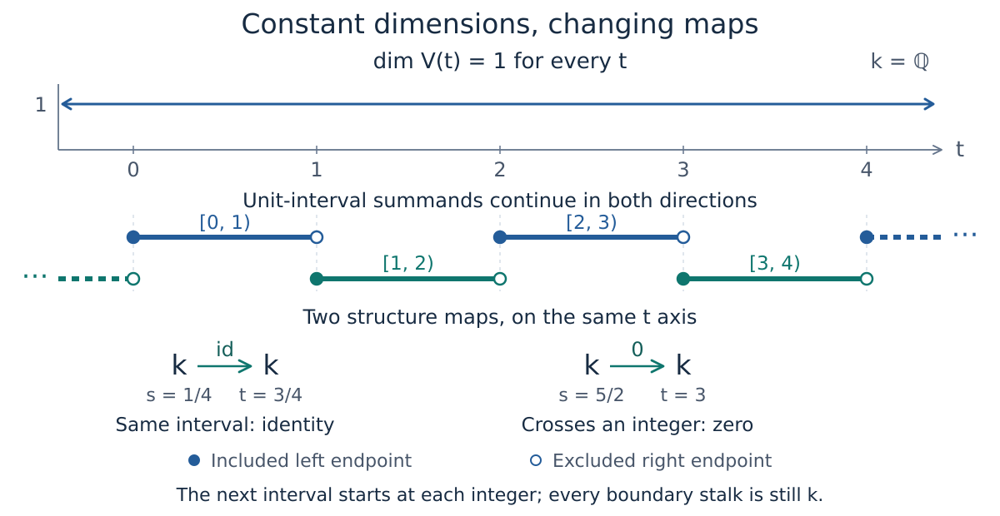

# Tameness and scope: when finite descriptions exist

The [indicator-presentations chapter](indicator_presentations.md) described
the square module using two regions and a coefficient matrix. The
[finite-encodings chapter](finite_encodings.md) recovered the same module
from a finite poset, its spaces and maps, and a classifier on the parameter
plane. When can a module have descriptions like these?

The answer depends on controlling how its maps vary, as well as the size
of its spaces. We will make that requirement precise, revisit the square,
and examine one module whose stalks all have dimension one but which has
no finite encoding.

You need the preceding chapters' definitions of modules, finite encodings,
and fringe presentations. We use a fixed coefficient field $\mathbb{k}$;
take $\mathbb{k}=\mathbb{Q}$ in the examples. The general statements apply
to an arbitrary parameter poset $Q$.

## What should it mean for a module to be constant on regions?

Recall the square $S=[0,2]^2$ in $\mathbb{R}^2$. Its module $M$ has
$M(q)=\mathbb{k}$ inside $S$ and $M(q)=0$ outside. A structure map between
comparable points inside is the identity; every other structure map is
the uniquely determined zero map of the appropriate shape.

There are two kinds of spaces here. Partition the plane into

$$
R_1=S,\qquad R_0=\mathbb{R}^2\setminus S.
$$

Use $\mathbb{k}$ as the common space for $R_1$ and $0$ for $R_0$.
Once these spaces are identified with the stalks, the maps depend only on
which two regions contain their endpoints:

| Source region | Target region | Map, whenever the parameters are comparable |
| --- | --- | --- |
| $R_1$ | $R_1$ | Identity on $\mathbb{k}$ |
| $R_1$ | $R_0$ | Zero map $\mathbb{k}\to0$ |
| $R_0$ | $R_1$ | Zero map $0\to\mathbb{k}$ |
| $R_0$ | $R_0$ | Unique map $0\to0$, also its identity |

This is more than a partition by dimensions: it describes the maps
consistently too.

For a general module, choose a partition $Q=\bigsqcup_i R_i$, a vector
space $V_i$ for each region, and isomorphisms
$\alpha_q:V_i\to M(q)$ for $q\in R_i$. It is a **constant subdivision**
if, for every ordered pair $(R_i,R_j)$, the map

$$
\alpha_r^{-1}\,M(q\leq r)\,\alpha_q:V_i\longrightarrow V_j
$$

is independent of the chosen comparable pair $q\in R_i$, $r\in R_j$.
This includes $i=j$ and self-comparisons. This is the compatibility
condition in [Ezra Miller's Definition 2.6](https://arxiv.org/html/2008.00063#S2.SS2).

The equation starts with a vector in $V_i$, sends it to $M(q)$, applies
the module map, then expresses the answer in the target region's common
space $V_j$. All comparisons use the same chosen identifications. Choosing
unrelated bases separately for each arrow would not establish this property.
The condition is called **no monodromy** in the cited definition.

For points in the same region, comparison with a self-map forces the
displayed map to be the identity on $V_i$. Thus any structure map between
comparable points of that region must be an isomorphism. For incomparable
points there is no structure map to require. Regions need not be connected,
convex, or bounded; the square's entire exterior is already one region
in this subdivision.

## The notion of tameness used here

A module is **pointwise finite-dimensional** if each stalk $M(q)$ has
finite dimension. Ezra Miller also calls this $Q$-finite; it does not
mean that the parameter poset $Q$ is finite.

In this chapter, **tame** means pointwise finite-dimensional and admitting
a constant subdivision with finitely many regions. Both requirements
belong to [Definition 2.11](https://arxiv.org/html/2008.00063#S2.SS2).

The square is tame: the two regions above work, and their common spaces
have dimensions one and zero. Tameness concerns the whole stated parameter
domain, here all of $\mathbb{R}^2$. Finite does not mean a bounded domain
or bounded regions.

The two requirements control different things. Finite-dimensional stalks
limit the size of each individual space. A finite constant subdivision
limits how many descriptions of spaces and maps are needed across the
domain. Together they give a uniform bound on stalk dimensions: take the
largest of the finitely many dimensions $\dim V_i$. The counterexample
below will show that even a uniform bound of one does not suffice by itself.

## A constant subdivision is not yet an encoding

The square's two-region subdivision is valid, but those two regions cannot
be the fibers of an order-preserving map to a two-element poset. Indeed,

$$
(-1,1)\leq(1,1)\leq(3,1).
$$

The first and last points are exterior, while the middle point is inside.
If $z$ labels the exterior and $a$ labels the square, monotonicity would
force $z\leq a\leq z$. Antisymmetry then gives $z=a$, incompatible with
the different stalk dimensions.

The constant-subdivision condition did not require its two region names
to form a poset. An encoding does. This is the extra organization that
lets a finite module supply the required maps.

For this square we already have a suitable refinement. Record

$$
u(x,y)=\mathbf{1}_{\{x\geq0,\ y\geq0\}},\qquad
c(x,y)=\mathbf{1}_{\{x>2\ \text{or}\ y>2\}}.
$$

Both bits increase with the parameters, so $\pi(x,y)=(u(x,y),c(x,y))$
is order-preserving into $\{0<1\}^2$. Its four fibers split the exterior
into three pieces and retain the square as the fiber labeled $(1,0)$.
Give that label the space $\mathbb{k}$ and the other three labels zero.
This is the four-label encoding developed earlier.

| Description of the same square module | What is finite? |
| --- | --- |
| Constant subdivision | Two regions with compatible identifications of spaces and maps |
| Signature encoding | Four labels, their ordered module, and the classifier $\pi$ |
| Nine-region encoding | Nine labels, their ordered module, and the band classifier |
| Fringe presentation | One upset, one downset, and the coefficient matrix $[1]$ |

The counts measure different ingredients. They are not competing counts
of persistent classes, and none of these constructions asserts minimality.

## Three equivalent ways to have finite data

For a fixed field and a **pointwise finite-dimensional module over any
poset**, the following are equivalent:

1. It admits a finite constant subdivision.
2. It admits a finite encoding: $M\cong\pi^*N$ with $\pi:Q\to P$
   order-preserving, $P$ finite, and every $N(p)$ finite-dimensional.
3. It admits a finite fringe presentation: an image of a map from a finite
   sum of upset indicators to a finite sum of downset indicators, with
   one scalar on each component's intersection.

The first two conditions are related by
[Theorem 4.22](https://arxiv.org/html/2008.00063#S4.SS4);
the third is included in
[Ezra Miller's syzygy theorem, Theorem 6.12](https://arxiv.org/html/2008.00063#S6.SS2).
The pointwise finite-dimensional hypothesis is explicit here: a finite
number of constant regions alone places no dimension bound on their common
spaces.

These are existence statements about the same module. They do not identify
the regions in one description with the labels or summands in another.
Here is how the constructions fit together.

### From an encoding to a constant subdivision

Take the nonempty fibers $\pi^{-1}(p)$. Identify each stalk in that fiber
with $N(p)$ using the given module isomorphism. A map between fibers is
then $N(p\leq p')$, independent of which comparable original parameters
were chosen. There are only finitely many fibers, so they give a finite
constant subdivision.

### From a fringe presentation to an encoding

For each upset, record membership; for each downset, record membership in
its complement. This produces finitely many increasing bits. Their
patterns form a finite ordered set. At each pattern, select the active
rows and columns of the coefficient matrix and take its image. Between
comparable patterns, restrict the appropriate target-coordinate projection
to the image.

The [previous chapter](indicator_presentations.md#how-the-presentation-leads-to-a-finite-encoding)
explained why these spaces and maps recover the presented module. The
construction uses the fixed scalar coefficients as well as the regions;
membership patterns alone would lose the linear algebra.

### From a constant subdivision to an encoding

This is the substantive step supplied by the finite-encoding theorem:
the compatible regional data admit a suitable finite ordered model.
Its construction uses upsets derived from the constant regions to obtain
order-preserving labels.

The new fibers need not be the original pieces. Nor should the theorem
be read as saying that every arbitrarily chosen subdivision can be retained
by merely splitting its pieces. It produces an encoding of the module.
For the particular square subdivision above, the explicit four-fiber
refinement does work.

### Why a finite encoding also yields a fringe presentation

There is a finite linear-algebra construction that explains this direction.
Start with the finite module $N$ on $P$. At a label $x$, form

$$
F(x)=\bigoplus_{p\leq x}N(p),\qquad
E(x)=\bigoplus_{r\geq x}N(r).
$$

After choosing a basis for every $N(p)$, $F$ is a finite sum of principal
upset indicators and $E$ a finite sum of principal downset indicators.
“Principal” means the upset $\{x:p\leq x\}$ or the downset
$\{x:x\leq r\}$ generated by one label.

Define maps

$$
F(x)\xrightarrow{a_x}N(x)\xrightarrow{b_x}E(x),
$$

where $a_x((v_p)_p)=\sum_{p\leq x}N(p\leq x)v_p$, and
$b_x(v)=(N(x\leq r)v)_{r\geq x}$.
The summand indexed by $x$ makes $a_x$ surjective and $b_x$ injective:
in each case that coordinate uses the identity of $N(x)$. The maps commute
with structure maps, so the image of $b\,a$ is isomorphic to $N$ as a module.

For a source summand indexed by $p$ and a target summand indexed by $r$,
the composite at any $p\leq x\leq r$ is

$$
N(x\leq r)\,N(p\leq x)=N(p\leq r).
$$

Its matrix is independent of $x$. Thus every scalar component is constant
on its upset–downset intersection, as a fringe presentation requires.
If $p\not\leq r$, that intersection is empty and the component is zero.
Pulling the construction back along $\pi$ replaces these regions by their
preimages and gives a finite fringe presentation of $M$. This establishes
existence; it need not give the smallest presentation. If a pulled-back
intersection is empty, set its unused coefficient entries to zero.

## A counterexample with dimension one everywhere

For this example only, use the one-parameter domain $\mathbb{R}$. Keep
$\mathbb{k}=\mathbb{Q}$. Put

$$
V(t)=\mathbb{k}\quad\text{for every }t\in\mathbb{R},
$$

and, for $s\leq t$, define

$$
V(s\leq t)=
\begin{cases}
\operatorname{id}_{\mathbb{k}},&\lfloor s\rfloor=\lfloor t\rfloor,\\
0,&\lfloor s\rfloor\ne\lfloor t\rfloor.
\end{cases}
$$

Here $\lfloor t\rfloor$ is the integer $n$ satisfying $n\leq t<n+1$.
The map is the identity within one unit interval and zero whenever it
crosses an integer boundary. For example,

$$
V(\tfrac14\leq\tfrac34)=[1],\qquad
V(\tfrac34\leq1)=[0],\qquad
V(1\leq\tfrac32)=[1].
$$

This is a module. For $s\leq t\leq u$, the floors are nondecreasing.
If the endpoint floors agree, all three agree and the maps are identities.
Otherwise at least one of the two successive maps is zero, and both the
composite and the direct map are zero. Self-maps are identities.

Equivalently, writing $I_n=[n,n+1)$,

$$
V\cong\bigoplus_{n\in\mathbb{Z}}\mathbb{k}[I_n].
$$

Here $\mathbb{k}[I_n]$ is the indicator module of the half-open interval
$[n,n+1)$. Exactly one summand is present at each
parameter. At an integer, one summand ends and the next begins, so the
stalk is still $\mathbb{k}$.

*Only a finite window of the construction is drawn. The unit intervals
continue in both directions. Open right endpoints belong to the ending
summand's convention; they do not mark zero stalks of the whole module.*

### Why no finite constant subdivision can work

Consider the infinitely many parameters $t_n=n+\tfrac12$ for integers
$n\geq0$. In any partition into finitely many regions, two of them,
say $t_n<t_m$, must belong to the same region.

Their structure map is zero, because they lie in different unit intervals.
Changing bases cannot turn a zero map into an isomorphism. But two comparable
points in one constant region must have an isomorphism between their
stalks: their transported map must agree with the identity self-map.
This is a contradiction. Hence $V$ is not tame.

There is also a direct obstruction to a finite encoding. Two of the
$t_n$ would have to receive the same finite label $p$. Their map would
then be recovered from $N(p\leq p)=\operatorname{id}_{N(p)}$ and would
be an isomorphism, again contradicting the zero map. The equivalence
theorem also rules out a finite fringe presentation.

Thus even **constant dimension one everywhere** does not guarantee any
of these finite descriptions. A dimension plot loses precisely the
distinction between the identity and zero maps in this example.

### A short rule and a finite window are different claims

The floor formula describes $V$ in a few symbols. It even gives an
encoding through the poset $\mathbb{Z}$, with $\mathbb{k}$ at every integer
and zero maps between distinct integers. That encoding is infinite.
A short program or formula is a different notion of finite description
from the finite encodings considered here.

If we restrict the domain to a fixed bounded interval, only finitely many
unit intervals meet it. Restricting the floor classifier to that finite
set of integer labels gives a finite encoding of the restricted module.
The restriction is tame, while the module on all of $\mathbb{R}$ is not.
A finite drawing or a finite collection of successful queries cannot
settle the global claim; the proof above does.

> **Coming visualization: compare maps with the dimension profile.**
> A selectable pair of parameters will show the two stalks, their interval
> labels, and the identity or zero structure matrix. Widening the displayed
> window will reveal more intervals without changing the dimension profile.
> The display will distinguish the finite window from the full real-line
> module; this interactive view is not implemented yet.

### Distinguish this from q-tameness

In one-parameter persistence, **q-tame** usually means that every map
$V(s\leq t)$ with $s<t$ has finite rank; see
[Frédéric Chazal, William Crawley-Boevey, and Vin de Silva, Section 1.4](https://arxiv.org/html/1405.5644#S1.SS4).
Our counterexample has ranks zero or one, so it is q-tame. It is not tame
in the finite-constant-subdivision sense used in this chapter. The two
terms impose different requirements.

## From an existence theorem to an implemented construction

The theorem concerns modules over arbitrary posets and allows abstract
upsets, downsets, and classifiers. To compute, we must also provide a
representation of those ingredients and methods for evaluating membership
and order. Finitely many sets need not come with finite geometric
descriptions or an algorithm for testing membership.

The square supplies both kinds of information: its finite presentation
has the coefficient $[1]$, and four explicit inequalities describe its
regions. The selected encoder can construct the finite model and classify
queries. The theorem alone is not an interface accepting an arbitrary
mathematically specified module and deciding whether it is tame.

Some concrete TamerOp entry routes are:

| Starting information | What the package works with |
| --- | --- |
| A finite poset, finite-dimensional spaces, and compatible maps | A finite module such as `TamerOp.Advanced.PModule`, inspected and validated directly. It is already a finite representation. |
| The square's box regions and coefficient matrix | `encode(upsets, downsets, coefficients, options)` produces an `EncodingResult` for the selected supported construction. |
| A supported polyhedral presentation | Presentation encoding using the applicable geometric backend, with that backend's generator and arithmetic requirements. |
| Typed data together with a supported filtration | Data ingestion through `encode`, requesting the completed encoding stage when an `EncodingResult` is wanted. |

The first row is not a promise of an `encode(module)` method. Mathematically
the identity map of a finite poset is an encoding of its module, while the
software can operate on that finite module directly.

For geometric presentations, consult the
[geometry contracts](math_categories.md#geometric-encoding-and-boundary-classes).
For data, the [ingestion guide](ingestion_options.md) explains filtration,
degree, grid, truncation, and intermediate-stage choices. These determine
which module is represented. A finite encoding recovers that chosen module;
it does not undo a change made when constructing the input.

The coefficient field and geometric arithmetic are separate choices.
Rational coefficients make the stated linear algebra exact without
automatically making every geometric input exact. The
[exact-grade guide](exact_grades.md) describes guarantees for its specific
construction. Likewise, neither the existence theorem nor a successful
example asserts that the returned encoding is minimal or inexpensive for
every supported input.

## What the foundation now lets us do

We can recognize a tame module through compatible constant regions,
finite encoding data, or a finite fringe presentation. The square exhibits
all three descriptions. The real-line counterexample explains why finite
stalk dimensions and an informative-looking dimension plot do not replace
the map compatibility requirement.

The full syzygy theorem also relates tameness to finite indicator
resolutions. A resolution organizes successive relations among simpler
modules; developing those constructions is a later algebraic step.
Existence of such resolutions does not identify every computation over
different base posets. In particular, finite-base Ext and Tor require
the [category and comparison hypotheses](math_categories.md) described
in their guide.

The immediate next step is practical: follow a parameter through the
square's returned classifier to its space, then follow a comparable pair
to its map. The [first learning path](learning_path.md) sets out that
inspection lesson and its planned visualization. Its purpose is now
precise: make the finite description, and what it recovers, visible.
