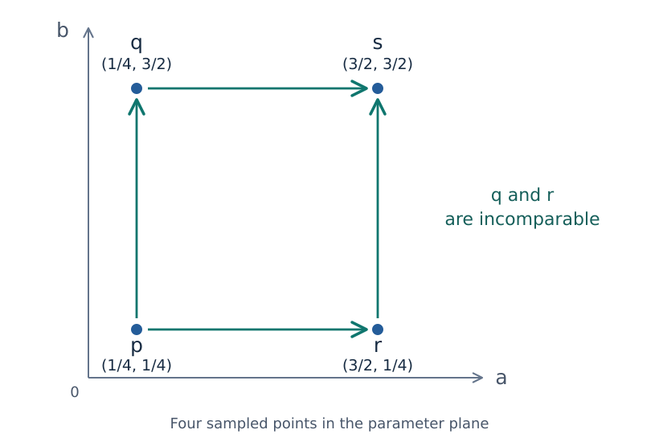

# Why two parameters change the problem

In the [ring lesson](tutorials/ring.ipynb), one number controlled which
squares were present. The interval $[0,5)$ told us when the hole appeared
and when it filled in. What changes when two independently varying
measurements determine which squares enter?

This short bridge needs only the ring example and familiarity with vectors
and linear maps. By the end, you should be able to decide which parameter
pairs can be compared and explain why we need maps as well as counts. No
Julia session is needed. The [persistence-modules chapter](persistence_modules.md)
develops the definitions and arguments in more detail.

## From one threshold to two

Imagine giving each square two values, $f$ and $g$. At the parameter pair
$(a,b)$, include a square when **both** $f\leq a$ and $g\leq b$, together
with its edges and vertices. Write $X_{(a,b)}$ for the resulting shape.
Increasing either threshold can add squares but cannot remove them. Thus

$$
(a,b)\leq(a',b')\quad\text{means}\quad a\leq a'\text{ and }b\leq b',
$$

and this comparison guarantees $X_{(a,b)}\subseteq X_{(a',b')}$.
This is **coordinatewise order**. We have described a possible construction;
the ring computation supplied only one measurement, so it has not already
computed this two-parameter family.

The directions matter. If a measurement instead retains cells *above* a
threshold, raising that threshold removes cells. Reverse that coordinate's
order, or negate the threshold, before using the increasing-coordinate
convention here.

## Which choices can we compare?

Consider these four parameter pairs. They are thresholds selecting shapes,
not positions of squares inside a shape.

*Moving right or up increases a threshold. The arrows show comparisons
among four sampled parameters; $p\leq s$ also holds through either route.
This schematic is a sample of the parameter plane, not a finite encoding.*

**Before reading on:** can we continue from $p$ to $q$? From $r$ to $s$?
What about from $q=(1/4,3/2)$ to $r=(3/2,1/4)$?

The first two comparisons hold: neither coordinate decreases. In the last
pair, one coordinate increases while the other decreases. Neither $q\leq r$
nor $r\leq q$ holds. Such a pair is **incomparable**. A partially ordered
set, or **poset**, records comparisons while allowing incomparable pairs.
Sorting these points into a list would not turn that list into a sequence
of prescribed inclusions.

## Follow classes, not just their number

Fix one coefficient field, as we used F₂ in the ring lesson. At each
parameter $q$, let $M(q)$ be the vector space of hole classes. For a
comparison $q\leq r$, the inclusion of shapes induces a linear map
$M(q)\to M(r)$ telling us what becomes of those classes. This is a
**structure map**. An inclusion can fill a hole, so its map on hole classes
need not be injective.

There is no prescribed structure map between the incomparable $q$ and $r$
above. That is different from a zero structure map, which belongs to an
existing comparison and sends every vector to zero.

Even knowing the number of independent classes at every parameter leaves
out how they continue. On two ordered parameters $u<v$, compare

$$
\mathbb{k}\xrightarrow{[1]}\mathbb{k}
\qquad\text{and}\qquad
\mathbb{k}\xrightarrow{[0]}\mathbb{k}.
$$

Here $\mathbb{k}$ denotes the chosen field, viewed as a one-dimensional
vector space. Both examples have dimension one at each parameter. In the
first, the earlier vector survives; in the second, every earlier vector
maps to zero, even though the target has nonzero vectors. A dimension plot
cannot distinguish them. This loss already occurs with one parameter;
the ring's barcode records continuation as well as dimensions.

The spaces and maps must also agree along different routes. Following a
class from $p$ through $q$ to $s$ must give the same answer as following it
through $r$ to $s$. Staying at one parameter leaves its vectors unchanged.
Spaces with these compatible maps form a **persistence module**; a space at
one parameter is also called a **stalk**. The
[full definition](persistence_modules.md#the-spaces-and-maps-must-fit-together)
makes these rules precise. General two-parameter modules have no ordinary
barcode that classifies them all; retaining the module keeps the spaces
and their continuation maps available.

## Can infinitely many spaces and maps have a finite description?

Over the real parameter plane, we have infinitely many spaces and
comparisons. A finite encoding uses finitely many labels, spaces, and maps,
together with an assignment from original parameters to those labels, to
recover the module. Such a description requires assumptions; it does not
exist for every persistence module.

For a filtration of our fixed finite collection of cells, that finiteness
is supplied by the construction itself.

Continue with [finite encodings](finite_encodings.md). That chapter specifies
a module supported on the closed square $[0,2]^2$ over rational coefficients
and shows how finite data recover its spaces and maps. The square is a new,
directly specified module whose answers we can check by hand. Both of our
incomparable parameters lie inside it: both having a nonzero stalk still
does not make the original parameters comparable.

For a fuller account of the spaces and compatibility rules before continuing,
read [persistence modules](persistence_modules.md). It leads to the same
square example.
